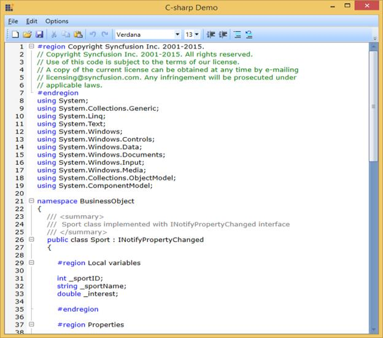

# Syntax Highlighting in WPF Syntax Editor

EditControl is enhanced with the Syntax highlighting support. This applies different colorings to keywords, literals, comments and so on. EditControl provides syntax highlighting support for all supported languages and also based on the custom language configurations provided by the users.

The following image displays the EditControl with DocumentLanguage.

