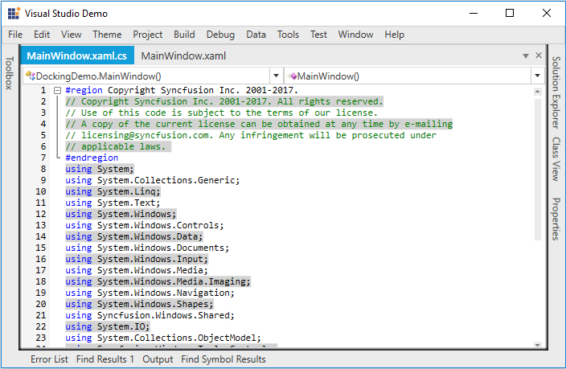

# Line Background Customization in WPF Syntax Editor (EditControl)

The EditControl provides several ways to customize the background color of specific lines. The samples below assume `using Syncfusion.Windows.Edit;` and an `EditControl` instance named `editControl1`.

## Applying a line background

The `SetLineBackground` method customizes the background color of a single line.

### Method signature

`SetLineBackground(lineNumber, fullLine, brush)`: Helps to customize the background of line.

### Parameters

* `lineNumber` – the 1-based line number to which the background is applied.
* `fullLine` – `true` to highlight the full line width; `false` to highlight only the text area.
* `brush` – the `System.Windows.Media.Brush` used to paint the background.





// Set the background to a specified Line.

this.editControl1.SetLineBackground(this.editControl1.LineNumber, true, Brushes.Yellow);





' Set the background to a specified Line.

this.editControl1.SetLineBackground(this.editControl1.LineNumber, true, Brushes.Yellow)





## Resetting a line background

The `ResetLineBackground` method clears the background color applied by `SetLineBackground`.

### Method signature

`ResetLineBackground(lineNumber)`: Helps to reset the background customization of line.

### Parameters

* `lineNumber` – the 1-based line number to reset.




// Reset the background of the current line.
this.editControl1.ResetLineBackground(this.editControl1.LineNumber);





' Reset the background to a specified Line.

this.editControl1.ResetLineBackground(this.editControl1.LineNumber)





## On demand line background customization

The `OnBeforeLineRender` event customizes the background color of the line on demand.





public MainWindow()

{

     InitializeComponent();

     editControl1.DocumentSource = "../../Source.cs";
     
     editControl1.OnBeforeLineRender += new 
     
     Syncfusion.Windows.Edit.OnBeforeLineRenderEventHandler(editControl1_OnBeforeLineRender);
}

// Invoked when before the Line Render.

 private void editControl1_OnBeforeLineRender(object sender, Syncfusion.Windows.Edit.OnBeforeLineRenderArgs args)
{
   
    if (args.LineItem.LineNumber % 2 == 0)
   
        {
            args.BackgroundColor = Brushes.LightGray;
            args.IsFullLine = false;
        }
}





public MainWindow()

{

     InitializeComponent()

     editControl1.DocumentSource = "../../Source.cs"
     
     editControl1.OnBeforeLineRender += new 
     
     Syncfusion.Windows.Edit.OnBeforeLineRenderEventHandler(editControl1_OnBeforeLineRender)
}

' Invoked when before the Line Render.

 private void editControl1_OnBeforeLineRender(object sender, Syncfusion.Windows.Edit.OnBeforeLineRenderArgs args)
{
   
    if (args.LineItem.LineNumber % 2 == 0)
   
        {
   
            args.BackgroundColor = Brushes.LightGray
   
            args.IsFullLine = false;   
        }
}





N> The on demand line background customization is recommended when the `EditControl` is loaded with huge data.

