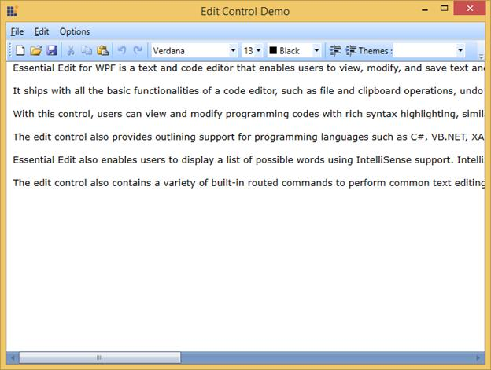

# WPF Syntax Editor Overview

This section covers information on the Essential Edit for WPF, its key features and prerequisites, compatibility with various operating systems and browsers, and the documentation details to use the control. It comprises the following sub sections.

## Introduction to Essential Edit WPF

Essential Edit WPF is easy to use and extensible control. This can be viewed as an advance notepad with features such as formatting, code editing, and more. It allows users to view, edit, and save the following:

•Large formatted text

•Code

•Data from the database

Essential Edit WPF allows to create interactive code editor applications with its unique feature set. This is a fully functional context menu that can be used to perform all basic editing operations such as select all, cut, copy, paste, undo, redo, and so on.

The following image shows an example of Essential Edit control.

**Real world scenarios**

The Essential Edit WPF control is a high performance control for creating text and language editors. Users can customize their page with the font, font color, background, and size properties. It has more features like context menu, expand and collapse functionality, and syntax highlight functionality for C#, XAML, and XML language patterns. Some of the real world scenarios of Essential Edit control for WPF are as follows:

•Text editor application like notepad.

•Code editor application like Visual Studio 2008 IDE.

## Key features

The following are the key features of Essential Edit WPF:

•**Basic editing**: Essential Edit WPF allows users to modify, edit text documents, and source code files. It facilitates to perform all edit operations such as select, cut, copy, paste, select all, delete, and so on.

•**File support**: Allows to open supported file types and make necessary changes and save them back to the same or different file types. It supports all file operations such as create new, open, or save files.

•**Syntax highlighting support**: Highlights the content in the edit control based on the selected language. Essential Edit provides built-in support for programming languages such as C#, Visual Basic, XAML, and XML.

•**Custom language support**: Essential Edit WPF extends support for user defined language configurations. Custom language configurations can be created easily and applied to the content in the edit control.

•**Undo/Redo support**: Allows to cancel or apply the changes done to the content in the order in which they were performed (LIFO). Undo and Redo can be performed using the built-in context menu or using keyboard shortcuts.

•**Line number support**: Displays line numbers for text in the edit control for easy reference. You can enable or disable this feature.

•**Expand or collapse support**: Facilitates to outline the programming codes and enables to expand or collapse the text within region or module to enhance the readability.

•**Read only mode**: Displays contents of a file or source codes files and prevents user from editing the contents of the file.

•**Editing commands**: Essential Edit WPF ships with built-in RoutedUICommands to perform various operations in the edit control externally using command bindings.

•**Fully functional context menu**: Edit WPF contains a built-in context menu with options to perform editing operations such as undo, redo, cut, copy, paste, select all, and so on. You can enable or disable the built-in context menu.

