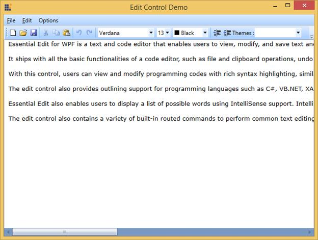

# About Syncfusion® WPF Syntax Editor Control

This section covers information on the Essential Edit for WPF, its key features, prerequisites, version compatibility, and the documentation details for using the control. It comprises the following sub-sections.

## Introduction to Essential Edit WPF

Essential Edit WPF is an easy-to-use and extensible control. It can be viewed as an advanced notepad with features such as formatting, code editing, and more. It allows users to view, edit, and save the following:

* Large formatted text
* Code
* Data from the database

Essential Edit WPF allows you to create interactive code editor applications with its unique feature set. It includes a fully functional context menu that can be used to perform all basic editing operations such as select all, cut, copy, paste, undo, redo, and so on.

The following image shows an example of the Essential Edit control.

### Real world scenarios

The Essential Edit WPF control is a high performance control for creating a text and language editor. Users can customize their page with the font, font color, background, and size properties. It has more features like context menu, expand and collapse functionality, and syntax highlight functionality for C#, XAML, and XML language patterns. Some of the real world scenarios of the Essential Edit control for WPF are as follows:

* Text editor application like Notepad.
* Code editor application like the Visual Studio code editor.

## Key features

The following are the key features of Essential Edit WPF:

* **Basic editing** – Essential Edit WPF allows users to modify and edit text documents and source code files. It facilitates all edit operations such as cut, copy, paste, select all, delete, and so on.
* **File support** – Allows opening of supported file types and making the necessary changes, then saving them back to the same or different file types. It supports all file operations such as creating new files, opening, or saving files.
* **Syntax highlighting support** – Highlights the content in the edit control based on the selected language. Essential Edit provides built-in support for C#, Visual Basic, XAML, XML, C, Java, SQL, and many more.
* **Custom language support** – Essential Edit WPF extends support for user-defined language configurations. Custom language configurations can be created easily and applied to the content in the edit control.
* **Undo/Redo support** – Allows you to cancel or apply the changes done to the content in the order in which they were performed (LIFO). Undo and Redo can be performed using the built-in context menu or keyboard shortcuts.
* **Line number support** – Displays line numbers for text in the edit control for easy reference. You can enable or disable this feature.
* **Expand or collapse support** – Facilitates outlining of programming code and enables expanding or collapsing text within a region or module to enhance readability.
* **Read only mode** – Displays the contents of a file or source code file and prevents the user from editing the contents.
* **Editing commands** – Essential Edit WPF ships with built-in `RoutedUICommands` to perform various operations in the edit control externally using command bindings.
* **Fully functional context menu** – Edit WPF contains a built-in context menu with options to perform editing operations such as undo, redo, cut, copy, paste, select all, and so on. You can enable or disable the built-in context menu.
