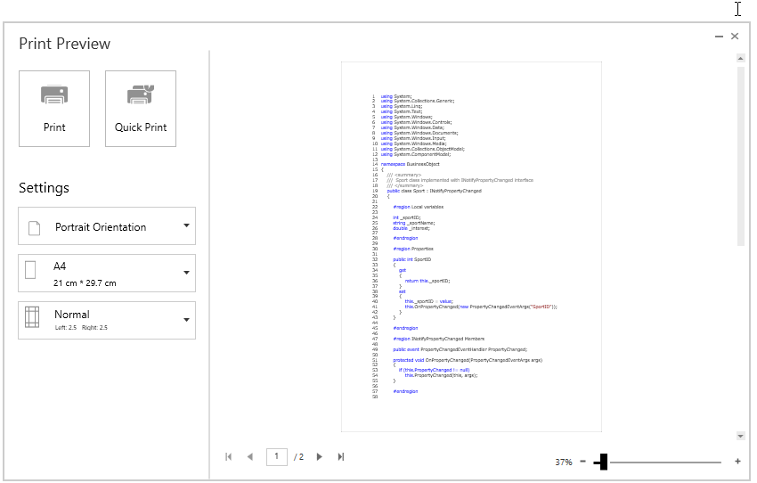
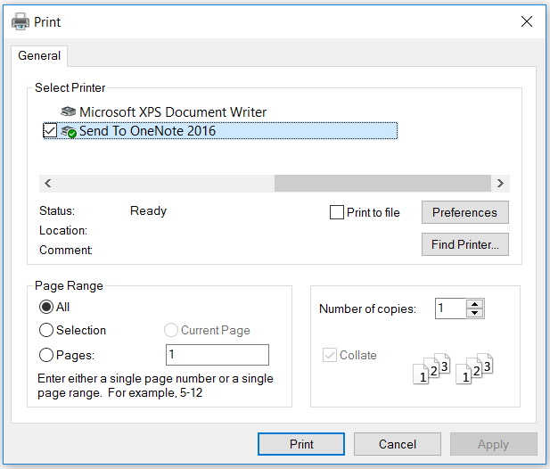
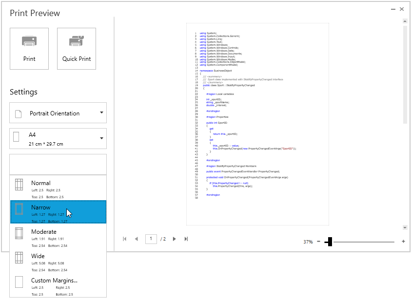

# Printing in WPF Syntax Editor

EditControl provides support to print the content displayed in the EditControl using `Print` method. 





editControl.Print();





' Invoke the print method

editControl.Print 





## Print Preview

EditControl provides option to display print preview to review and customize the document in desired format before printing. Print preview window can be opened by calling `ShowPrintPreview` method.





editControl.ShowPrintPreview();





' Invoke the print Preview Window

editControl.ShowPrintPreview





### Print

Print preview window has Print and Quick Print Buttons which needs to be clicked to print the EditControl.

**Step 1:** Clicking the Print button opens the System print dialog where user can select the printer and set the number of copies to be printed.

**Step 2:** Clicking the Quick Print button, directly print the pages using default printer without opening the print dialog.

## Print Settings

EditControl provides various options to customize page settings using `EditControl.PrintSettings` property of type `PrintSettings`.

### Orientation

EditControl provides support to switch between Portrait (more rows but fewer columns) and Landscape (more columns but fewer rows) orientation while printing. Orientation can be changed by setting `PrintSettings.Orientation` Property.




editControl.PrintSettings = new PrintSettings();

editControl.PrintSettings.Orientation = Syncfusion.Windows.Shared.Printing.PrintOrientation.Landscape;

editControl.ShowPrintPreview();





editcontrol.PrintSettings = New PrintSettings

editcontrol.PrintSettings.Orientation = Syncfusion.Windows.Shared.Printing.PrintOrientation.Landscape

editcontrol.ShowPrintPreview





Print orientation can be changed in print preview at runtime by selecting from orientation drop-down in print preview.

### Page size

EditControl provides support to change the page size. Page size can be changed by setting `PrintSettings.PageWidth` and `PrintSettings.PageHeight` properties.





editControl.PrintSettings = new PrintSettings();

editControl.PrintSettings.PageHeight = 800;            

editControl.PrintSettings.PageWidth = 800;

editControl.Print();





editControl.PrintSettings = New PrintSettings

editControl.PrintSettings.PageHeight = 800

editControl.PrintSettings.PageWidth = 800

editControl.Print





Page size can be changed in print preview also by selecting from page-size drop-down which displays pre-defined page sizes. You can also manually enter custom page width and height in the editors below page-size drop-down and press OK to apply the custom width and height for the page.

### Page margin

EditControl provides support to change the page margins to adjust content in printed page. Page margin can be changed by setting `PrintSettings.PageMargin` property.




editControl.PrintSettings = new PrintSettings();

editControl.PrintSettings.PageMargin = new Thickness(5);

editControl.Print();





editcontrol.PrintSettings = New PrintSettings

editcontrol.PrintSettings.PageMargin = New Thickness(5)

editcontrol.Print





Page margin can be changed in print preview also by selecting from pre-defined page margin from margin drop-down. You can manually enter custom margins in the editors below margin drop-down and press OK to apply the custom margin.

## Setting Header and Footer

EditControl provides a way to display additional content at the top (Header) or bottom (Footer) of the page while printing. This can be achieved by setting `PageHeaderHeight` , `PageHeaderTemplate` , `PageFooterHeight` , `PageFooterTemplate` properties in `PrintSettings`.

Steps to add page header while printing,

1. Create DataTemplate in Application.Resources.



<Application.Resources>
    <DataTemplate x:Key="pageHeaderTempalte">
        <Grid Background="Gray">
            <TextBlock Text="Syncfusion" 
                       FontSize="18" 
                       FontWeight="Bold" 
                       Foreground="White" 
                       HorizontalAlignment="Center"/>
        </Grid>
    </DataTemplate>
</Application.Resources>



2.Set the above defined DataTemplate to `PrintSettings.PageHeaderTemplate` and assign value for `PrintSettings.PageHeaderHeight` property also.





editcontrol.PrintSettings = new PrintSettings();

editcontrol.PrintSettings.PageHeaderHeight = 30;

editcontrol.PrintSettings.PageHeaderTemplate = Application.Current.Resources["pageHeaderTempalte"] as DataTemplate;

editcontrol.ShowPrintPreview();





editcontrol.PrintSettings = New PrintSettings

editcontrol.PrintSettings.PageHeaderHeight = 30

editcontrol.PrintSettings.PageHeaderTemplate = CType(Application.Current.Resources("pageHeaderTemplate"),DataTemplate)

editcontrol.ShowPrintPreview





3.Now run the application and you can see page header in all the pages. In the same way, you can set `PrintSettings.PageFooterTemplate` also.

### Printing Current Date time and Page number

You can print current Date and Time at each page by setting the  `PageFooterHeight`.
 
You can get the page number from PrintPageControl.



<Application.Resources>
    <DataTemplate x:Key="pageFooterTempalte">
        <Grid>
            <TextBlock HorizontalAlignment="Center" 
                       FontSize="20" 
                       Text="{Binding Source={x:Static system:DateTime.Now}}"/>
            <TextBlock Margin="0,0,10,0"
                       HorizontalAlignment="Right"
                       VerticalAlignment="Center" FontSize="20">
                <TextBlock.Text>
                    <Binding Path="PageIndex"
                             RelativeSource="{RelativeSource Mode=FindAncestor,
                                                              AncestorType={x:Type syncfusion:PrintPageControl}}"
                             StringFormat="Page : {0}" />
                </TextBlock.Text>
            </TextBlock>
        </Grid>
    </DataTemplate>
</Application.Resources>






editcontrol.PrintSettings = new PrintSettings();

editcontrol.PrintSettings.PageFooterHeight = 30;

editcontrol.PrintSettings.PageFooterTemplate = Application.Current.Resources["pageFooterTempalte"] as DataTemplate;

editcontrol.ShowPrintPreview();





editcontrol.PrintSettings = New PrintSettings

editcontrol.PrintSettings.PageHeaderHeight = 30

editcontrol.PrintSettings.PageFooterTemplate = CType(Application.Current.Resources("pageFooterTemplate"),DataTemplate)

editcontrol.ShowPrintPreview





