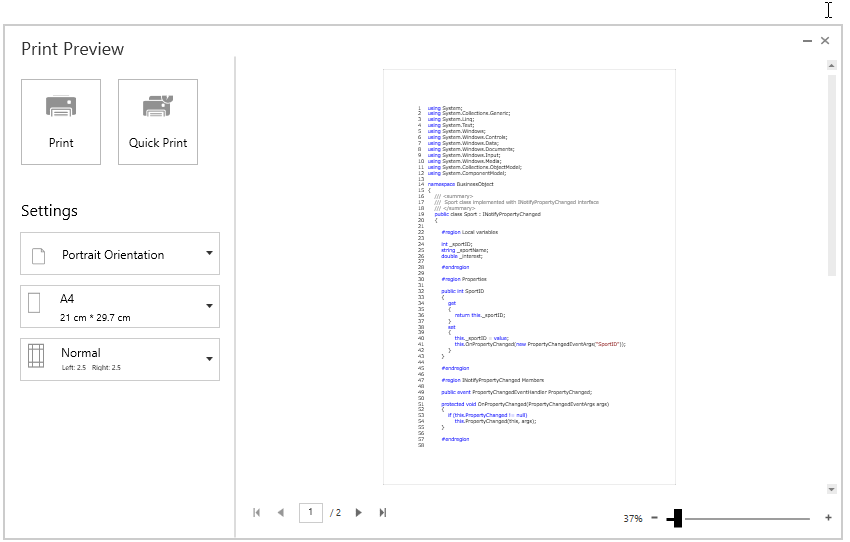
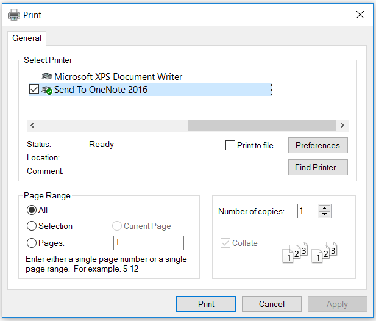
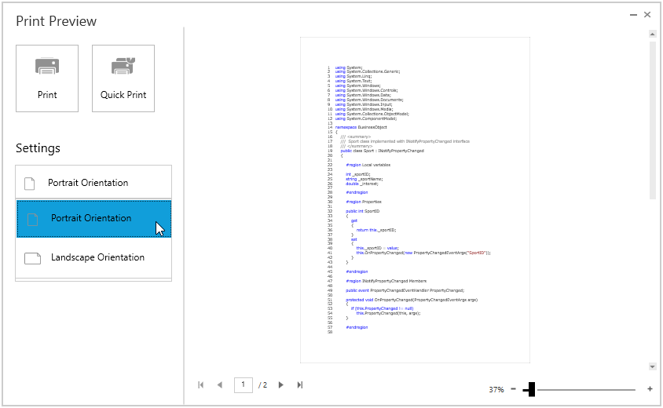
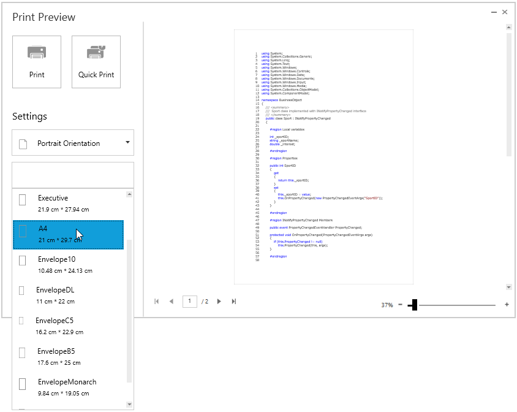
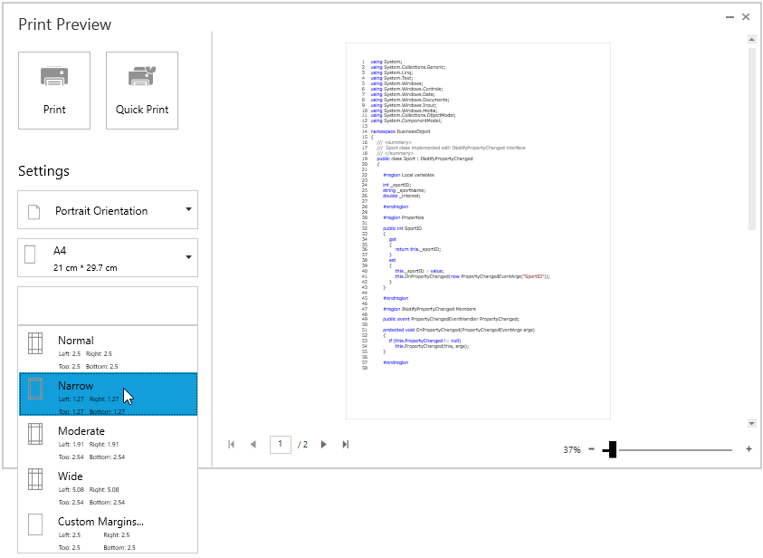
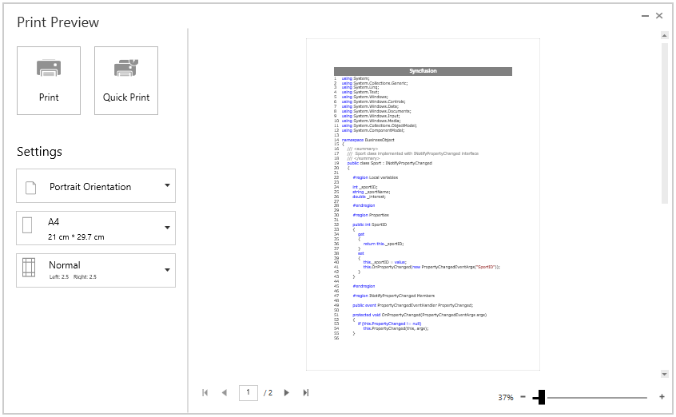
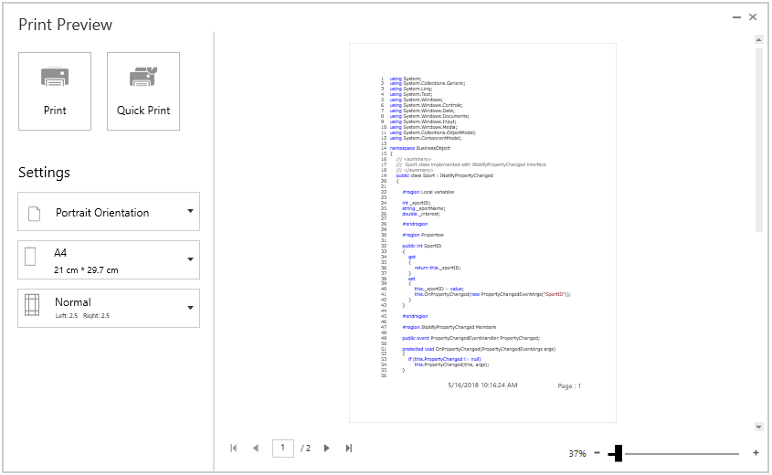

# Printing in WPF Syntax Editor

The `EditControl` provides support for printing the content displayed in the control using the [Print](https://help.syncfusion.com/cr/wpf/Syncfusion.Windows.Edit.EditControl.html#Syncfusion_Windows_Edit_EditControl_Print) method, and for previewing the printed output using the [ShowPrintPreview](https://help.syncfusion.com/cr/wpf/Syncfusion.Windows.Edit.EditControl.html#Syncfusion_Windows_Edit_EditControl_ShowPrintPreview) method. The samples below assume `using Syncfusion.Windows.Edit;` and an `EditControl` instance named `editControl`.





editControl.Print();





editControl.Print 





## Print Preview

EditControl provides option to display print preview to review and customize the document in desired format before printing. Print preview window can be opened by calling [ShowPrintPreview](https://help.syncfusion.com/cr/wpf/Syncfusion.Windows.Edit.EditControl.html#Syncfusion_Windows_Edit_EditControl_ShowPrintPreview) method.





editControl.ShowPrintPreview();





editControl.ShowPrintPreview





### Print and Quick Print

The print preview window has **Print** and **Quick Print** buttons which are clicked to print the EditControl.

**Step 1:** Clicking the **Print** button opens the system print dialog where the user can select the printer and set the number of copies to be printed.

**Step 2:** Clicking the **Quick Print** button directly prints the pages using the default printer without opening the print dialog.

## Print settings

The [PrintSettings](https://help.syncfusion.com/cr/wpf/Syncfusion.Windows.Edit.EditControl.html#Syncfusion_Windows_Edit_EditControl_PrintSettings) property is of type `PrintSettings` and exposes options to customize page settings.

### Orientation

Switch between Portrait (more rows but fewer columns) and Landscape (more columns but fewer rows) orientation using `PrintSettings.Orientation`.




editControl.PrintSettings = new PrintSettings();
editControl.PrintSettings.Orientation = Syncfusion.Windows.Shared.Printing.PrintOrientation.Landscape;
editControl.ShowPrintPreview();





editcontrol.PrintSettings = New PrintSettings
editcontrol.PrintSettings.Orientation = Syncfusion.Windows.Shared.Printing.PrintOrientation.Landscape
editcontrol.ShowPrintPreview





The print orientation can be changed in the print preview at runtime by selecting a value from the orientation drop-down.

### Page size

Change the page size using the `PrintSettings.PageWidth` and `PrintSettings.PageHeight` properties.




editControl.PrintSettings = new PrintSettings();
editControl.PrintSettings.PageHeight = 800;            
editControl.PrintSettings.PageWidth = 800;
editControl.Print();





editControl.PrintSettings = New PrintSettings
editControl.PrintSettings.PageHeight = 800
editControl.PrintSettings.PageWidth = 800
editControl.Print





The page size can be changed in the print preview as well by selecting from the page-size drop-down, which displays pre-defined page sizes. You can also manually enter a custom page width and height in the editors below the page-size drop-down and click **OK** to apply the custom width and height.

### Page margin

Change the page margins using the `PrintSettings.PageMargin` property.




editControl.PrintSettings = new PrintSettings();
editControl.PrintSettings.PageMargin = new Thickness(5);
editControl.Print();





editcontrol.PrintSettings = New PrintSettings
editcontrol.PrintSettings.PageMargin = New Thickness(5)
editcontrol.Print





The page margin can be changed in the print preview as well by selecting from the pre-defined page margin in the margin drop-down. You can manually enter custom margins in the editors below the margin drop-down and click **OK** to apply them.

## Setting Header and Footer

EditControl provides a way to display additional content at the top (Header) or bottom (Footer) of the page while printing. This can be achieved by setting `PageHeaderHeight` , `PageHeaderTemplate` , `PageFooterHeight` , `PageFooterTemplate` properties in `PrintSettings`.

Steps to add page header while printing,

1. Define a `DataTemplate` as a resource.





<Application.Resources>
    <DataTemplate x:Key="pageHeaderTempalte">
        <Grid Background="Gray">
            <TextBlock Text="Syncfusion" 
                       FontSize="18" 
                       FontWeight="Bold" 
                       Foreground="White" 
                       HorizontalAlignment="Center"/>
        </Grid>
    </DataTemplate>
</Application.Resources>




{{ codesnippet1 | OrderList_Indent_Level_1 }}

2. Set the above defined DataTemplate to `PrintSettings.PageHeaderTemplate` and assign value for `PrintSettings.PageHeaderHeight` property also.





editcontrol.PrintSettings = new PrintSettings();
editcontrol.PrintSettings.PageHeaderHeight = 30;
editcontrol.PrintSettings.PageHeaderTemplate = Application.Current.Resources["pageHeaderTempalte"] as DataTemplate;
editcontrol.ShowPrintPreview();





editcontrol.PrintSettings = New PrintSettings
editcontrol.PrintSettings.PageHeaderHeight = 30
editcontrol.PrintSettings.PageHeaderTemplate = CType(Application.Current.Resources("pageHeaderTemplate"),DataTemplate)
editcontrol.ShowPrintPreview





{{ codesnippet2 | OrderList_Indent_Level_1 }}

3. Run the application to see the page header on all pages. Use the same approach with `PrintSettings.PageFooterTemplate` to add a page footer.

### Printing Date, Time, and Page Number

You can display the current date and time on each printed page by defining a template for the `PageFooter`. You can also display the page number by binding to the `PageIndex` property of the `PrintPageControl`.




<Application.Resources>
    <DataTemplate x:Key="pageFooterTempalte">
        <Grid>
            <TextBlock HorizontalAlignment="Center" 
                       FontSize="20" 
                       Text="{Binding Source={x:Static system:DateTime.Now}}"/>
            <TextBlock Margin="0,0,10,0"
                       HorizontalAlignment="Right"
                       VerticalAlignment="Center" FontSize="20">
                <TextBlock.Text>
                    <Binding Path="PageIndex"
                             RelativeSource="{RelativeSource Mode=FindAncestor,
                                                              AncestorType={x:Type syncfusion:PrintPageControl}}"
                             StringFormat="Page : {0}" />
                </TextBlock.Text>
            </TextBlock>
        </Grid>
    </DataTemplate>
</Application.Resources>







editcontrol.PrintSettings = new PrintSettings();
editcontrol.PrintSettings.PageFooterHeight = 30;
editcontrol.PrintSettings.PageFooterTemplate = Application.Current.Resources["pageFooterTempalte"] as DataTemplate;
editcontrol.ShowPrintPreview();





editcontrol.PrintSettings = New PrintSettings
editcontrol.PrintSettings.PageHeaderHeight = 30
editcontrol.PrintSettings.PageFooterTemplate = CType(Application.Current.Resources("pageFooterTemplate"),DataTemplate)
editcontrol.ShowPrintPreview





