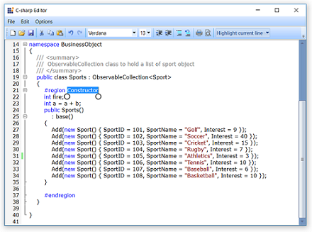

# Text Selection in WPF Syntax Editor

The `SyntaxEditor` control supports the selection of content through mouse, keyboard, and touch interactions. 

## Selection using Mouse

User can select text using the mouse by clicking on a position and dragging the selection to the desired line position. 

## Selection using Keyboard with shortcuts

The following keyboard shortcuts are supported for content selection.

<table>
<tr>
<td>
Selection Shortcut Keys  </td><td>
Description  </td></tr>
<tr>
<td>
Shift + Right arrow  </td><td>
Extends selection one position forward.  </td></tr>
<tr>
<td>
Shift + Left arrow  </td><td>
Extends selection one position backward.  </td></tr>
<tr>
<td>
Shift + Down arrow  </td><td>
Extends selection to the same position on the next line.  </td></tr>
<tr>
<td>
Shift + Up arrow  </td><td>
Extends selection to the same position on the previous line.  </td></tr>
<tr>
<td>
Shift + Home  </td><td>
Extends selection to the start of the current line.  </td></tr>
<tr>
<td>
Shift + End  </td><td>
Extends selection to the end of the current line.  </td></tr>
<tr>
<td>
Ctrl + Shift + Home  </td><td>
Extends selection to the document start position.  </td></tr>
<tr>
<td>
Ctrl + Shift + End  </td><td>
Extends selection to the document end position.  </td></tr>
<tr>
<td>
Ctrl + Shift + Right arrow  </td><td>
Extends selection to the current word end position.  </td></tr>
<tr>
<td>
Ctrl + Shift + Left arrow  </td><td>
Extends selection to the current word start position.  </td></tr>
<tr>
<td>
Ctrl + A  </td><td>
Selects the entire document.  </td></tr>
</table>

## Selection using Touch 

Users can select text by double-tapping the desired word. Selection pointers will be displayed at the start and end positions of the selected content. 

Users can extend the selection by dragging the selection pointers. The following screenshot shows an extended selection of content.

When a selection goes beyond the view port of the SyntaxEditor control, a scroll viewer will automatically bring new content into the view and the text selection will extend to that content.

