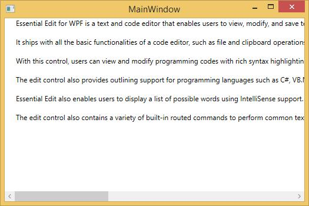

## Line Numbers

Edit WPF enables users to display line numbers for the content in the Edit Control. Line numbers can be displayed or hidden by using the **ShowLineNumber** property of the EditControl class. The following lines of code can be used to display or hide line numbers in Edit Control. 



<sfedit:EditControl Name="editControl" ShowLineNumber="False">

</sfedit:EditControl>





editControl.ShowLineNumber = false;



The following image displays hidden Line Numbers

