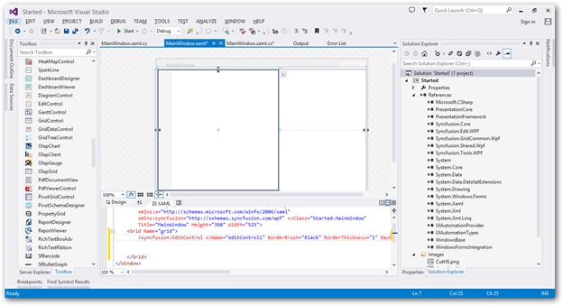

# Getting Started

This section explains how to create an interactive code editor application like Microsoft Visual Studio Editor using the EditControl.

# Creating simple application with EditControl

You can create Windows Forms application with EditControl as follows:

1. [Creating the project](#creating-the-project)
2. [Adding control via Designer](#adding-control-via-designer)
3. [Adding control manually in code](#adding-control-manually-in-code)
4. [Loading a file into Document](#loading-a-file-into-document)
5. [Syntax Highlighting](#syntax-highlighting)

### Creating the project

Create a new WPF project in Visual Studio to display the EditControl.

## Adding control via designer

The EditControl can be added to the application by dragging it from the toolbox and dropping it in the designer view. The following required assembly references will be added automatically:

* Syncfusion.Edit.WPF
* Syncfusion.GridCommon.WPF
* Syncfusion.Shared.WPF
* Syncfusion.Tools.WPF

## Adding control manually in code 

The EditControl can be created in XAML or C# as follows.

* Include an namespace for the above assemblies to the Main window.





<Window

xmlns="http://schemas.microsoft.com/winfx/2006/xaml/presentation"

xmlns:x="http://schemas.microsoft.com/winfx/2006/xaml" 

xmlns:syncfusion="http://schemas.syncfusion.com/wpf" />





using Syncfusion.Windows.Edit;





Imports Syncfusion.Windows.Edit








<syncfusion:EditControl x:Name="editControl1" BorderBrush="Black" BorderThickness="1" Background="White" Foreground="Black" HorizontalAlignment="Left" Height="300" Margin="0" VerticalAlignment="Top" Width="300"/>





[C#]

EditControl EditControl = new EditControl();





Dim EditControl As EditControl = New EditControl





## Loading a file into document

This option helps to load a file into the EditControl.

Essential Edit WPF facilitates users to create, open, modify and save text files and programming language files. EditControl provides built-in support for a variety of text based file formats such as txt, cs, VB, SQL, XAML, and XML. It also enables to specify custom file types in the custom language configurations.

### Opening a file

The `DocumentSource` property of EditControl is used to specify the file to be opened with EditControl. The following code can be used to set the DocumentSource property.





<sfedit:EditControl x:Name="editControl" DocumentSource="C:\Content.txt" ShowLineNumber="False" EnableOutlining="False"/>





editControl.DocumentSource = @"C:\Content.txt";





editControl.DocumentSource = "C:\Content.txt"





The following image displays the contents from file set as DocumentSource window.

Files can also be opened using the LoadFile method. LoadFile method displays a FileOpenDialog to enable you to choose the file that needs to be opened in the EditControl.





editControl.LoadFile();





editControl.LoadFile()





The following image displays the file open dialog.

### Saving the text in a file

SaveFile method in the EditControl class is used to save the text in EditControl to a file. EditControl does support saving all the built-in languages, file types and custom language file type respectively.

Enable save file, by using the following code.





editControl.SaveFile();





editControl.SaveFile()





The following image displays the save file dialog.

## Syntax highlighting

The EditControl offers mostly used languages like C#, VB, XML, XAML and SQL as built-in languages. It also provides support to configure new custom language.

The EditControl has built-in syntax highlighting support for the following languages:

   * C Sharp
   * Visual Basic
   * XML
   * XAML
   * SQL
   
With the language support, EditControl enables the users to create, open, modify and save programming codes from different file types. EditControl provides built in Syntax highlighting and outlining support for all supported languages with SQL being exception in outlining support. It also provides built-in IntelliSense support for all procedural languages such as C# and Visual Basic.

The `DocumentLanguage` property in the EditControl class enables the users to select the language. DocumentLanguage is a Language enum type property with default value as Text. The following lines of code can be used to change the DocumentLanguage property.





<sfedit:EditControl x:Name="editControl" DocumentLanguage="CSharp" DocumentSource="C:\Source.cs" FontSize="13"/>





editControl.DocumentLanguage = Languages.CSharp;





editControl.DocumentLanguage = Languages.CSharp





The following image displays the EditControl displaying contents.

