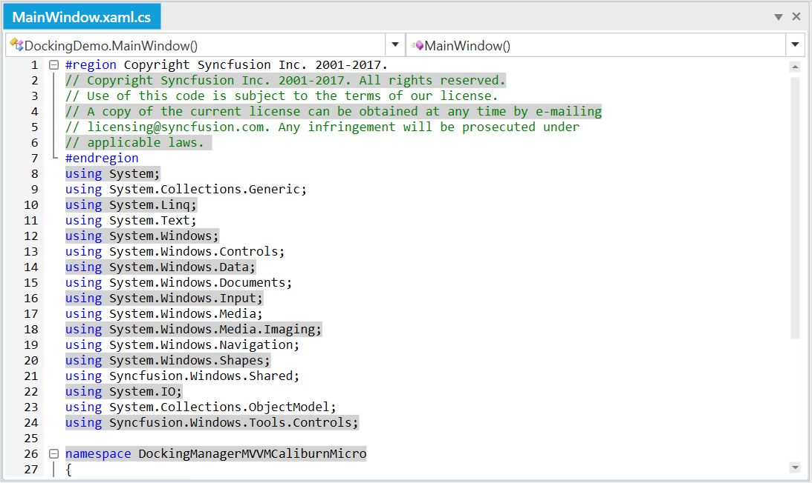

# Line Background customization

## Apply Line Background customization

The `SetLineBackground` function helps to customize the background color of specific lines.

### Method

`SetLineBackground(lineNumber, fullLine, brush)` - Helps to customize the background of Line. 

### Arguments

`lineNumber` - To specify the line number to be customized

`fullLine` - To specify, whether to highlight full line. 

`brush` - To specify the `Brush` of background customization. 





// Set the background to a specified Line.

this.editControl1.SetLineBackground(this.editControl1.LineNumber, true, Brushes.Yellow);





' Set the background to a specified Line.

this.editControl1.SetLineBackground(this.editControl1.LineNumber, true, Brushes.Yellow)





## Reset Line Background customization

The `ResetLineBackground` function helps to reset the background Color for customized lines. The following codes illustrates the same. 

### Method

`ResetLineBackground(lineNumber)` - Helps to reset the background customization of Line. 

### Arguments

`lineNumber` - To specify the line number to be reset the applied customization. 





// Reset the background to a specified Line.

this.editControl1.ResetLineBackground(this.editControl1.LineNumber);





' Reset the background to a specified Line.

this.editControl1.ResetLineBackground(this.editControl1.LineNumber)





## On Demand Line Background Customization 

`OnBeforeLineRender` event used to customize the background color of the line on demand. The following codes illustrates the same. 





public MainWindow()

{

     InitializeComponent();

     editControl1.DocumentSource = "../../Source.cs";
     
     editControl1.OnBeforeLineRender += new 
     
     Syncfusion.Windows.Edit.OnBeforeLineRenderEventHandler(editControl1_OnBeforeLineRender);
}

// Invoked when before the Line Render.

 private void editControl1_OnBeforeLineRender(object sender, Syncfusion.Windows.Edit.OnBeforeLineRenderArgs args)
{
   
    if (args.LineItem.LineNumber % 2 == 0)
   
        {
   
            args.BackgroundColor = Brushes.LightGray;
   
            args.IsFullLine = false;
   
        }
}





public MainWindow()

{

     InitializeComponent()

     editControl1.DocumentSource = "../../Source.cs"
     
     editControl1.OnBeforeLineRender += new 
     
     Syncfusion.Windows.Edit.OnBeforeLineRenderEventHandler(editControl1_OnBeforeLineRender)
}

' Invoked when before the Line Render.

 private void editControl1_OnBeforeLineRender(object sender, Syncfusion.Windows.Edit.OnBeforeLineRenderArgs args)
{
   
    if (args.LineItem.LineNumber % 2 == 0)
   
        {
   
            args.BackgroundColor = Brushes.LightGray
   
            args.IsFullLine = false;   
        }
}





N> We recommend this, when `EditControl` is loaded with huge data.

