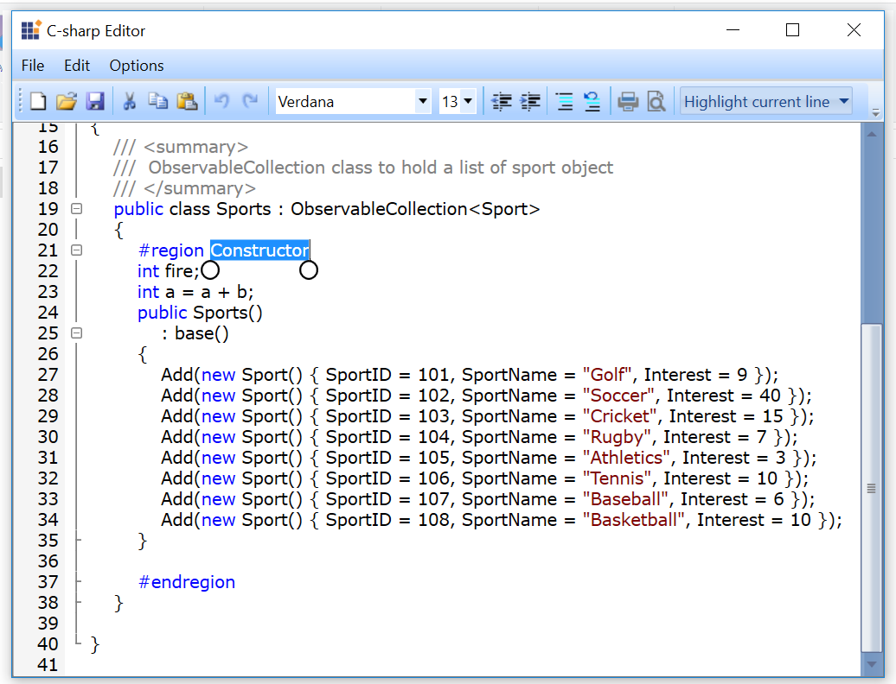
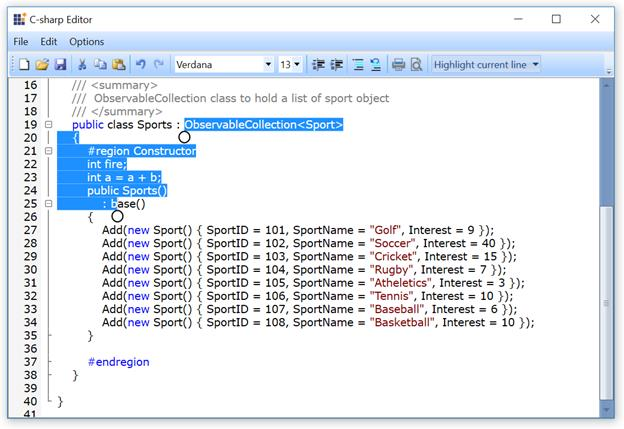

# Text Selection

SyntaxEditor supports selection of content through UI interactions such as Mouse, Keyboard and Touch. 

## Selection using Mouse

User can do selection using mouse by clicking on the desired position and drag the selection to desired line position. Selection of content can be extended through Keyboard selection. This will be explained in Keyboard selection section.

## Selection using Keyword with shortcuts

The following keyboard shortcuts are supported by SyntaxEditor for selection.

<table>
<tr>
<td>
Selection Shortcut  </td><td>
Description  </td></tr>
<tr>
<td>
SHIFT + Right Arrow  </td><td>
Extends selection to one position forward.  </td></tr>
<tr>
<td>
SHIFT + Left Arrow  </td><td>
Extends selection to one position backward.  </td></tr>
<tr>
<td>
SHIFT + Down Arrow  </td><td>
Extends selection to the same position at next line.  </td></tr>
<tr>
<td>
SHIFT + Up Arrow  </td><td>
Extends selection to the same position at previous line.  </td></tr>
<tr>
<td>
SHIFT + Home  </td><td>
Extends selection to start of the current line.  </td></tr>
<tr>
<td>
SHIFT + End  </td><td>
Extends selection to end of the current line.  </td></tr>
<tr>
<td>
CTRL + SHIFT + Home  </td><td>
Extends selection to the document start position.  </td></tr>
<tr>
<td>
CTRL + SHIFT + End  </td><td>
Extends selection to the document end position.  </td></tr>
<tr>
<td>
CTRL + SHIFT + Right  </td><td>
Extends selection to the current word end position.  </td></tr>
<tr>
<td>
CTRL + SHIFT + Left  </td><td>
Extends selection to the current word start position.  </td></tr>
<tr>
<td>
CTRL + A  </td><td>
Selects the entire document.  </td></tr>
</table>

## Selection using Touch 

User can do selection by double touch the desired word. Selection pointers will be displayed at start and end position of the selected content. 

User can extend the selection by dragging the selection pointers. The following screenshot shows the extend selection of selected content.

When selection goes beyond viewport of EditControl, ScrollViewer will be automatically bring new contents to the view and text selection will happen to those contents.

