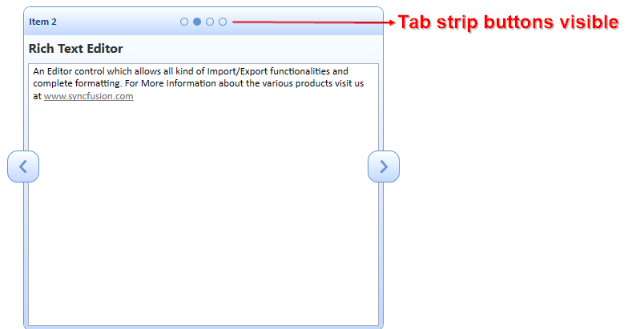

# Appearance in WPF Tab Navigation

## Show/hide the Header

You can enable/disable the visibility of header by setting [HeaderVisibility](https://help.syncfusion.com/cr/wpf/Syncfusion.Windows.Tools.Controls.TabNavigationControl.html#Syncfusion_Windows_Tools_Controls_TabNavigationControl_HeaderVisibility) property of TabNavigationControl.



 <!-- TabNavigation Control -->
<syncfusion:TabNavigationControl x:Name="TabNavigation" HeaderVisibility="Collapsed" >
	<syncfusion:TabNavigationItem Header="TabItem1" Content="TabNavigationItem 1"/>
	<syncfusion:TabNavigationItem Header="TabItem2" Content="TabNavigationItem 2"/>
	<syncfusion:TabNavigationItem Header="TabItem3" Content="TabNavigationItem 3"/>
</syncfusion:TabNavigationControl>


//Hide the header
tabNavigation.HeaderVisibility = Visibility.Collapsed;



## Show/hide the NavigationButton

You can enable/disable the visibility of navigation button by setting [NavigationButtonVisibility](https://help.syncfusion.com/cr/wpf/Syncfusion.Windows.Tools.Controls.TabNavigationControl.html#Syncfusion_Windows_Tools_Controls_TabNavigationControl_NavigationButtonVisibility) property of TabNavigationControl.



<!-- TabNavigation Control -->
<syncfusion:TabNavigationControl x:Name="TabNavigation" TabStripVisibility="Visible" NavigationButtonVisibility="Collapsed" >
	<syncfusion:TabNavigationItem Header="TabItem1" Content="TabNavigationItem 1"/>
	<syncfusion:TabNavigationItem Header="TabItem2" Content="TabNavigationItem 2"/>
</syncfusion:TabNavigationControl>


//Hide the navigation button
tabNavigation.NavigationButtonVisibility = Visibility.Collapsed;



## Show/hide the TabStrip

You can enable/disable the visibility of tab strip by setting [TabStripVisibility](https://help.syncfusion.com/cr/wpf/Syncfusion.Windows.Tools.Controls.TabNavigationControl.html#Syncfusion_Windows_Tools_Controls_TabNavigationControl_TabStripVisibility) property of TabNavigationControl.



<!-- TabNavigation Control -->
<syncfusion:TabNavigationControl x:Name="TabNavigation" TabStripVisibility="Visible">
	<syncfusion:TabNavigationItem Header="TabItem1" Content="TabNavigationItem 1"/>
	<syncfusion:TabNavigationItem Header="TabItem2" Content="TabNavigationItem 2"/>
</syncfusion:TabNavigationControl>


//Enable the tab strip visibility
tabNavigation.TabStripVisibility = Visibility.Visible;



