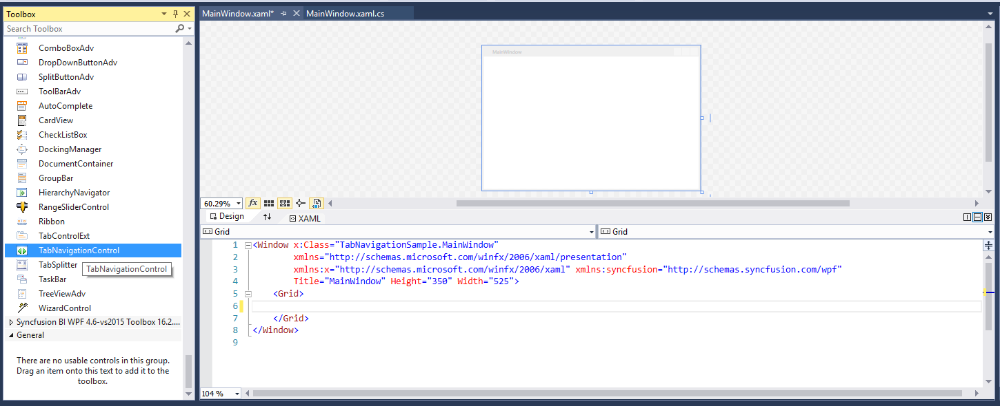
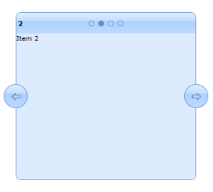

# Getting Started with WPF Tab Navigation

## Assembly deployment

Refer to the [control dependencies](https://help.syncfusion.com/wpf/control-dependencies#tabnavigation) section for the list of assemblies or NuGet packages that need to be added as references in order to use the control in a WPF application.

To install via the NuGet Package Manager Console, run:

```powershell
Install-Package Syncfusion.Tools.WPF
```

## Creating simple application with Tab Navigation Control

Follow these steps to create a WPF application that uses the Tab Navigation Control.

1. [Creating the project](#creating-the-project)
2. [Adding control via Designer](#adding-control-via-designer)
3. [Adding control manually in XAML](#adding-control-manually-in-xaml)
4. [Adding control manually in C#](#adding-control-manually-in-c)

### Creating the project

Create a new WPF project in Visual Studio to use the Tab Navigation Control and explore its built-in features.

1. Open Visual Studio and click **File → New → Project**.
2. Select **WPF App (.NET Framework)** or **WPF Application** depending on your installed workloads, then click **Next**.
3. Enter a project name (for example, `TabNavigationSample`), choose a location, and click **Create**.
4. Ensure the target framework is supported by your installed version of Syncfusion Essential Studio (see [control dependencies](https://help.syncfusion.com/wpf/control-dependencies#tabnavigation)).

### Adding control via Designer

You can add the `TabNavigationControl` to your application by dragging it from the **Toolbox** and dropping it onto the designer surface. The required assembly references will be added automatically.

1. Make sure the Syncfusion WPF Toolbox is installed (this happens when you install Essential Studio or the WPF add-on).
2. Open **View → Toolbox** and search for `TabNavigationControl` under the **Syncfusion Controls** tab.
3. Drag `TabNavigationControl` onto the designer surface of `MainWindow.xaml`.
4. Build and run the project to verify that the control renders.



### Adding control manually in XAML

To add the control manually in XAML, follow these steps:

1. Add the following assembly references to the project:
	* Syncfusion.Tools.WPF 
	* Syncfusion.Shared.WPF 
2. Import the Syncfusion WPF schema **http://schemas.syncfusion.com/wpf** in the XAML page.
3. Add the `TabNavigationControl` to the XAML page.




<Window xmlns="http://schemas.microsoft.com/winfx/2006/xaml/presentation"
        xmlns:x="http://schemas.microsoft.com/winfx/2006/xaml"
        xmlns:syncfusion="http://schemas.syncfusion.com/wpf"
        x:Class="TabNavigationSample.MainWindow"
        Title="MainWindow" Height="350" Width="525">
    <Grid x:Name="grid">
        <!-- Tab Navigation Control -->
        <syncfusion:TabNavigationControl x:Name="tabNavigation"/>
    </Grid>
</Window>



{{ codesnippet1 | OrderList_Indent_Level_1 }}

### Adding control manually in C\#

To add the control manually in C#, follow these steps:

1. Add the below required assembly references to the project,
	* Syncfusion.Tools.WPF 
	* Syncfusion.Shared.WPF 
2. Import the **Syncfusion.Windows.Tools.Controls** namespace.
3. Create an instance of _TabNavigationControl_ and add it to the window.




using System.Windows;
using Syncfusion.Windows.Tools.Controls;

namespace TabNavigationSample
{
    /// <summary>
    /// Interaction logic for MainWindow.xaml
    /// </summary>
    public partial class MainWindow : Window
    {
        public MainWindow()
        {
            InitializeComponent();

            // Adding Tab Navigation Control programmatically
            TabNavigationControl tabNavigation = new TabNavigationControl();
            grid.Children.Add(tabNavigation);
        }
    }
}



{{ codesnippet2 | OrderList_Indent_Level_1 }}

### Adding Items using TabNavigationItem

You can populate the `TabNavigationControl` by adding items directly to its [Items](https://learn.microsoft.com/en-us/dotnet/api/system.windows.controls.itemscontrol.items?view=netframework-4.7.2) collection. Items added to the tab navigation control are automatically wrapped in [TabNavigationItem](https://help.syncfusion.com/cr/wpf/Syncfusion.Windows.Tools.Controls.TabNavigationItem.html) containers.



<!-- Tab Navigation Control -->
<syncfusion:TabNavigationControl x:Name="tabNavigation">
    <!-- TabNavigationItem 1 -->
	<syncfusion:TabNavigationItem Header="1">
		<syncfusion:TabNavigationItem.Content>
			<Grid>
				<TextBlock Text="Item 1"/>
			</Grid>
		</syncfusion:TabNavigationItem.Content>
	</syncfusion:TabNavigationItem>
    <!-- TabNavigationItem 2 -->
	<syncfusion:TabNavigationItem Header="2">
		<syncfusion:TabNavigationItem.Content>
			<Grid>
				<TextBlock Text="Item 2"/>
			</Grid>
		</syncfusion:TabNavigationItem.Content>
	</syncfusion:TabNavigationItem>
	<!-- TabNavigationItem 3 -->
	<syncfusion:TabNavigationItem Header="3">
	    <syncfusion:TabNavigationItem.Content>
			<Grid>
				<TextBlock Text="Item 3"/>
			</Grid>
		</syncfusion:TabNavigationItem.Content>
	</syncfusion:TabNavigationItem>
	<!-- TabNavigationItem 4 -->
	<syncfusion:TabNavigationItem Header="4">
		<syncfusion:TabNavigationItem.Content>
			<Grid>
				<TextBlock Text="Item 4"/>
			</Grid>
		</syncfusion:TabNavigationItem.Content>
	</syncfusion:TabNavigationItem>
</syncfusion:TabNavigationControl>



TabNavigationControl tabNavigation = new TabNavigationControl();
//TabNavigationItem
TabNavigationItem item1 = new TabNavigationItem();
item1.Header = "1";
item1.Content = "Item 1";

TabNavigationItem item2 = new TabNavigationItem();
item2.Header = "2";
item2.Content = "Item 2";

TabNavigationItem item3 = new TabNavigationItem();
item3.Header = "3";
item3.Content = "Item 3";

TabNavigationItem item4 = new TabNavigationItem();
item4.Header = "4";
item4.Content = "Item 4";

//Adding items to TabNavigationControl
tabNavigation.Items.Add(item1);
tabNavigation.Items.Add(item2);
tabNavigation.Items.Add(item3);
tabNavigation.Items.Add(item4);
this.Content= tabNavigation;





### Binding ItemsSource

Tab Navigation Control supports data binding with various data sources, including IList, XML, and ObservableCollection. For more information, refer to the [Data binding](https://help.syncfusion.com/wpf/tab-navigation/data-binding) section.



<syncfusion:TabNavigationControl TransitionEffect="Slide" ItemsSource="{Binding MyCollection}"/>





namespace TabNavigationSample
{
    /// <summary>
    /// Interaction logic for MainWindow.xaml
    /// </summary>
    public partial class MainWindow : Window
    { 
		TabNavigationItem temp;
        public MainWindow()
        {
            InitializeComponent();
			MyCollection = new ObservableCollection<TabNavigationItem>();
			for (int i = 0; i < 10; i++)
			{
				temp = new TabNavigationItem();
				temp.Header = i;
				temp.Content= "Item " + i.ToString();
				MyCollection.Add(temp);
			}
			this.DataContext = this;
		}
		public ObservableCollection<TabNavigationItem> MyCollection 
		{
			get { return (ObservableCollection<TabNavigationItem>)GetValue(MyCollectionProperty); }
			set { SetValue(MyCollectionProperty, value); }
	    }
		// Using a DependencyProperty as the backing store for MyCollection.  This enables animation, styling, binding and so on
		public static readonly DependencyProperty MyCollectionProperty = DependencyProperty.Register("MyCollection", typeof(ObservableCollection<TabNavigationItem>), typeof(MainWindow), new PropertyMetadata(null));
	}
}



## Theme

Tab Navigation Control supports a variety of built-in themes. Refer to the following pages to learn how to apply themes to the Tab Navigation Control:

  * [Apply theme using SfSkinManager](https://help.syncfusion.com/wpf/themes/skin-manager)
  * [Create a custom theme using ThemeStudio](https://help.syncfusion.com/wpf/themes/theme-studio#creating-custom-theme)


