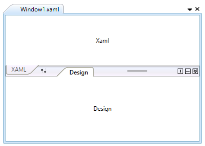

# Getting Started with TabSplitter

This section explains about how to create [TabSplitter](https://help.syncfusion.com/cr/wpf/Syncfusion.Windows.Tools.Controls.TabSplitter.html) control.

## Assembly deployment

Refer to the [control dependencies](https://help.syncfusion.com/wpf/control-dependencies#tabsplitter) section to get the list of assemblies or NuGet package that needs to be added as a reference to use the control in any application.

[Click here](https://help.syncfusion.com/wpf/visual-studio-integration/nuget-packages) to find more details on how to install nuget packages in WPF application.

## Adding the TabSplitter control via XAML

N> Download demo application from [GitHub](https://github.com/SyncfusionExamples/wpf-tabsplitter-example)

1) Create a new WPF application via Visual Studio.

2) Add the following assembly reference to this project.

* Syncfusion.Shared.WPF
* Syncfusion.Tools.WPF

3) Import Syncfusion WPF schema **http://schemas.syncfusion.com/wpf**, and declare the [TabSplitter](https://help.syncfusion.com/cr/wpf/Syncfusion.Windows.Tools.Controls.TabSplitter.html) control in XAML page.





<Window x:Class="TabSplitter.MainWindow"
        xmlns="http://schemas.microsoft.com/winfx/2006/xaml/presentation"
        xmlns:x="http://schemas.microsoft.com/winfx/2006/xaml"
        xmlns:d="http://schemas.microsoft.com/expression/blend/2008"
        xmlns:mc="http://schemas.openxmlformats.org/markup-compatibility/2006"
        xmlns:syncfusion="http://schemas.syncfusion.com/wpf"
        xmlns:local="clr-namespace:TabSplitter"
        mc:Ignorable="d"
        Title="MainWindow" Height="450" Width="800">

<Grid Name="grid">
        <syncfusion:TabSplitter Name="tabSplitter" Height="280" Width="400" />
</Grid>





## Adding the TabSplitter control via C#

1) Create a new WPF application via Visual Studio.

2) Add the following required assembly references to the project.

* Syncfusion.Shared.WPF
* Syncfusion.Tools.WPF

3) Include the required namespace.





using Syncfusion.Windows.Tools.Controls;





4) Create an instance of [TabSplitter](https://help.syncfusion.com/cr/wpf/Syncfusion.Windows.Tools.Controls.TabSplitter.html) control and add it to the window.





//Instance of TabSplitter
TabSplitter tabSplitter = new TabSplitter();
tabSplitter.Height = 280;
tabSplitter.Width = 400;

//Add control into the window
grid.Children.Add(tabSplitter);





## Adding splitter item

1) You can add the splitter item into the TabSplitter control by using [Header](https://help.syncfusion.com/cr/wpf/Syncfusion.Windows.Tools.Controls.TabSplitterItem.html#Syncfusion_Windows_Tools_Controls_TabSplitterItem_Header) property. The TabSplitter items contains a collection of panel items. The panel items are [TopPanelItems](https://help.syncfusion.com/cr/wpf/Syncfusion.Windows.Tools.Controls.TabSplitterItem.html#Syncfusion_Windows_Tools_Controls_TabSplitterItem_TopPanelItems) and [BottomPanelItems](https://help.syncfusion.com/cr/wpf/Syncfusion.Windows.Tools.Controls.TabSplitterItem.html#Syncfusion_Windows_Tools_Controls_TabSplitterItem_BottomPanelItems). You can also split the pages in TabSplitter item by using the [SplitterPage](https://help.syncfusion.com/cr/wpf/Syncfusion.Windows.Tools.Controls.SplitterPage.html).





<syncfusion:TabSplitterItem Header="Window1.xaml">                
    <syncfusion:TabSplitterItem.TopPanelItems>
        <syncfusion:SplitterPage Header="XAML" />        
    </syncfusion:TabSplitterItem.TopPanelItems>
    <syncfusion:TabSplitterItem.BottomPanelItems>
        <syncfusion:SplitterPage Header="Design" />
    </syncfusion:TabSplitterItem.BottomPanelItems>
</syncfusion:TabSplitterItem>





//Create an instances of splitter page
SplitterPage splitterPage = new SplitterPage();
splitterPage.Header = "XAML";

SplitterPage splitterPage1 = new SplitterPage();
splitterPage1.Header = "Design";

//Create the tab splitter item
TabSplitterItem tabSplitterItem1 = new TabSplitterItem();
tabSplitterItem1.Header = "MainWindow.XAML";

//Add the splitter page into the tabSplitterItem
tabSplitterItem1.TopPanelItems.Add(splitterPage);
tabSplitterItem1.BottomPanelItems.Add(splitterPage1);

//Add tabSplitterItem into the tabSplitter
tabSplitter.Items.Add(tabSplitterItem1);





2) Add any one of the control to the splitter page of TabSplitter and add the content into the splitter page.





<syncfusion:TabSplitterItem Header="Window1.xaml">                
    <syncfusion:TabSplitterItem.TopPanelItems>
        <syncfusion:SplitterPage Header="XAML">
            <Label Content="Xaml" HorizontalContentAlignment="Center" VerticalContentAlignment="Center" />
        </syncfusion:SplitterPage>
    </syncfusion:TabSplitterItem.TopPanelItems>
    <syncfusion:TabSplitterItem.BottomPanelItems>
        <syncfusion:SplitterPage Header="Design">
            <Label Content="Design" HorizontalContentAlignment="Center" VerticalContentAlignment="Center" />
        </syncfusion:SplitterPage>
    </syncfusion:TabSplitterItem.BottomPanelItems>
</syncfusion:TabSplitterItem>





Label label = new Label();
label.Content = "XAML";
label.HorizontalContentAlignment = HorizontalAlignment.Center;
label.VerticalContentAlignment = VerticalAlignment.Center;

Label label1 = new Label();
label1.Content = "Design";
label1.HorizontalContentAlignment = HorizontalAlignment.Center;
label1.VerticalContentAlignment = VerticalAlignment.Center;

splitterPage.Content = label;
splitterPage1.Content = label1;





## Tab orientation

The Tabsplitter items are placed horizontally or vertically by using the [Orientation](https://help.syncfusion.com/cr/wpf/Syncfusion.Windows.Tools.Controls.TabSplitterItem.html#Syncfusion_Windows_Tools_Controls_TabSplitterItem_Orientation) property.





<syncfusion:TabSplitterItem Header="Window1.xaml" Orientation="Vertical">
</syncfusion:TabSplitterItem>





tabSplitterItem1.Orientation = Orientation.Vertical;





## Collapsing bottom panel

You can collapse or expand the bottom panel by setting the [IsCollapsedBottomPanel](https://help.syncfusion.com/cr/wpf/Syncfusion.Windows.Tools.Controls.TabSplitterItem.html#Syncfusion_Windows_Tools_Controls_TabSplitterItem_IsCollapsedBottomPanel) property to `true`. The default value is `false`.





<syncfusion:TabSplitterItem Header="Window1.xaml" IsCollapsedBottomPanel="True">
</syncfusion:TabSplitterItem>





tabSplitterItem1.IsCollapsedBottomPanel = true;





## Theme

TabSplitter supports various built-in themes. Refer to the below links to apply themes for the TabSplitter,

  * [Apply theme using SfSkinManager](https://help.syncfusion.com/wpf/themes/skin-manager)
	
  * [Create a custom theme using ThemeStudio](https://help.syncfusion.com/wpf/themes/theme-studio#creating-custom-theme)

  
