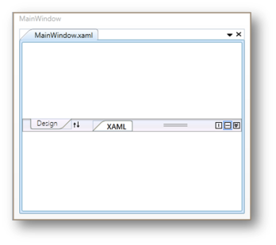

# Getting Started

## Feature Summary

This section guides you on getting started with TabSplitter control.

## Appearance and Structure of the TabSplitter Control

TabSplitter is similar to the VS 2008 style split view of tabbed groups with features like swapping, collapse and expansion of tab groups.

