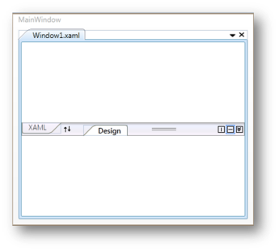

# Interactive Features in WPF Tab Splitter

This section illustrates the following interactive features of TabSplitter control. 

## Adding TabSplitterItem to the TabSplitter Control

TabSplitter contains one or more pages that are defined as TabSplitter Items. Use the following code to add a TabSplitter Item to the TabSplitter control.


 

 <!-- Adding TabSplitter -->

<syncfusion:TabSplitter Name="tabsplitter">

    <!-- Adding TabSplitterItem -->

   <syncfusion:TabSplitterItem Header="Window1.xml" Name="tabSplitterItem1">

    </syncfusion:TabSplitterItem>

</syncfusion:TabSplitter>




// Creating an instance of TabSplitter

TabSplitter tabSplitter = new TabSplitter();

// Creating an instance of TabSplitterItem

TabSplitterItem tabSplitterItem1 = new TabSplitterItem();

// Adding header of the TabSplitterItem

tabSplitterItem1.Header = "Window1.xml";         

// Adding TabSplitter Item to TabSplitter

tabSplitter.Items.Add(tabSplitterItem1);

// Adding TabSplitter to Window 

this.Content = tabsplitter;




## Panel Items

TabSplitter Items contains a collection of pages. These pages are defined as Panel Items. 

 There are two types of panel Items:

* [TopPanelItems](https://help.syncfusion.com/cr/wpf/Syncfusion.Windows.Tools.Controls.TabSplitterItem.html#Syncfusion_Windows_Tools_Controls_TabSplitterItem_TopPanelItems): consists of collection of pages that are placed at the top panel of the TabSplitter
* [BottomPanelItems](https://help.syncfusion.com/cr/wpf/Syncfusion.Windows.Tools.Controls.TabSplitterItem.html#Syncfusion_Windows_Tools_Controls_TabSplitterItem_BottomPanelItems): consists of collection of pages that are placed at the bottom panel of the TabSplitter

 The following code example can be used to add Panel Items to the TabSplitter Item:




<!-- Adding TabSplitter -->

<syncfusion:TabSplitter Name="tabsplitter">

    <!-- Adding TabSplitterItem -->

<syncfusion:TabSplitterItem Header="Window1.xml"  Name="tabSplitterItem1">

        <!-- Adding TopPanelItems -->

        <syncfusion:TabSplitterItem.TopPanelItems>

            <!-- Adding SplitterPage -->

            <syncfusion:SplitterPage Name="splitterPage1" Header="XAML">

            </syncfusion:SplitterPage>

        </syncfusion:TabSplitterItem.TopPanelItems>

        <!-- Adding BottomPanelItems -->

        <syncfusion:TabSplitterItem.BottomPanelItems>

            <!-- Adding SplitterPage -->

            <syncfusion:SplitterPage Name="splitterPage2" Header="Design">

            </syncfusion:SplitterPage>

        </syncfusion:TabSplitterItem.BottomPanelItems>

    </syncfusion:TabSplitterItem>

</syncfusion:TabSplitter>




// Creating an instance of TabSplitter

TabSplitter tabSplitter = new TabSplitter();

// Creating an instance of TabSplitterItem

TabSplitterItem tabSplitterItem1 = new TabSplitterItem();

// Adding header of the TabSplitterItem

tabSplitterItem1.Header = "Window1.xml";

// Creating an instance splitter page

SplitterPage splitterPage1 = new SplitterPage();

splitterPage1.Header = "XAML";

// Adding SplitterPage to TopPanelItem

tabSplitterItem1.TopPanelItems.Add(splitterPage1);

// Creating an instance SplitterPage

SplitterPage splitterPage2 = new SplitterPage();

splitterPage2.Header = "Design";

// Adding SplitterPage to BottomPanelItem

tabSplitterItem1.BottomPanelItems.Add(splitterPage2);

// Adding TabSplitter Item to TabSplitter

tabSplitter.Items.Add(tabSplitterItem1);

// Adding TabSplitter to Window 

this.Content = tabsplitter;




## Splitter Page

You can split the pages in the TabSplitter Item by using the [SplitterPage](https://help.syncfusion.com/cr/wpf/Syncfusion.Windows.Tools.Controls.SplitterPage.html). The following code example illustrates how to add a SplitterPage to the TabSplitter Item.




<!-- Adding TabSplitter -->

<syncfusion:TabSplitter Name="tabsplitter">

    <!-- Adding TabSplitterItem -->

  <syncfusion:TabSplitterItem Header="Window1.xml" Name="tabSplitterItem1">

        <!-- Adding TopPanelItems -->

        <syncfusion:TabSplitterItem.TopPanelItems>

            <!-- Adding SplitterPage -->

            <syncfusion:SplitterPage Name="splitterPage1" Header="XAML">

            </syncfusion:SplitterPage>

        </syncfusion:TabSplitterItem.TopPanelItems>

        <!-- Adding BottomPanelItems -->

        <syncfusion:TabSplitterItem.BottomPanelItems>

            <!-- Adding Splitter Page -->

            <syncfusion:SplitterPage Name="splitterPage2" Header="Design">

            </syncfusion:SplitterPage>

        </syncfusion:TabSplitterItem.BottomPanelItems>

    </syncfusion:TabSplitterItem>

</syncfusion:TabSplitter>




// Creating an instance of TabSplitter

TabSplitter tabSplitter = new TabSplitter();

// Creating an instance of TabSplitterItem

TabSplitterItem tabSplitterItem1 = new TabSplitterItem();

// Adding header of the TabSplitterItem

tabSplitterItem1.Header = "Window1.xml";

// Creating an instance SplitterPage

SplitterPage splitterPage1 = new SplitterPage();

splitterPage1.Header = "XAML";

// Adding SplitterPage to TopPanelItem

tabSplitterItem1.TopPanelItems.Add(splitterPage1);

// Creating an instance SplitterPage

SplitterPage splitterPage2 = new SplitterPage();

splitterPage2.Header = "Design";

// Adding SplitterPage to BottomPanelItem

tabSplitterItem1.BottomPanelItems.Add(splitterPage2);

// Adding TabSplitter Item to TabSplitter

tabSplitter.Items.Add(tabSplitterItem1);

// Adding TabSplitter to Window 

this.Content = tabsplitter;




## Collapsing Bottom Panel

You can collapse or expand the Bottom Panel by using the [IsCollapsedBottomPanel](https://help.syncfusion.com/cr/wpf/Syncfusion.Windows.Tools.Controls.TabSplitterItem.html#Syncfusion_Windows_Tools_Controls_TabSplitterItem_IsCollapsedBottomPanel) property. The default value is _false_. To collapse the Bottom Panel, refer to the following code snippet:




<!-- Adding TabSplitter -->

<syncfusion:TabSplitter Name="tabsplitter">

    <!-- Adding TabSplitterItem -->

    <syncfusion:TabSplitterItem Header="Window1.xml" IsCollapsedBottomPanel="True" Name="tabSplitterItem1">

        <!-- Adding TopPanelItems -->

        <syncfusion:TabSplitterItem.TopPanelItems>

            <!-- Adding SplitterPage -->

            <syncfusion:SplitterPage Name="splitterPage1" Header="XAML">

            </syncfusion:SplitterPage>

        </syncfusion:TabSplitterItem.TopPanelItems>

        <!-- Adding BottomPanelItems -->

        <syncfusion:TabSplitterItem.BottomPanelItems>

            <!-- Adding SplitterPage -->

            <syncfusion:SplitterPage Name="splitterPage2" Header="Design">

            </syncfusion:SplitterPage>

        </syncfusion:TabSplitterItem.BottomPanelItems>

    </syncfusion:TabSplitterItem>

</syncfusion:TabSplitter>




// Enable IsCollapseBottomPanel property.

tabSplitterItem1.IsCollapsedBottomPanel = true;  




## Setting BottomPanelHeight of TabSplitter

You can set the height of the BottomPanel in TabSplitter using [BottomPanelHeight](https://help.syncfusion.com/cr/wpf/Syncfusion.Windows.Tools.Controls.TabSplitter.html#Syncfusion_Windows_Tools_Controls_TabSplitter_BottomPanelHeight) property. To set the height of the BottomPanel, refer the following code snippet: 




<!-- Adding TabSplitter -->

<syncfusion:TabSplitter BottomPanelHeight="150">

        <!-- Adding TabSplitterItem -->

            <syncfusion:TabSplitterItem Header="MainWindow.xml">

<!-- Adding TopPanelItems -->

                <syncfusion:TabSplitterItem.TopPanelItems>

                    <syncfusion:SplitterPage Header="Design" />

                </syncfusion:TabSplitterItem.TopPanelItems>

<!-- Adding BottomPanelItems -->

                <syncfusion:TabSplitterItem.BottomPanelItems>

                    <syncfusion:SplitterPage Header="XAML"/>

                </syncfusion:TabSplitterItem.BottomPanelItems>

            </syncfusion:TabSplitterItem>

 </syncfusion:TabSplitter>




// Creating an instance of TabSplitter

            TabSplitter tabSplitter = new TabSplitter();

//Setting BottomPanelHeight property

            tabSplitter.BottomPanelHeight = 150;





