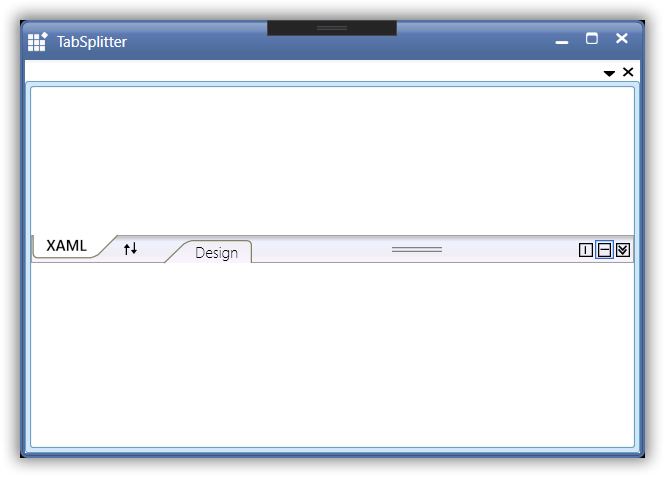

# Layout Related Features

This section illustrates the following Layout-related feature of [TabSplitter](https://help.syncfusion.com/cr/cref_files/wpf/Syncfusion.Tools.Wpf~Syncfusion.Windows.Tools.Controls.TabSplitter.html) control.

## Customizing the Appearance of TabSplitter

The appearance of the [TabSplitter](https://help.syncfusion.com/cr/cref_files/wpf/Syncfusion.Tools.Wpf~Syncfusion.Windows.Tools.Controls.TabSplitter.html) control is customized by using the appearance properties available in the control. You can set the color for the [MouseOverBackground](https://help.syncfusion.com/cr/wpf/Syncfusion.Tools.Wpf~Syncfusion.Windows.Tools.Controls.TabSplitter~MouseOverBackground.html), [MouseOverForeground](https://help.syncfusion.com/cr/wpf/Syncfusion.Tools.Wpf~Syncfusion.Windows.Tools.Controls.TabSplitter~MouseOverForeground.html), [SelectedForeground](https://help.syncfusion.com/cr/wpf/Syncfusion.Tools.Wpf~Syncfusion.Windows.Tools.Controls.TabSplitter~SelectedForeground.html) and [SelectedBackground](https://help.syncfusion.com/cr/wpf/Syncfusion.Tools.Wpf~Syncfusion.Windows.Tools.Controls.TabSplitter~SelectedBackground.html) of the TabSplitter control. Here is the code snippet.




<Grid>
        <!-- Adding TabSplitter With Selected Brush -->
    <syncfusion:TabSplitter Name="tabsplitter" MouseOverBackground="Green" MouseOverForeground="Yellow" SelectedBackground="Red" SelectedForeground="YellowGreen">
             
        <!-- Adding TabSplitterItem -->
    <syncfusion:TabSplitterItem Header="Window1.xml" Name="tabSplitterItem1">

        <!-- Adding TopPanelItems -->
        <syncfusion:TabSplitterItem.TopPanelItems> 
            <syncfusion:SplitterPage Name="splitterPage1" Header="XAML" />
        </syncfusion:TabSplitterItem.TopPanelItems>

        <!-- Adding BottomPanelItems -->
        <syncfusion:TabSplitterItem.BottomPanelItems> 
            <syncfusion:SplitterPage Name="splitterPage2" Header="Design" />
        </syncfusion:TabSplitterItem.BottomPanelItems>

    </syncfusion:TabSplitterItem>
</syncfusion:TabSplitter>
</Grid>




// Set the selected background.
tabsplitter.SelectedBackground = Brushes.Red;

// Set the selected foreground.
tabsplitter.SelectedForeground = Brushes.YellowGreen;

// Set the MouseOverBackground.
tabsplitter.MouseOverBackground = Brushes.Green;

// Set the MouseOverForeground.
tabsplitter.MouseOverForeground = Brushes.Yellow;





## Hide TabSplitterItem header tab in TabSplitter

You can hide the [TabSplitterItem](https://help.syncfusion.com/cr/cref_files/wpf/Syncfusion.Tools.Wpf~Syncfusion.Windows.Tools.Controls.TabSplitterItem.html) header tab in [TabSplitter](https://help.syncfusion.com/cr/cref_files/wpf/Syncfusion.Tools.Wpf~Syncfusion.Windows.Tools.Controls.TabSplitter.html) by enabling the [HideHeaderOnSingleChild](https://help.syncfusion.com/cr/cref_files/wpf/Syncfusion.Tools.Wpf~Syncfusion.Windows.Tools.Controls.TabSplitter~HideHeaderOnSingleChild.html)  property. This property works only if TabSplitter control has one TabSplitterItem in it.




<Grid>
    <syncfusion:TabSplitter Name="tabsplitter" HideHeaderOnSingleChild="True">
        <syncfusion:TabSplitterItem Header="Window1.xml" Name="tabSplitterItem1">
            <syncfusion:TabSplitterItem.TopPanelItems> 
                <syncfusion:SplitterPage Name="splitterPage1" Header="XAML" />
            </syncfusion:TabSplitterItem.TopPanelItems>

            <syncfusion:TabSplitterItem.BottomPanelItems> 
                <syncfusion:SplitterPage Name="splitterPage2" Header="Design" />
            </syncfusion:TabSplitterItem.BottomPanelItems>
        </syncfusion:TabSplitterItem>
    </syncfusion:TabSplitter>
</Grid>




TabSplitter tabSplitter = new TabSplitter() { HideHeaderOnSingleChild = true};

TabSplitterItem tabSplitterItem = new TabSplitterItem() { Header= "Window1.xml" };

SplitterPage page1 = new SplitterPage() { Header = "XAML" };
SplitterPage page2 = new SplitterPage() { Header = "Design" };

tabSplitterItem.TopPanelItems.Add(page1);
tabSplitterItem.BottomPanelItems.Add(page2);

tabSplitter.Items.Add(tabSplitterItem);




