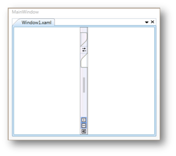

# Orientation in WPF Tab Splitter

The items in the [WPF Tab Splitter](https://www.syncfusion.com/wpf-controls/tab-splitter) are placed horizontally or vertically by using the [Orientation](https://help.syncfusion.com/cr/wpf/Syncfusion.Windows.Tools.Controls.TabSplitterItem.html#Syncfusion_Windows_Tools_Controls_TabSplitterItem_Orientation) property. This dependency property sets the orientation of the TabSplitterItem. It supports the following orientation types.

* Horizontal: The TabSplitterItem in the WPF Tab Splitter is placed horizontally.
* Vertical: The TabSplitterItem in the WPF Tab Splitter is placed vertically.

Set the orientation using the code given below:




<!-- Adding TabSplitter -->

<syncfusion:TabSplitter Name="tabsplitter">

    <!-- Adding TabSplitterItem -->

    <syncfusion:TabSplitterItem Header="Window1.xml" Orientation="Vertical" Name="tabSplitterItem1">

        <!-- Adding TopPanelItems -->

        <syncfusion:TabSplitterItem.TopPanelItems> 

            <!-- Adding SplitterPage -->

            <syncfusion:SplitterPage Name="splitterPage1" Header="XAML">

            </syncfusion:SplitterPage>

        </syncfusion:TabSplitterItem.TopPanelItems>

        <!-- Adding BottomPanelItems -->

        <syncfusion:TabSplitterItem.BottomPanelItems> 

            <!-- Adding SplitterPage -->

            <syncfusion:SplitterPage Name="splitterPage2" Header="Design">

            </syncfusion:SplitterPage>

        </syncfusion:TabSplitterItem.BottomPanelItems>

    </syncfusion:TabSplitterItem>

</syncfusion:TabSplitter>





// Set the Orientation

tabSplitterItem1.Orientation = Orientation.Vertical;




