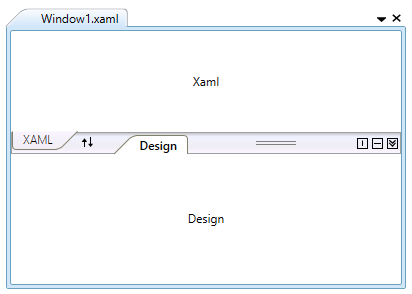

# About Syncfusion® WPF Tab Splitter Control

The WPF Tab Splitter is similar to VS 2008 style Split view of Tabbed Groups.

## Features

**Swap** - Provides support to swapping the two tab groups.

**Collapse and Expand** - Provides support to collapse and expand the tab groups.

**Layout** - Provides support to toggle between vertical and horizontal layouts.

**Appearance** - Provides support to set the Background, Foreground color to WPF Tab Splitter.
