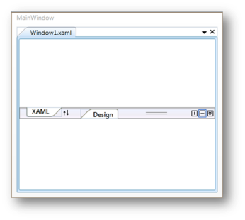

# Selected Page in WPF Tab Splitter

In the [WPF Tab Splitter](https://www.syncfusion.com/wpf-controls/tab-splitter), you can set the selected page by using the [IsSelectedPage](https://help.syncfusion.com/cr/wpf/Syncfusion.Windows.Tools.Controls.SplitterPage.html#Syncfusion_Windows_Tools_Controls_SplitterPage_IsSelectedPage) property. If this property is set to `true`, the page is selected; otherwise, it is not selected.




 <!-- Adding TabSplitter -->

<syncfusion:TabSplitter Name="tabsplitter">

    <!-- Adding TabSplitterItem -->

<syncfusion:TabSplitterItem Header="Window1.xml"  Name="tabSplitterItem1">

        <!-- Adding TopPanelItems -->

        <syncfusion:TabSplitterItem.TopPanelItems> 

            <!-- Adding SplitterPage -->

<syncfusion:SplitterPage IsSelectedPage="True" Name="splitterPage1" Header="XAML">

            </syncfusion:SplitterPage>

        </syncfusion:TabSplitterItem.TopPanelItems>

        <!-- Adding BottomPanelItems -->

        <syncfusion:TabSplitterItem.BottomPanelItems> 

            <!-- Adding SplitterPage -->

            <syncfusion:SplitterPage Name="splitterPage2" Header="Design">

            </syncfusion:SplitterPage>

        </syncfusion:TabSplitterItem.BottomPanelItems>

    </syncfusion:TabSplitterItem>

</syncfusion:TabSplitter>




// Enable the IsSelectedPage property.

splitterPage1.IsSelectedPage = true;




