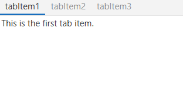
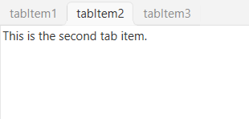
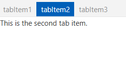

# Appearance in WPF TabControl (TabControlExt)

This section explains different UI customization and theming options available in [TabControl](https://help.syncfusion.com/cr/wpf/Syncfusion.Windows.Tools.Controls.TabControlExt.html).

## Change flow direction

You can change the flow direction of the `TabControl` layout from right to left by setting the `FlowDirection` property value as `RightToLeft`. The default value of `FlowDirection` property is `LeftToRight`.




<syncfusion:TabControlExt FlowDirection="RightToLeft"
                          Name="tabControlExt">
    <syncfusion:TabItemExt Content="This is the first tab item"
                           Header="tabItem1"/>
</syncfusion:TabControlExt>




tabControlExt.FlowDirection = FlowDirection.RightToLeft;




N> View [Sample](https://github.com/SyncfusionExamples/syncfusion-wpf-tabcontrolext-examples/tree/master/Samples/Themes) in GitHub

## TabItemHeaderStyle

You can customize the tab header style using the `TabItemHeaderStyle` property in ThemeStudio themes. The default value of `TabItemHeaderStyle`  is `Underline`.
The available header styes are,

* **Underline**

* **Curve**

* **Fill**

### Underline

The below example demonstrates the UI of the `Underline` header style.




<syncfusion:TabControlExt x:Name="tabControlExt" TabItemHeaderStyle="Underline">
    <syncfusion:TabItemExt Header="tabItem1">
        <TextBlock Name="textBlock" Text="This is the first tab item." />
    </syncfusion:TabItemExt>
    <syncfusion:TabItemExt Header="tabItem2">
        <TextBlock Name="textBlock1" Text="This is the second tab item." />
    </syncfusion:TabItemExt>
    <syncfusion:TabItemExt Header="tabItem3">
        <TextBlock Name="textBlock2" Text="This is the third tab item." />
    </syncfusion:TabItemExt>
</syncfusion:TabControlExt>




tabControlExt.TabItemHeaderStyle = TabItemHeaderStyle.Underline;




### Curve

The below example demonstrates the UI of the `Curve` header style.




<syncfusion:TabControlExt x:Name="tabControlExt" TabItemHeaderStyle="Curve">
    <syncfusion:TabItemExt Header="tabItem1">
        <TextBlock Name="textBlock" Text="This is the first tab item." />
    </syncfusion:TabItemExt>
    <syncfusion:TabItemExt Header="tabItem2">
        <TextBlock Name="textBlock1" Text="This is the second tab item." />
    </syncfusion:TabItemExt>
    <syncfusion:TabItemExt Header="tabItem3">
        <TextBlock Name="textBlock2" Text="This is the third tab item." />
    </syncfusion:TabItemExt>
</syncfusion:TabControlExt>




tabControlExt.TabItemHeaderStyle = TabItemHeaderStyle.Curve;




### Fill

The below example demonstrates the UI of the `Fill` header style.




<syncfusion:TabControlExt x:Name="tabControlExt" TabItemHeaderStyle="Fill">
    <syncfusion:TabItemExt Header="tabItem1">
        <TextBlock Name="textBlock" Text="This is the first tab item." />
    </syncfusion:TabItemExt>
    <syncfusion:TabItemExt Header="tabItem2">
        <TextBlock Name="textBlock1" Text="This is the second tab item." />
    </syncfusion:TabItemExt>
    <syncfusion:TabItemExt Header="tabItem3">
        <TextBlock Name="textBlock2" Text="This is the third tab item." />
    </syncfusion:TabItemExt>
</syncfusion:TabControlExt>




tabControlExt.TabItemHeaderStyle = TabItemHeaderStyle.Fill;




## Theme

TabControl supports various built-in themes. Refer to the below links to apply themes for the TabControl,

  * [Apply theme using SfSkinManager](https://help.syncfusion.com/wpf/themes/skin-manager)
	
  * [Create a custom theme using ThemeStudio](https://help.syncfusion.com/wpf/themes/theme-studio#creating-custom-theme)

  
