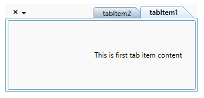
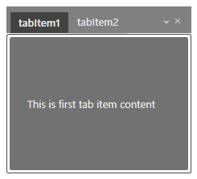

# Appearance in WPF TabControl (TabControlExt)

This section explains different UI customization and theming options available in [TabControl](https://help.syncfusion.com/cr/wpf/Syncfusion.Windows.Tools.Controls.TabControlExt.html).

## Change flow direction

You can change the flow direction of the `TabControl` layout from right to left by setting the `FlowDirection` property value as `RightToLeft`. The default value of `FlowDirection` property is `LeftToRight`.




<syncfusion:TabControlExt FlowDirection="RightToLeft"
                          Name="tabControlExt">
    <syncfusion:TabItemExt Content="This is the first tab item"
                           Header="tabItem1"/>
</syncfusion:TabControlExt>




tabControlExt.FlowDirection = FlowDirection.RightToLeft;




N> View [Sample](https://github.com/SyncfusionExamples/syncfusion-wpf-tabcontrolext-examples/tree/master/Samples/Themes) in GitHub

## Theme

You can customize the appearance of the `TabControl` control by using the [SfSkinManager.SetVisualStyle](https://help.syncfusion.com/cr/wpf/Syncfusion.SfSkinmanager.SfSkinmanager.html#Syncfusion_SfSkinManager_SfSkinManager_SetVisualStyle_System_Windows_DependencyObject_Syncfusion_SfSkinManager_VisualStyles_) method and `SfSkinManager.VisualStyle` property . The following are the various built-in visual styles for `TabControl` control.

* Blend
* Default
* Lime
* MaterialDark
* MaterialDarkBlue
* MaterialLight
* MaterialLightBlue
* Metro
* Office2010Black
* Office2010Blue
* Office2010Silver
* Office2013DarkGray
* Office2013LightGray
* Office2013White
* Office2016Colorful
* Office2016DarkGray
* Office2016White
* Office365
* Saffron
* SystemTheme
* VisualStudio2013
* VisualStudio2015

Here, the `Blend` style is applied to the `TabControl`.




<syncfusion:TabControlExt syncfusionskin:SfSkinManager.VisualStyle="Blend" 
                          Name="tabControlExt">
</syncfusion:TabControlExt>




//Namespace for the SfSkinManager.
using Syncfusion.SfSkinManager;

TabControlExt tabControlExt = new TabControlExt();
SfSkinManager.SetVisualStyle(tabControlExt, VisualStyles.Blend);




N> View [Sample](https://github.com/SyncfusionExamples/syncfusion-wpf-tabcontrolext-examples/tree/master/Samples/Themes) in GitHub
