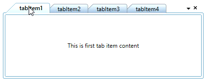

# Arrange and navigate tab items in TabControl (TabControlExt)

This section explains how to arrange the tab item and its alignment functionalities in the [TabControl](https://help.syncfusion.com/cr/wpf/Syncfusion.Tools.Wpf~Syncfusion.Windows.Tools.Controls.TabControlExt.html).

## Rearrange position of tab items

If you want to rearrange the tab items position, drag that item and drop to anywhere you want to place it in the tab panel. You can restrict it by setting the [AllowDragDrop](https://help.syncfusion.com/cr/wpf/Syncfusion.Tools.Wpf~Syncfusion.Windows.Tools.Controls.TabControlExt~AllowDragDrop.html) property value as `false`. The default value of `AllowDragDrop` property is `true`. The drag marker will preview the location, where you drop the dragged tab item.




<syncfusion:TabControlExt AllowDragDrop="True" >
    <syncfusion:TabItemExt Header="tabItem1" />
    <syncfusion:TabItemExt Header="tabItem2" />
</syncfusion:TabControlExt>




tabControlExt.AllowDragDrop = true;




N> View [Sample](https://github.com/SyncfusionExamples/syncfusion-wpf-tabcontrolext-examples/tree/master/Samples/ArranageTabs) in GitHub

### change drag marker color

You can change the drag marker color by setting the color value for the [DragMarkerColor](https://help.syncfusion.com/cr/wpf/Syncfusion.Tools.Wpf~Syncfusion.Windows.Tools.Controls.TabControlExt~DragMarkerColor.html) property. The default value of `DragMarkerColor` property is `Black`.




<syncfusion:TabControlExt DragMarkerColor="Red" 
                          AllowDragDrop="True">
    <syncfusion:TabItemExt Header="tabItem1" />
    <syncfusion:TabItemExt Header="tabItem2" />
</syncfusion:TabControlExt>




tabControlExt.DragMarkerColor = Brushes.Red;
tabControlExt.AllowDragDrop = true;




N> View [Sample](https://github.com/SyncfusionExamples/syncfusion-wpf-tabcontrolext-examples/tree/master/Samples/ArranageTabs) in GitHub

## Tab items alignment

Tab items can be aligned to any side of the `TabControl` by using the [TabStripPlacement](https://help.syncfusion.com/cr/wpf/Syncfusion.Tools.Wpf~Syncfusion.Windows.Tools.Controls.TabControlSettings~TabStripPlacement.html) property. The default value of `TabStripPlacement` property is `Top`.

The following TabStrip placement options are supported by the `TabControl`.

* Top - Tab items are placed at top of the `TabControl`.
* Bottom - Tab items are placed at bottom of the `TabControl`.
* Left - Tab items are placed at left side of the `TabControl`.
* Right - Tab items are placed at right side of the `TabControl`.




<syncfusion:TabControlExt TabStripPlacement="Bottom">
    <syncfusion:TabItemExt Header="tabItem1" />
    <syncfusion:TabItemExt Header="tabItem2" />
</syncfusion:TabControlExt>




tabControlExt.TabStripPlacement = Dock.Bottom;




N> View [Sample](https://github.com/SyncfusionExamples/syncfusion-wpf-tabcontrolext-examples/tree/master/Samples/Tabs%20Placement) in GitHub

### Rotating the tab items

Whenever the `TabStripPlacement` is set to `Left` or `Right`, the tab headers are vertically arranged. To improve the user readability, the tab items can be rotated by using the [RotateTextWhenVertical](https://help.syncfusion.com/cr/wpf/Syncfusion.Tools.Wpf~Syncfusion.Windows.Tools.Controls.TabControlExt~RotateTextWhenVertical.html) property as `true`. The default value of `RotateTextWhenVertical` property is `false`.




<syncfusion:TabControlExt RotateTextWhenVertical="True"
                          TabStripPlacement="Right">
    <syncfusion:TabItemExt Header="tabItem1" />
    <syncfusion:TabItemExt Header="tabItem2" />
</syncfusion:TabControlExt>




tabControlExt.RotateTextWhenVertical = true;
tabControlExt.TabStripPlacement = Dock.Right;




N> View [Sample](https://github.com/SyncfusionExamples/syncfusion-wpf-tabcontrolext-examples/tree/master/Samples/Tabs%20Placement) in GitHub

## Arrange tab item on single or multiple lines

You can arrange the tab item in single-line or multi-line by using the [TabItemLayout](https://help.syncfusion.com/cr/wpf/Syncfusion.Tools.Wpf~Syncfusion.Windows.Tools.Controls.TabControlExt~TabItemLayout.html) property. By default,  the tab items are arranged in a single line. The default value of `TabItemLayout` property is `SingleLine`.

`TabControl` provides the following layout types.

<table>
<tr>
<th>TabItemLayout</th>
<th>Description</th>
<th>Image</th></tr>
<tr>
<td>SingleLine</td>
<td>Tabs are displayed in single line with default width. If you add more tabs and they exceed the TabControl size, then they are in hidden state and you can navigate to that hidden tabs only by using the scroll button or mouse scrolling. In this mode, each tab size not changed based on the TabControl size.</td>
<td> 

</td>
</tr>
<tr>
<td>SingleLineStar</td>
<td>All the tabs are visible and arranged in single line. TabControl width is equally divided by the tabs. In this mode, each tab size changed based on the TabControl size.</td>
<td> 

</td>
</tr>
<tr>
<td>MultiLine</td>
<td> If you want to arrange tabs with equal width in multiple tab rows , use "MultiLine" mode.</td>
<td> 

</td>
</tr>
<tr>
<td>MultiLineWithFullWidth</td>
<td>To eliminate the empty space at the end of the row,"MultiLineWithFullWidth" is used. Here, the tabs arranged like in multiline except they expand to fill up the empty space at last row.</td>
<td> 

</td>
</tr>
<tr>
<td>MultiLineStar</td>
<td>If you want to arrange the multiple tabs with equal with and without any unwanted space at last tab, use the "MultiLineStar" mode. In this mode, multiple tabs are arranged in last row to fill the empty space</td>
<td> 

</td>
</tr>
</table>

N> `MultiLineStar` mode is preferable for the `TabControl` which contains larger width.

N> View [Sample](https://github.com/SyncfusionExamples/syncfusion-wpf-tabcontrolext-examples/tree/master/Samples/Tabs%20Placement) in GitHub




<syncfusion:TabControlExt TabItemLayout="MultiLineStar" 
                          Width="300"
                          Name="tabControlExt">
    <syncfusion:TabItemExt Header="tabItem1" />
    <syncfusion:TabItemExt Header="tabItem2" />
</syncfusion:TabControlExt>




tabControlExt.TabItemLayout = TabItemLayoutType.MultiLineStar;




N> View [Sample](https://github.com/SyncfusionExamples/syncfusion-wpf-tabcontrolext-examples/tree/master/Samples/TabControlLayout) in GitHub

## Restrict size of a TabItem

 By default, size of the tab item is based on its content. When content size changes, tab item size also changes. You can restrict it for any `TabItemLayout` modes by using the`TabItemExt.Width`, `TabItemExt.MinWidth` and `TabItemExt.MaxWidth` properties. You can resize the tab item only within the `TabItemExt.MinWidth` and `TabItemExt.MaxWidth` values.




<syncfusion:TabControlExt  TabItemLayout="SingleLine"
                          Margin="30"
                          Name="tabControlExt">
    <syncfusion:TabItemExt  MinWidth="100"  
                            Header="tabItem1"/>
    <syncfusion:TabItemExt Header="tabItem2" />
    <syncfusion:TabItemExt Header="tabItem3" />
</syncfusion:TabControlExt>




tabControlExt.TabItemLayout = TabItemLayoutType.SingleLine;




## Navigate using mouse or keyboard

You can navigate from one tab to any other tab by using the mouse click on the tab header. You can use the `Ctrl + Tab` key to navigate to the next tab item when control not in focused state. You also use the `Left-Arrow` and `Right-Arrow` key, to navigate the previous tab item or next tab item from the current tab item.

## Navigate using scroll button

If you add more tab items, then some tab headers are collapsed. If you navigate to the collapsed tab items, click the scroll button which is placed in the top-right corner of the tab header panel. You can auto visible or hide the scroll button by using the [TabScrollButtonVisibility](https://help.syncfusion.com/cr/wpf/Syncfusion.Tools.Wpf~Syncfusion.Windows.Tools.Controls.TabControlExt~TabScrollButtonVisibility.html) property value as `Auto` or `Hidden`.

The following `TabScrollStyle` supported by the `TabControl` control.

* Extended Mode - Provides the Next, Previous, Last and First navigation options
* Normal Mode – Provides the Next and Previous navigation options only




<syncfusion:TabControlExt TabScrollButtonVisibility="Auto"
                          Width="300"
                          Name="tabControlExt">
    <syncfusion:TabItemExt Header="tabItem1" />
    <syncfusion:TabItemExt Header="tabItem2" />
</syncfusion:TabControlExt>




tabControlExt.TabScrollButtonVisibility = TabScrollButtonVisibility.Auto;




### Navigate using scroll button in extended mode

You can easily navigate to first or last or next or previous tab items by setting the [TabScrollStyle](https://help.syncfusion.com/cr/wpf/Syncfusion.Tools.Wpf~Syncfusion.Windows.Tools.Controls.TabControlExt~TabScrollStyle.html) property value as `Extended`, then it will show the `First`, `Last`, `Next`, `Previous` button options in the scroll button. The default value of the `TabScrollStyle` property is `Normal`.




<syncfusion:TabControlExt TabScrollButtonVisibility="Auto"
                          TabScrollStyle="Extended" 
                          Width="300"
                          Name="tabControlExt">
    <syncfusion:TabItemExt Header="tabItem1" />
    <syncfusion:TabItemExt Header="tabItem2" />
</syncfusion:TabControlExt>




tabControlExt.TabScrollStyle = TabScrollStyle.Extended;




N> View [Sample](https://github.com/SyncfusionExamples/syncfusion-wpf-tabcontrolext-examples/tree/master/Samples/Tabs%20Placement) in GitHub

## Navigate using tab list menu

You can easily navigate to any tab item by using the tab list menu which is placed in the top-right corner of the tab header panel .The header of all tab item’s are shown as a menu item in the tab list menu. You can hide this tab list menu by using the [ShowTabListContextMenu](https://help.syncfusion.com/cr/wpf/Syncfusion.Tools.Wpf~Syncfusion.Windows.Tools.Controls.TabControlExt~ShowTabListContextMenu.html) property value as `false`.  The default value of `ShowTabListContextMenu` property is `true`.




<syncfusion:TabControlExt ShowTabListContextMenu="True"
                          Name="tabControlExt">
    <syncfusion:TabItemExt Header="tabItem1" />
    <syncfusion:TabItemExt Header="tabItem2" />
</syncfusion:TabControlExt>




tabControlExt.ShowTabListContextMenu = true;




N> View [Sample](https://github.com/SyncfusionExamples/syncfusion-wpf-tabcontrolext-examples/tree/master/Samples/ContextMenu) in GitHub

## Navigate to the hidden items using mouse scroll

If you want to navigate to the hidden tabs on the `TabItemLayout.SingleLine` layout mode, hover the mouse on tab header and scroll the mouse to backward or forward direction.

