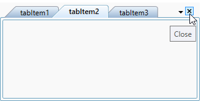
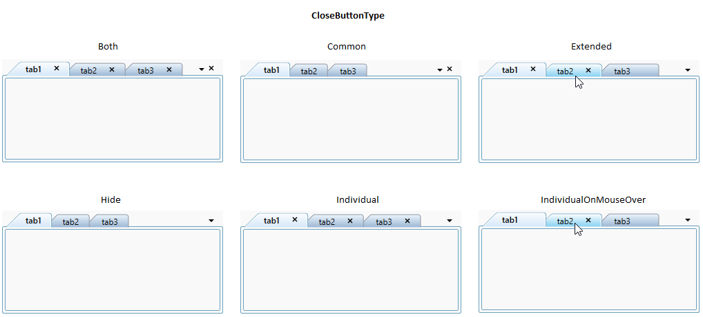
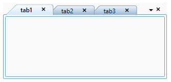
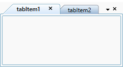
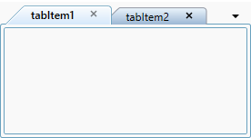
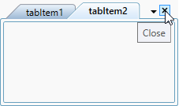

# Close tabs in WPF TabControl (TabControlExt)

This section explains how to closing the tab item and its functionalities in the [TabControl](https://help.syncfusion.com/cr/wpf/Syncfusion.Windows.Tools.Controls.TabControlExt.html).

## Closing tab item 

You can close the selected tab by clicking the close button which is placed top-right corner of the tab panel.

### Closing tab item using mouse middle click

You can close any tab item by clicking mouse middle button on the tab item header. You can enable it by setting the [CloseTabOnMiddleClick](https://help.syncfusion.com/cr/wpf/Syncfusion.Windows.Tools.Controls.TabControlExt.html#Syncfusion_Windows_Tools_Controls_TabControlExt_CloseTabOnMiddleClick) property value as `true`. The default value of `CloseTabOnMiddleClick` property is `false`.




<syncfusion:TabControlExt CloseTabOnMiddleClick="True"
                          Name="tabControlExt">
    <syncfusion:TabItemExt Header="tabItem1" Name="tabItemExt1"/>
    <syncfusion:TabItemExt Header="tabItem2" Name="tabItemExt2"/>
</syncfusion:TabControlExt>




tabControlExt.CloseTabOnMiddleClick = true;




You can also close the tab items using the default tab item context menu. Refer this [page](https://help.syncfusion.com/wpf/tabcontrol/contextmenu#default-tab-item-context-menu) to know more about the closing the tab item using context menu.

N> View [Sample](https://github.com/SyncfusionExamples/syncfusion-wpf-tabcontrolext-examples/tree/master/Samples/Tab-Closing) in GitHub

## Show or hide close button

You can show or hide the close button in each tabs and tab panel by using the [CloseButtonType](https://help.syncfusion.com/cr/wpf/Syncfusion.Windows.Tools.Controls.TabControlExt.html#Syncfusion_Windows_Tools_Controls_TabControlExt_CloseButtonType) property. 

The following Close button modes are supported by the `TabControl`.

* Common – The single close button is displayed commonly for all tab items in the tab panel.
* Individual – The close button is displayed individually for each tab items in the tab panel.
* Both – The close button is displayed individually for each tab item and also displayed in the tab panel.
* Hide – All close buttons is hidden in the tab panel.
* IndividualOnMouseOver - The close button is displayed when the mouse hovers over the tab item in the tab panel.
* Extended - The Close button is displayed in the selected tab and mousing hovering tab in the tab panel.




<syncfusion:TabControlExt CloseButtonType="Both"
                          Name="tabControlExt">
    <syncfusion:TabItemExt Header="tab1" Name="tabItemExt1"/>
    <syncfusion:TabItemExt Header="tab2" Name="tabItemExt2"/>
</syncfusion:TabControlExt>




tabControlExt.CloseButtonType = CloseButtonType.Both;




N> View [Sample](https://github.com/SyncfusionExamples/syncfusion-wpf-tabcontrolext-examples/tree/master/Samples/Tab-Closing) in GitHub

### Show or hide close button for specific tab item

You can show or hide close button for particular tab item by using the [TabItemExt.CloseButtonState](https://help.syncfusion.com/cr/wpf/Syncfusion.Windows.Tools.Controls.TabItemExt.html#Syncfusion_Windows_Tools_Controls_TabItemExt_CloseButtonState) property. The `TabItemExt.CloseButtonState` is effective only when the `CloseButtonType` property is set to one among `Individual`, `Extended`, or `Both`. 

<table>
<tr>
<td>
<b> CloseButtonState </b>   </td><td>
<b> Description </b>   </td></tr>
<tr>
<td>
Visible  </td><td>
The close button of TabItemExt is visible  </td></tr>
<tr>
<td>
Collapsed  </td><td>
The close button of TabItemExt is collapsed  </td></tr>
</table>




<syncfusion:TabControlExt CloseButtonType="Both"
                          Name="tabControlExt">
    <syncfusion:TabItemExt CloseButtonState="Visible" 
                           Header="tabItem1" Name="tabItemExt1"/>
    <syncfusion:TabItemExt CloseButtonState="Collapsed"
                           Header="tabItem2" Name="tabItemExt2"/>
</syncfusion:TabControlExt>




tabControlExt.CloseButtonType = CloseButtonType.Both;

//Changing the particular item close button visibility
tabItemExt1.CloseButtonState = Visibility.Visible;
tabItemExt2.CloseButtonState = Visibility.Collapsed;




N> View [Sample](https://github.com/SyncfusionExamples/syncfusion-wpf-tabcontrolext-examples/tree/master/Samples/Tab-Closing) in GitHub

## Restrict or allow closing the tab item

You can restrict or allow the tab item closing by using either property or event. 

### Restrict closing the tab item using property

You can restrict the closing functionality of specific tab item using the [TabItemExt.CanClose](https://help.syncfusion.com/cr/wpf/Syncfusion.Windows.Tools.Controls.TabItemExt.html#Syncfusion_Windows_Tools_Controls_TabItemExt_CanClose) property. When the `TabItemExt.CanClose` property is set to `false`, the corresponding tab item will be non-closable. The default value of `TabItemExt.CanClose` property is `true`.



 
<syncfusion:TabControlExt CloseButtonType="Individual"
                          Name="tabControlExt">
    <syncfusion:TabItemExt CanClose="False"
                           Header="tabItem1" Name="tabItemExt1"/>
    <syncfusion:TabItemExt CanClose="True" 
                           Header="tabItem2" Name="tabItemExt2"/>
</syncfusion:TabControlExt>




tabControlExt.CloseButtonType = CloseButtonType.Individual;

//Restrict and allow the particular item close button
tabItemExt1.CanClose = false;
tabItemExt2.CanClose = true;




Here, `tabItem1` cancel button is disabled.

N> View [Sample](https://github.com/SyncfusionExamples/syncfusion-wpf-tabcontrolext-examples/tree/master/Samples/Tab-Closing) in GitHub

### Restrict closing the tab item using event

The closing of tab item can be restricted by setting `e.Cancel` to `true` in [OnCloseButtonClick](https://help.syncfusion.com/cr/wpf/Syncfusion.Windows.Tools.Controls.TabControlExt.html) event. `e` represents the event argument [CloseTabEventArgs](https://help.syncfusion.com/cr/wpf/Syncfusion.Windows.Tools.Controls.CloseTabEventArgs.html) for `OnCloseButtonClick` event. The default value of `e.Cancel` is `false`.




<syncfusion:TabControlExt OnCloseButtonClick="TabControlExt_OnCloseButtonClick" >
    <syncfusion:TabItemExt Header="tabItem1" />
    <syncfusion:TabItemExt Header="tabItem2" />
</syncfusion:TabControlExt>




tabControlExt.OnCloseButtonClick += TabControlExt_OnCloseButtonClick;




You can handle the event as follows:




private void TabControlExt_OnCloseButtonClick(object sender, CloseTabEventArgs e) {
    if(e.TargetTabItem.Header.ToString() == "tabItem1") {
        e.Cancel = true;
    }               
}




Here, `tabItem1` cannot be closed.

N> View [Sample](https://github.com/SyncfusionExamples/syncfusion-wpf-tabcontrolext-examples/tree/master/Samples/Tab-Closing) in GitHub

## Hide or delete item when closing a tab

You can decide whether the tab item can be only hidden from the view or removed from the items collection of `TabControl` by using the [CloseMode](https://help.syncfusion.com/cr/wpf/Syncfusion.Windows.Tools.Controls.TabControlExt.html#Syncfusion_Windows_Tools_Controls_TabControlExt_CloseMode) property while closing it. If you set `CloseMode` property as `Hide`, the tab item will be hidden and the selection will be moved to previous index while hiding it. Also, if the property `CloseMode` is `Delete`, the tab item will be removed from the items collection and the selection will be retained in the same index while removing it. The default value of the `CloseMode` property is `Hide`.




<syncfusion:TabControlExt CloseMode="Delete"
                          Name="tabControlExt">
    <syncfusion:TabItemExt Header="tabItem1" />
    <syncfusion:TabItemExt Header="tabItem2" />
</syncfusion:TabControlExt>




tabControlExt.CloseMode = CloseMode.Delete;




N> View [Sample](https://github.com/SyncfusionExamples/syncfusion-wpf-tabcontrolext-examples/tree/master/Samples/Tab-Closing) in GitHub

## Tab item closed notification

When the tab item is closed, it will be notified by using the [TabClosed](https://help.syncfusion.com/cr/wpf/Syncfusion.Windows.Tools.Controls.TabControlExt.html) event. You can get the details about the closed tab item from [CloseTabEventArgs](https://help.syncfusion.com/cr/wpf/Syncfusion.Windows.Tools.Controls.CloseTabEventArgs.html).




<syncfusion:TabControlExt TabClosed="TabControlExt_TabClosed" >
    <syncfusion:TabItemExt Header="tabItem1" />
    <syncfusion:TabItemExt Header="tabItem2" />
</syncfusion:TabControlExt>




tabControlExt.TabClosed += TabControlExt_TabClosed;




You can handle the event as follows:




private void TabControlExt_TabClosed(object sender, CloseTabEventArgs e) {
    var deletedItem = e.TargetTabItem;
}




