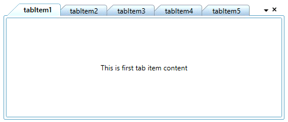
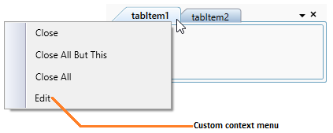
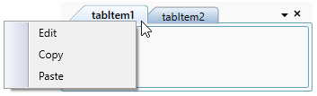
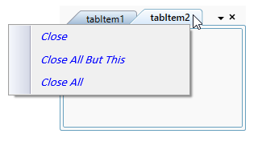
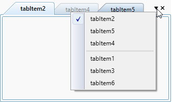
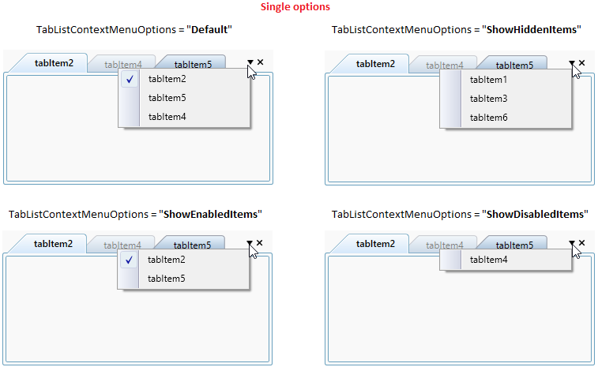
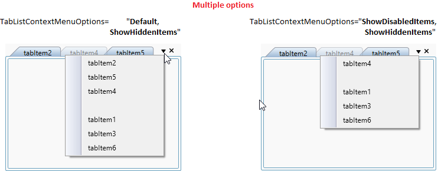
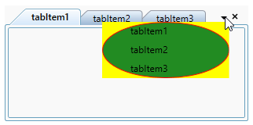
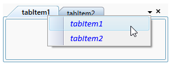

# Context menu in WPF TabControl (TabControlExt)

This section explains how to show the tab list and tab item context menu and add custom context menu in [TabControl](https://help.syncfusion.com/cr/wpf/Syncfusion.Windows.Tools.Controls.TabControlExt.html).

## Default tab item context menu

You can close the one or more tab items by using the context menu. You can enable it by using the  [ShowTabItemContextMenu](https://help.syncfusion.com/cr/wpf/Syncfusion.Windows.Tools.Controls.TabControlExt.html#Syncfusion_Windows_Tools_Controls_TabControlExt_ShowTabItemContextMenu) property to `true`. You can open this context menu by right click on tab header. The default value of `ShowTabItemContextMenu` property is `false`.

The built-in tabitem context menu has the following menu items:

* `Close` - Closes the selected tab item.
* `Close All But This` - Closes all the tab items, except the selected tab item.
* `Close All` - Closes all the tab items.

N> The [CloseMode](https://help.syncfusion.com/cr/wpf/Syncfusion.Windows.Tools.Controls.TabControlExt.html#Syncfusion_Windows_Tools_Controls_TabControlExt_CloseMode) in `TabControl` is an enum that includes option `Hide` and `Delete`. When you click any default options (Close, Close All and Close All But This) in tabitem context menu and when the `CloseMode` is set to `Hide`, the tabitem moves to the hidden state or when the `CloseMode` is set to `Delete`, the tabitem is completely deleted from `TabControl`.




<syncfusion:TabControlExt ShowTabItemContextMenu="True" 
                          CloseMode="Hide"
                          Name="tabControlExt">
    <syncfusion:TabItemExt Content="This is the first tab item"
                           Header="tabItem1"/>
</syncfusion:TabControlExt>




tabControlExt.ShowTabItemContextMenu = true;
tabControlExt.CloseMode = CloseMode.Hide;




N> View [Sample](https://github.com/SyncfusionExamples/syncfusion-wpf-tabcontrolext-examples/tree/master/Samples/ContextMenu) in GitHub

### Tab item context menu events

Closing the tab items using the context menu can be notified by following events.

* `Close` option - [OnCloseButtonClick](https://help.syncfusion.com/cr/wpf/Syncfusion.Windows.Tools.Controls.TabControlExt.html) event
* `Close All But This` option - [OnCloseOtherTabs](https://help.syncfusion.com/cr/wpf/Syncfusion.Windows.Tools.Controls.TabControlExt.html) event
* `Close All` option - [OnCloseAllTabs](https://help.syncfusion.com/cr/wpf/Syncfusion.Windows.Tools.Controls.TabControlExt.html) event.

You can use the [CloseTabEventArgs.ClosingTabItems](https://help.syncfusion.com/cr/wpf/Syncfusion.Windows.Tools.Controls.CloseTabEventArgs.html#Syncfusion_Windows_Tools_Controls_CloseTabEventArgs_ClosingTabItems) property to find out which tabitem is closing from the `OnCloseOtherTabs` and  `OnCloseAllTabs` events and use the [CloseTabEventArgs.TargetTabItem](https://help.syncfusion.com/cr/wpf/Syncfusion.Windows.Tools.Controls.CloseTabEventArgs.html#Syncfusion_Windows_Tools_Controls_CloseTabEventArgs_TargetTabItem) property to find out which tabitem is closing from the `OnCloseButtonClick` event.




<syncfusion:TabControlExt OnCloseAllTabs="TabControlExt_OnCloseAllTabs"
                          OnCloseButtonClick="TabControlExt_OnCloseButtonClick"
                          OnCloseOtherTabs="TabControlExt_OnCloseAllTabs"
                          Name="tabControlExt">
</syncfusion:TabControlExt>




tabControlExt.OnCloseAllTabs += TabControlExt_OnCloseAllTabs;
tabControlExt.OnCloseButtonClick += TabControlExt_OnCloseButtonClick;
tabControlExt.OnCloseOtherTabs += TabControlExt_OnCloseOtherTabs;




You can handle this events as follows,




private void TabControlExt_OnCloseAllTabs(object sender, CloseTabEventArgs e) {
    var closingTabItems = e.ClosingTabItems;
}
private void TabControlExt_OnCloseButtonClick(object sender, CloseTabEventArgs e) {
    var closingTabItem = e.TargetTabItem;
}
private void TabControlExt_OnCloseOtherTabs(object sender, CloseTabEventArgs e) {
    var closingTabItems = e.ClosingTabItems;
}




### Adding custom context menu item for the tab items

You can add the custom context menu item for the tab item using the [TabItemExt.ContextMenuItems](https://help.syncfusion.com/cr/wpf/Syncfusion.Windows.Tools.Controls.TabItemExt.html#Syncfusion_Windows_Tools_Controls_TabItemExt_ContextMenuItems) property. You can perform any operation by handling the `CustomMenuItem.Click` event. You can enable it by setting the [TabControlExt.IsCustomTabItemContextMenuEnabled](https://help.syncfusion.com/cr/wpf/Syncfusion.Windows.Tools.Controls.TabControlExt.html#Syncfusion_Windows_Tools_Controls_TabControlExt_IsCustomTabItemContextMenuEnabled) property to `true`. The default value of `TabControlExt.IsCustomTabItemContextMenuEnabled` property is `false`.




<syncfusion:TabControlExt IsCustomTabItemContextMenuEnabled="True"
                          Name="tabControlExt" >
    <syncfusion:TabItemExt Header="tabItem1">
        
        <!--Adding custom context menu items-->
        <syncfusion:TabItemExt.ContextMenuItems>
            <syncfusion:CustomMenuItem Header="Edit" />
        </syncfusion:TabItemExt.ContextMenuItems>
    </syncfusion:TabItemExt>
</syncfusion:TabControlExt>




// Enable custom tabitem context menu
tabControlExt.IsCustomTabItemContextMenuEnabled = true;

// Adding custom context menu for the tabitem
CustomMenuItem customMenuItem = new CustomMenuItem();
customMenuItem.Header = "Edit";
tabItemExt1.ContextMenuItems.Add(customMenuItem);




N> View [Sample](https://github.com/SyncfusionExamples/syncfusion-wpf-tabcontrolext-examples/tree/master/Samples/ContextMenu) in GitHub

### Hide default context menu items

If you want to show only custom context menu items in the default context menu, then you can hide the default context menu item using [TabControlExt.DefaultContextMenuItemVisibility](https://help.syncfusion.com/cr/wpf/Syncfusion.Windows.Tools.Controls.TabControlExt.html#Syncfusion_Windows_Tools_Controls_TabControlExt_DefaultContextMenuItemVisibility) property value as `false`. The default value of `TabControlExt.DefaultContextMenuItemVisibility` property is `true`.




<syncfusion:TabControlExt IsCustomTabItemContextMenuEnabled="True"
                          DefaultContextMenuItemVisibility="Collapsed"
                          Name="tabControlExt" >
    <syncfusion:TabItemExt Header="tabItemExt1">
        <syncfusion:TabItemExt.ContextMenuItems>
            <syncfusion:CustomMenuItem Header="Edit" />
            <syncfusion:CustomMenuItem Header="Copy" />
            <syncfusion:CustomMenuItem Header="Paste" />
        </syncfusion:TabItemExt.ContextMenuItems>
    </syncfusion:TabItemExt>
</syncfusion:TabControlExt>




//Collapse the default contextmenu visibility
tabControlExt.DefaultContextMenuItemVisibility = Visibility.Collapsed;

//Adding custom context menu for the first tabitem
CustomMenuItem customMenuItem1 = new CustomMenuItem() { Header = "Edit"};
CustomMenuItem customMenuItem2 = new CustomMenuItem() { Header = "Copy"};
CustomMenuItem customMenuItem3 = new CustomMenuItem() { Header = "Paste"};

tabItemExt1.ContextMenuItems.Add(customMenuItem1);
tabItemExt1.ContextMenuItems.Add(customMenuItem2);
tabItemExt1.ContextMenuItems.Add(customMenuItem3);




N> View [Sample](https://github.com/SyncfusionExamples/syncfusion-wpf-tabcontrolext-examples/tree/master/Samples/ContextMenu) in GitHub

### Custom template for default tab item context menu

You can customize the default tab item context menu appearance for the each tab items by using the [TabItemExt.TabItemContextMenuItemTemplate](https://help.syncfusion.com/cr/wpf/Syncfusion.Windows.Tools.Controls.TabItemExt.html#Syncfusion_Windows_Tools_Controls_TabItemExt_TabItemContextMenuItemTemplate) property.




<Window.Resources>

    <!--Custom data template for the TabItem ContextMenu-->
    <DataTemplate x:Key="TabItemContextMenuItemTemplate"
          DataType="syncfusion:TabItemExt">
        <TextBlock FontFamily="Calibri"
                   Foreground="Blue"
                   FontStyle="Oblique"
                   Text="{Binding}"/>
    </DataTemplate>
</Window.Resources>

<syncfusion:TabControlExt ShowTabItemContextMenu="True" 
                          Name="tabControlExt">
    <syncfusion:TabItemExt TabItemContextMenuItemTemplate=
                                "{StaticResource TabItemContextMenuItemTemplate}"
                           Header="tabItem1"/>
    <syncfusion:TabItemExt TabItemContextMenuItemTemplate=
                                "{StaticResource TabItemContextMenuItemTemplate}"
                           Header="tabItem2" />
</syncfusion:TabControlExt>




N> View [Sample](https://github.com/SyncfusionExamples/syncfusion-wpf-tabcontrolext-examples/tree/master/Samples/Templates) in GitHub

## Tab list context menu for switching tabs

You can easily navigate to any tab item by using the tab list menu which is placed in the top-right corner of the tab header panel .The header of all visible tab item’s are shown as a menu item in the tab list menu. You can hide this tab list menu by using the [ShowTabListContextMenu](https://help.syncfusion.com/cr/wpf/Syncfusion.Windows.Tools.Controls.TabControlExt.html#Syncfusion_Windows_Tools_Controls_TabControlExt_ShowTabListContextMenu) property value as `false`.  The default value of `ShowTabListContextMenu` property is `true`.

N> The currently selected tab item has a tick mark on the TabListContextMenu.




<syncfusion:TabControlExt ShowTabListContextMenu="True"
                          Name="tabControlExt">
    <syncfusion:TabItemExt Header="tabItem1" />
    <syncfusion:TabItemExt Header="tabItem2" />
</syncfusion:TabControlExt>




tabControlExt.ShowTabListContextMenu = true;




N> View [Sample](https://github.com/SyncfusionExamples/syncfusion-wpf-tabcontrolext-examples/tree/master/Samples/ContextMenu) in GitHub

### Show hidden tab items in tab list context menu

By default, all the tab items except hidden items are listed in the tab list context menu. If you wants to show the hidden tab items into tab list context menu to navigate, use the [TabListContextMenuOptions](https://help.syncfusion.com/cr/wpf/Syncfusion.Windows.Tools.Controls.TabControlExt.html#Syncfusion_Windows_Tools_Controls_TabControlExt_TabListContextMenuOptions) property value as `Default, ShowHiddenItems`. 

You can set the multiple options for the `TabListContextMenuOptions` to show different types of tab items into the context menu. The default value of `TabListContextMenuOptions` property is `Default`.




<syncfusion:TabControlExt TabListContextMenuOptions="Default, ShowHiddenItems"
                          ShowTabListContextMenu="True"
                          Name="tabControlExt">
    <syncfusion:TabItemExt Header="tabItem1" Visibility="Collapsed"/>
    <syncfusion:TabItemExt Header="tabItem2"/>
    <syncfusion:TabItemExt Header="tabItem3" Visibility="Collapsed"/>
    <syncfusion:TabItemExt Header="tabItem4" IsEnabled="False"/>
    <syncfusion:TabItemExt Header="tabItem5"/>
    <syncfusion:TabItemExt Header="tabItem6" Visibility="Collapsed"/>
</syncfusion:TabControlExt>




tabControlExt.ShowTabListContextMenu = true;
tabControlExt.TabListContextMenuOptions = TabListContextMenuOptions.Default | 
                                          TabListContextMenuOptions.ShowHiddenItems;




### Show specific type tab items in tab list context menu

If you want to show the specific type tab items in tab list context menu, set the single option to the `TabListContextMenuOptions` property. If you wants to show only the hidden tab items into tab list context menu to navigate, use the `TabListContextMenuOptions` property value as `ShowHiddenItems`. If you wants to show only the enabled tab items into tab list context menu to navigate, use the `TabListContextMenuOptions` property value as `ShowEnabledItems`. If you wants to show only the disabled tab items into tab list context menu to navigate, use the `TabListContextMenuOptions` property value as `ShowDisabledItems`.




<syncfusion:TabControlExt TabListContextMenuOptions="ShowEnabledItems"
                          ShowTabListContextMenu="True"
                          Name="tabControlExt">
    <syncfusion:TabItemExt Header="tabItem1" Visibility="Collapsed"/>
    <syncfusion:TabItemExt Header="tabItem2"/>
    <syncfusion:TabItemExt Header="tabItem3" Visibility="Collapsed"/>
    <syncfusion:TabItemExt Header="tabItem4" IsEnabled="False"/>
    <syncfusion:TabItemExt Header="tabItem5"/>
    <syncfusion:TabItemExt Header="tabItem6" Visibility="Collapsed"/>
</syncfusion:TabControlExt>




tabControlExt.ShowTabListContextMenu = true;
tabControlExt.TabListContextMenuOptions = TabListContextMenuOptions.ShowEnabledItems;




N> View [Sample](https://github.com/SyncfusionExamples/syncfusion-wpf-tabcontrolext-examples/tree/master/Samples/TabListContextMenuOptions) in GitHub

### Show multi-type tab items in tab list context menu

If you want to show the multiple type of tab items like enabled, disabled or hidden tab items together in tab list context menu, set the multiple options for the `TabListContextMenuOptions` property.




<syncfusion:TabControlExt TabListContextMenuOptions="ShowDisabledItems,ShowHiddenItems"
                          ShowTabListContextMenu="True"
                          Name="tabControlExt">
    <syncfusion:TabItemExt Header="tabItem1" Visibility="Collapsed"/>
    <syncfusion:TabItemExt Header="tabItem2"/>
    <syncfusion:TabItemExt Header="tabItem3" Visibility="Collapsed"/>
    <syncfusion:TabItemExt Header="tabItem4" IsEnabled="False"/>
    <syncfusion:TabItemExt Header="tabItem5"/>
    <syncfusion:TabItemExt Header="tabItem6" Visibility="Collapsed"/>
</syncfusion:TabControlExt>




tabControlExt.ShowTabListContextMenu = true;
tabControlExt.TabListContextMenuOptions = TabListContextMenuOptions.ShowDisabledItems | 
                                          TabListContextMenuOptions.ShowHiddenItems




### Custom template for the tab list context menu

You can customize the tab list menu appearance by using the [TabListContextMenuTemplate](https://help.syncfusion.com/cr/wpf/Syncfusion.Windows.Tools.Controls.TabControlExt.html#Syncfusion_Windows_Tools_Controls_TabControlExt_TabListContextMenuTemplate) property.




<syncfusion:TabControlExt ShowTabListContextMenu="True" 
                          Name="tabControlExt" >
    <syncfusion:TabControlExt.TabListContextMenuTemplate>
        <ControlTemplate>
            <Border Background="Green">
                <Border Background="Yellow"
                        Margin="5">
                    <Grid>
                        <ItemsPresenter/>
                    </Grid>
                </Border>
            </Border>
        </ControlTemplate>
    </syncfusion:TabControlExt.TabListContextMenuTemplate>
    <syncfusion:TabItemExt Header="tabItem1"/>
    <syncfusion:TabItemExt Header="tabItem2"/>
    <syncfusion:TabItemExt Header="tabItem3"/>
</syncfusion:TabControlExt>




### Custom template for the tab list menu item

You can customize the tab list menu items appearance by using the [TabListContextMenuItemTemplate](https://help.syncfusion.com/cr/wpf/Syncfusion.Windows.Tools.Controls.TabControlExt.html#Syncfusion_Windows_Tools_Controls_TabControlExt_TabListContextMenuItemTemplate) property.




<syncfusion:TabControlExt ShowTabListContextMenu="True" 
                          Name="tabControlExt" >
    <syncfusion:TabControlExt.TabListContextMenuItemTemplate>
        <DataTemplate>
            <TextBlock FontFamily="Calibri"
                       Foreground="Blue"
                       FontStyle="Oblique"
                       Text="{Binding}"/>
        </DataTemplate>
    </syncfusion:TabControlExt.TabListContextMenuItemTemplate>
    <syncfusion:TabItemExt Header="tabItem1" />
    <syncfusion:TabItemExt Header="tabItem2" />
</syncfusion:TabControlExt>




N> View [Sample](https://github.com/SyncfusionExamples/syncfusion-wpf-tabcontrolext-examples/tree/master/Samples/Templates) in GitHub