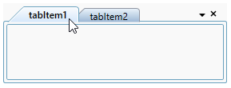
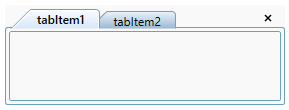

# Context menu in WPF TabControl

This section explains how to show the tab list and tabitem context menu and add custom context menu in TabControl.

## Built-in context menu of tabitem

You can show the built-in tabitem context menu by setting the [TabControlExt.ShowTabItemContextMenu](https://help.syncfusion.com/cr/wpf/Syncfusion.Tools.Wpf~Syncfusion.Windows.Tools.Controls.TabControlExt~ShowTabItemContextMenu.html) property to `true` in TabControl.

The built-in tabitem context menu has the following menu items:

* **Close** - Closes the current or selected tabitem.
* **Close All But This** - Closes all the tabitem, except the current or selected tabitem.
* **Close All** - Closes all the tabitem.

The [CloseMode](https://help.syncfusion.com/cr/wpf/Syncfusion.Tools.Wpf~Syncfusion.Windows.Tools.Controls.TabControlExt~CloseMode.html) is an enum that includes values as **Hide** and **Delete** in the TabControl. When you click any default options(Close, Close All and Close All But This) in tabitem context menu and when the `CloseMode` is set to `Hide`, the tabitem moves to the hidden state and the selection will be moved to previous selected index while hiding it or when the `CloseMode` is set to `Delete`, the tabitem is removed from TabControl, and it automatically gets deleted from the tabitem collection.





<syncfusion:TabControlExt Name="tabControl" ShowTabItemContextMenu="True" CloseMode="Hide">
    <syncfusion:TabItemExt Header="tabItem1" />
    <syncfusion:TabItemExt Header="tabItem2" />        
</syncfusion:TabControlExt>





//Set the visibility of tabitem context menu
tabControlExt.ShowTabItemContextMenu = true;

//Set close mode to TabControl
tabControlExt.CloseMode = CloseMode.Hide;





In the below screenshot, the `ShowTabItemContextMenu` property is set to `false` in TabControl.

### TabItem Context menu events

The TabControl notifies that the tabitem is closed by the user through [OnCloseOtherTabs](https://help.syncfusion.com/cr/wpf/Syncfusion.Tools.Wpf~Syncfusion.Windows.Tools.Controls.TabControlExt~OnCloseOtherTabs_EV.html), [OnCloseAllTabs](https://help.syncfusion.com/cr/wpf/Syncfusion.Tools.Wpf~Syncfusion.Windows.Tools.Controls.TabControlExt~OnCloseAllTabs_EV.html) and [OnCloseButtonClick](https://help.syncfusion.com/cr/wpf/Syncfusion.Tools.Wpf~Syncfusion.Windows.Tools.Controls.TabControlExt~OnCloseButtonClick_EV.html) events. You can use the `TargetTabItem` property to find out which tabitem is closing from TabControl in these events.





tabControlExt.OnCloseAllTabs += TabControlExt_OnCloseAllTabs;
tabControlExt.OnCloseButtonClick += TabControlExt_OnCloseButtonClick;
tabControlExt.OnCloseOtherTabs += TabControlExt_OnCloseOtherTabs;

 private void TabControlExt_OnCloseOtherTabs(object sender, CloseTabEventArgs e)
{            
    var targetTabItem = e.TargetTabItem;
}

private void TabControlExt_OnCloseButtonClick(object sender, CloseTabEventArgs e)
{
    var targetTabItem = e.TargetTabItem;
}

private void TabControlExt_OnCloseAllTabs(object sender, CloseTabEventArgs e)
{
    var targetTabItem = e.TargetTabItem;
}





## Built-in context menu of tab list

You can show the context menu of tab list by setting the [TabControlExt.ShowTabListContextMenu](https://help.syncfusion.com/cr/wpf/Syncfusion.Tools.Wpf~Syncfusion.Windows.Tools.Controls.TabControlExt~ShowTabListContextMenu.html) property to `true` in TabControl. The header of all tabitem's are shown as a menu item in the context menu of the tab list. The default value is `true`.

You can also switch the tabitem by selecting an item from the tab list context menu.





<syncfusion:TabControlExt Name="tabControl" ShowTabListContextMenu="True">
    <syncfusion:TabItemExt Header="tabItem1" />
    <syncfusion:TabItemExt Header="tabItem2" />        
</syncfusion:TabControlExt>





//Set the visibility of tab list context menu
tabControlExt.ShowTabListContextMenu = true;





In the below screenshot, the `ShowTabListContextMenu` property is set to `false` in TabControl.

### Customizing tab list context menu

You can customize the tab list context menu appearance by using `TabControlExt.TabListContextMenuItemTemplate` in TabControl.





<syncfusion:TabControlExt x:Name="tabControl"
                          ShowTabListContextMenu="True"
                          >
    <syncfusion:TabControlExt.TabListContextMenuItemTemplate>
        <DataTemplate>
            <TextBlock VerticalAlignment="Center" FontFamily="Calibri" Foreground="Blue" FontStyle="Oblique" FontSize="15" Text="{Binding}" />
        </DataTemplate>
    </syncfusion:TabControlExt.TabListContextMenuItemTemplate>
    <syncfusion:TabItemExt Header="tabItem1" />
    <syncfusion:TabItemExt Header="tabItem2" />
</syncfusion:TabControlExt>





## Custom context menu

You can add the custom tabitem context menu using the [TabItemExt.ContextMenuItems](https://help.syncfusion.com/cr/wpf/Syncfusion.Tools.Wpf~Syncfusion.Windows.Tools.Controls.TabItemExt~ContextMenuItems.html) property in TabControl. This property is enabled by setting the [TabControlExt.IsCustomTabItemContextMenuEnabled](https://help.syncfusion.com/cr/wpf/Syncfusion.Tools.Wpf~Syncfusion.Windows.Tools.Controls.TabControlExt~IsCustomTabItemContextMenuEnabled.html) property to `true`. The default value is `false`.





<syncfusion:TabControlExt Name="tabControl" IsCustomTabItemContextMenuEnabled="True">
    <syncfusion:TabItemExt Header="tabItem1">
        <syncfusion:TabItemExt.ContextMenuItems>
            <syncfusion:CustomMenuItem Header="Edit" />
        </syncfusion:TabItemExt.ContextMenuItems>
    </syncfusion:TabItemExt>
    <syncfusion:TabItemExt Header="tabItem2">
        <syncfusion:TabItemExt.ContextMenuItems>
            <syncfusion:CustomMenuItem Header="Edit" />
        </syncfusion:TabItemExt.ContextMenuItems>
    </syncfusion:TabItemExt>
</syncfusion:TabControlExt>





// Enable custom tabitem context menu
tabControlExt.IsCustomTabItemContextMenuEnabled = true;

// Adding custom context menu for the first tabitem
CustomMenuItem customMenuItem = new CustomMenuItem();
customMenuItem.Header = "Edit";
tabItemExt1.ContextMenuItems.Add(customMenuItem);

// Adding custom context menu for the second tabitem
CustomMenuItem customMenuItem1 = new CustomMenuItem();
customMenuItem1.Header = "Edit";
tabItemExt2.ContextMenuItems.Add(customMenuItem1);





If you want to show only custom context menu in TabControl, then you can collapse the default context menu item using [TabControlExt.DefaultContextMenuItemVisibility](https://help.syncfusion.com/cr/wpf/Syncfusion.Tools.Wpf~Syncfusion.Windows.Tools.Controls.TabControlExt~DefaultContextMenuItemVisibility.html) property.





<syncfusion:TabControlExt Name="tabControl" IsCustomTabItemContextMenuEnabled="True"
                                            DefaultContextMenuItemVisibility="Collapsed">
    <syncfusion:TabItemExt Header="tabItem1">
        <syncfusion:TabItemExt.ContextMenuItems>
            <syncfusion:CustomMenuItem Header="Edit" />
            <syncfusion:CustomMenuItem Header="Copy" />
            <syncfusion:CustomMenuItem Header="Paste" />
        </syncfusion:TabItemExt.ContextMenuItems>
    </syncfusion:TabItemExt>
</syncfusion:TabControlExt>





//Collapse the default contextmenu visibility
tabControlExt.DefaultContextMenuItemVisibility = Visibility.Collapsed;

//Adding custom context menu for the first tabitem
CustomMenuItem customMenuItem1 = new CustomMenuItem();
CustomMenuItem customMenuItem2 = new CustomMenuItem();
CustomMenuItem customMenuItem3 = new CustomMenuItem();

customMenuItem1.Header = "Edit";
customMenuItem2.Header = "Copy";
customMenuItem3.Header = "Paste";

tabItemExt1.ContextMenuItems.Add(customMenuItem1);
tabItemExt1.ContextMenuItems.Add(customMenuItem2);
tabItemExt1.ContextMenuItems.Add(customMenuItem3);





