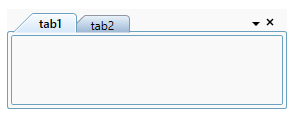
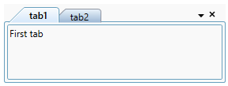

# Binding tab items in WPF TabControl

You can add a tab item using data binding in the WPF [TabControl](https://help.syncfusion.com/cr/wpf/Syncfusion.Windows.Tools.Controls.TabControlExt.html).

## Adding tab items using data binding

The `TabControl` can bound to an external source to auto create tabs and display the data using `ItemsSource` property. When you are auto generating tabitem using `ItemsSource`, you need to set `HeaderTemplate` property in `ItemContainerStyle` or `ItemTemplate` to define header and use `ContentTemplate` for display the content of the tab item.  

If the data source implements `INotifyCollectionChanged` interface, then `TabControl` will automatically refresh the UI when item is added, removed or cleared in the collection. When an item is added or removed in `ObservableCollection`, `TabControl` automatically refresh the UI as `ObservableCollection` implements `INotifyCollectionChanged`. But when an item is added or removed in `List`, `TabControl` will not refresh the UI automatically.

N> To bind `ItemsSource` to `TabControl`, you need to have collection with data object which holds header and content details.

Here, `Model` class defined with `Header` and `Content` properties and `ViewModel` class has `ItemsSource` property of type `ObservableCollection<Model>`.

N> Download demo application from [GitHub](https://github.com/SyncfusionExamples/wpf-tabcontrol-databinding)




// Model.cs
public class Model {
    public string Header { get; set; }        
    public string Content { get; set; }
    public Model() {

    }
}

//ViewModel.cs
public class ViewModel : NotificationObject {
    private ObservableCollection<Model> tabItems;
    public ObservableCollection<Model> TabItems {
        get { return tabItems; }
        set {
            tabItems = value;
            this.RaisePropertyChanged("TabItems");
        }
    }        
    
    public ViewModel() {
        tabItems = new ObservableCollection<Model>();
        PopulateCollection();
    }

    public void PopulateCollection() {
        Model model1 = new Model() {
            Header = "tab1",
            Content = "This is the content of first tabitem."
        };
        Model model2 = new Model() {
            Header = "tab1",
            Content = "This is the content of second tabitem."
        };

        //Adding the tab tems into the collection
        tabItems.Add(model1);
        tabItems.Add(model2);
    }
}







<Window.DataContext>
    <local:ViewModel />
</Window.DataContext>

<Grid>
    <syncfusion:TabControlExt ItemsSource="{Binding TabItems}"
                              Name="tabControlExt">
        <!--Binding the header text for the Tab item-->
        <syncfusion:TabControlExt.ItemContainerStyle>
            
        </syncfusion:TabControlExt.ItemContainerStyle>
        
        <!--Binding the content for the Tab item-->
        <syncfusion:TabControlExt.ContentTemplate>
            <DataTemplate>
                <TextBlock Text="{Binding Content}" />
            </DataTemplate>
        </syncfusion:TabControlExt.ContentTemplate>
    </syncfusion:TabControlExt>
</Grid>




N> View [Sample](https://github.com/SyncfusionExamples/syncfusion-wpf-tabcontrolext-examples/tree/master/Samples/Databinding) in GitHub

## TabItem Header

You can define tab item header using [ItemTemplate](https://docs.microsoft.com/en-us/dotnet/api/system.windows.controls.itemscontrol.itemtemplate?view=netframework-4.8) or `HeaderTemplate` in [ItemContainerStyle](https://docs.microsoft.com/en-us/dotnet/api/system.windows.controls.itemscontrol.itemcontainerstyle?view=netframework-4.8) properties. Otherwise, Tab Item header will display the data object class name associated with tab item.

N> The data object associated with tab item is the BindingContext for both `ItemContainerStyle.HeaderTemplate` and `ItemTemplate`.




<Window.DataContext>
    <local:ViewModel />
</Window.DataContext>

<Grid>
    <syncfusion:TabControlExt x:Name="tabControlExt" 
                              ItemsSource="{Binding TabItems}">
        <syncfusion:TabControlExt.ItemContainerStyle>
            
        </syncfusion:TabControlExt.ItemContainerStyle>
    </syncfusion:TabControlExt>
</Grid>




Below code is used to define the tabitem header using `ItemTemplate` property.




<Window.DataContext>
    <local:ViewModel />
</Window.DataContext>
<Grid>
    <syncfusion:TabControlExt x:Name="tabControl" 
                              ItemsSource="{Binding TabItems}">
        <syncfusion:TabControlExt.ItemTemplate>
            <DataTemplate>
                <TextBlock Text="{Binding Header}"/>
            </DataTemplate>
        </syncfusion:TabControlExt.ItemTemplate>
    </syncfusion:TabControlExt>
</Grid>




N> View [Sample](https://github.com/SyncfusionExamples/syncfusion-wpf-tabcontrolext-examples/tree/master/Samples/Databinding) in GitHub

## TabItem content

You can define the tab item content using `ContentTemplate` property. Otherwise, Tab item content will display the data object class name which is associated with tab item.




<Window.DataContext>
    <local:ViewModel />
</Window.DataContext>
<Grid>
    <syncfusion:TabControlExt x:Name="tabControl" 
                              ItemsSource="{Binding TabItems}">
        <syncfusion:TabControlExt.ContentTemplate>
            <DataTemplate>
                <TextBlock Text="{Binding Content}" />
            </DataTemplate>
        </syncfusion:TabControlExt.ContentTemplate>
    </syncfusion:TabControlExt>
</Grid>




##  Editing tab header

By default, built-in `TextBox` is used as editor for the tab item header editing. You can customize the editing tab item header appearance for the each tab items by using the [EditHeaderTemplate](https://help.syncfusion.com/cr/wpf/Syncfusion.Windows.Tools.Controls.TabControlExt.html#Syncfusion_Windows_Tools_Controls_TabControlExt_EditHeaderTemplate) property.




<Window.DataContext>
    <local:ViewModel />
</Window.DataContext>
<Grid>
    <syncfusion:TabControlExt ItemsSource="{Binding TabItems}"
                              Name="tabControlExt"
                              Margin="20">
        <syncfusion:TabControlExt.ItemContainerStyle>
            
        </syncfusion:TabControlExt.ItemContainerStyle>                  
        
        <!--Custom UI for edit header template-->
        <syncfusion:TabControlExt.EditHeaderTemplate>
            <DataTemplate>
                <TextBox Text="{Binding Header, Mode=TwoWay}"
                  Background="Red" 
                  Foreground="White" />
            </DataTemplate>
        </syncfusion:TabControlExt.EditHeaderTemplate>
    </syncfusion:TabControlExt>
</Grid>




N> View [Sample](https://github.com/SyncfusionExamples/syncfusion-wpf-tabcontrolext-examples/tree/master/Samples/Databinding) in GitHub