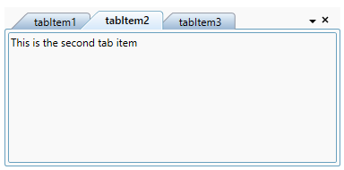

# Adding tab items in WPF TabControl

You can add a tabitem using [TabItemExt](https://help.syncfusion.com/cr/wpf/Syncfusion.Tools.Wpf~Syncfusion.Windows.Tools.Controls.TabItemExt.html) or data binding in the WPF [TabControl](https://help.syncfusion.com/cr/wpf/Syncfusion.Tools.Wpf~Syncfusion.Windows.Tools.Controls.TabControlExt.html).

## Adding tab items using TabItem

You can add the tabitem using the `Items` property of `TabControl`. You can set the tabitem name using `TabItemExt.Header` property and add the content to each tabitem by using `TabItemExt.Content` property. The default value of Content and Header properties in is `null`.




<syncfusion:TabControlExt Name="tabControl">
    <syncfusion:TabItemExt Header="tabItem1">
        <TextBlock Name="textBlock" Text="This is the first tab item." />
    </syncfusion:TabItemExt>
    <syncfusion:TabItemExt Header="tabItem2">
        <TextBlock Name="textBlock1" Text="This is the second tab item." />
    </syncfusion:TabItemExt>
    <syncfusion:TabItemExt Header="tabItem3">
        <TextBlock Name="textBlock2" Text="This is the third tab item." />
    </syncfusion:TabItemExt>
</syncfusion:TabControlExt>




// Creating an instances of tabitems and adding header & content
TabItemExt tabItemExt1 = new TabItemExt() 
{
    Header= "tabItem1", 
    Content= new TextBlock() { Text= "This is the first tab item" }  
};

TabItemExt tabItemExt2 = new TabItemExt() 
{
    Header= "tabItem2", 
    Content= new TextBlock() { Text= "This is the second tab item" }  
};

TabItemExt tabItemExt3 = new TabItemExt() 
{
    Header= "tabItem3", 
    Content= new TextBlock() { Text= "This is the third tab item" }  
};

// Creating an instances of tabitems and adding the tabitems into the TabControl
TabControlExt tabControl = new TabControlExt();
tabControl.Items.Add(tabItemExt1);
tabControl.Items.Add(tabItemExt2);
tabControl.Items.Add(tabItemExt3);




## Adding tab items using data binding

The [TabControl](https://help.syncfusion.com/cr/wpf/Syncfusion.Tools.Wpf~Syncfusion.Windows.Tools.Controls.TabControlExt.html) can bound to an external source to auto create tabs and display the data using `ItemsSource` property. `TabControl` auto creates the tabitem only if [ItemTemplate](https://docs.microsoft.com/en-us/dotnet/api/system.windows.controls.itemscontrol.itemtemplate?view=netframework-4.8) or `HeaderTemplate` in [ItemContainerStyle](https://docs.microsoft.com/en-us/dotnet/api/system.windows.controls.itemscontrol.itemcontainerstyle?view=netframework-4.8) property is defined.

If the data source implements [INotifyCollectionChanged](https://msdn.microsoft.com/en-us/library/System.Collections.Specialized.INotifyCollectionChanged) interface, then `TabControl` will automatically refresh the UI when item is added, removed or cleared in the collection. When an item is added or removed in [ObservableCollection](https://docs.microsoft.com/en-us/dotnet/api/system.collections.objectmodel.observablecollection-1?redirectedfrom=MSDN&view=netframework-4.8), `TabControl` automatically refresh the UI as `ObservableCollection` implements `INotifyCollectionChanged`. But when an item is added or removed in List, `TabControl` will not refresh the UI automatically.

N> To bind `ItemsSource` to `TabControl`, you need to have collection with data object which holds header and content details.

Here, `Model` class defined with `Header` and `Content` properties and `ViewModel` class has `ItemsSource` property of type `ObservableCollection<Model>`.

N> Download demo application from [GitHub](https://github.com/SyncfusionExamples/wpf-tabcontrol-databinding)




// Model.cs
public class Model {
    private string header;
    private string content;

    public string Header {
        get { return header; }
        set {
            header = value;
            this.RaisePropertyChanged("Header");
        }
    }
    
    public string Content {
        get { return content; }
        set
        {
            content = value;
            this.RaisePropertyChanged("Content");
        }
    }
    public Model() {
    }
}

//ViewModel.cs
public class ViewModel : NotificationObject {
    private ObservableCollection<Model> tabItems;

    public ObservableCollection<Model> TabItems {
        get { return tabItems; }
        set { 
            tabItems = value;
            this.RaisePropertyChanged("TabItems"); 
        }
    }

    public ViewModel() {
        tabItems = new ObservableCollection<Model>();
        PopulateCollection();
    }
    private void PopulateCollection() {
        Model model = new Model() { Header = "tab1", Content="This is the first tabitem's content." };
        Model model1 = new Model() { Header = "tab2", Content="This is the second tabitem's content." };
        tabItems.Add(model);
        tabItems.Add(model1);
    }
}



When you are auto generating tabitem using `ItemsSource`, you need to set [HeaderTemplate](https://docs.microsoft.com/en-us/dotnet/api/system.web.ui.webcontrols.templatefield.headertemplate?view=netframework-4.8) property in [TabControlExt.ItemContainerStyle](https://docs.microsoft.com/en-us/dotnet/api/system.windows.controls.itemscontrol.itemcontainerstyle?view=netframework-4.8) or [ItemTemplate](https://docs.microsoft.com/en-us/dotnet/api/system.windows.controls.itemscontrol.itemtemplate?view=netframework-4.8) to define header and use `ContentTemplate` for display the content of the tabitem.  

In the below code, `ViewModel` bound to `TabControl` and `ItemContainerStyle.HeaderTemplate` and `ContentTemplate` is defined to populate `TabControl` with content and header.




<syncfusion:TabControlExt ItemsSource="{Binding TabItems}"
                          Name="tabControlExt">
    <syncfusion:TabControlExt.DataContext>
        <local:ViewModel></local:ViewModel>
    </syncfusion:TabControlExt.DataContext>
    <!--Binding the header text for the Tab item-->
    <syncfusion:TabControlExt.ItemContainerStyle>
        
    </syncfusion:TabControlExt.ItemContainerStyle>

    <!--Binding the content for the Tab item-->
    <syncfusion:TabControlExt.ContentTemplate>
        <DataTemplate>
            <TextBlock Text="{Binding Content}" />
        </DataTemplate>
    </syncfusion:TabControlExt.ContentTemplate>
</syncfusion:TabControlExt>




N> Tab items are populated based on `ItemsSource` only if `ItemContainerStyle.HeaderTemplate` or `ItemTemplate` is defined.

## TabItem Header

You can define tabitem header using [ItemTemplate](https://docs.microsoft.com/en-us/dotnet/api/system.windows.controls.itemscontrol.itemtemplate?view=netframework-4.8) or `HeaderTemplate` in [ItemContainerStyle](https://docs.microsoft.com/en-us/dotnet/api/system.windows.controls.itemscontrol.itemcontainerstyle?view=netframework-4.8) properties. Otherwise, TabItem header will display the data object class name associated with tabitem.

N> The data object associated with tabitem is the BindingContext for both `ItemContainerStyle.HeaderTemplate` and `ItemTemplate`.

Below code is used to define the tabitem header using `HeaderTemplate` in `ItemContainerStyle` property.





<Window.DataContext>
        <local:ViewModel />
</Window.DataContext>
<Grid>
    <syncfusion:TabControlExt x:Name="tabControl" 
                          Height="100" Width="280" 
                          ItemsSource="{Binding TabItems}">
        <syncfusion:TabControlExt.ItemContainerStyle>
            
        </syncfusion:TabControlExt.ItemContainerStyle>
    </syncfusion:TabControlExt>
</Grid>





Below code is used to define the tabitem header using `ItemTemplate` property.





<Window.DataContext>
        <local:ViewModel />
</Window.DataContext>
<Grid>
    <syncfusion:TabControlExt x:Name="tabControl" 
                          Height="100" Width="280" 
                          ItemsSource="{Binding TabItems}">
        <syncfusion:TabControlExt.ItemTemplate>
            <DataTemplate>
                <TextBlock Text="{Binding Header}"/>
            </DataTemplate>
        </syncfusion:TabControlExt.ItemTemplate>
    </syncfusion:TabControlExt>
</Grid>





## TabItem content

You can define the tabitem content using [TabControlExt.ContentTemplate](https://docs.microsoft.com/en-us/dotnet/api/system.windows.controls.contentcontrol.contenttemplate?view=netframework-4.8) property. Otherwise, TabItem content will display the data object class name which is associated with tabitem.





<Window.DataContext>
        <local:ViewModel />
</Window.DataContext>
<Grid>
    <syncfusion:TabControlExt x:Name="tabControl" 
                          Height="100" Width="280" 
                          ItemsSource="{Binding TabItems}"
                          >
        <syncfusion:TabControlExt.ContentTemplate>
            <DataTemplate>
                <TextBlock Text="{Binding Content}" />
            </DataTemplate>
        </syncfusion:TabControlExt.ContentTemplate>
    </syncfusion:TabControlExt>    
</Grid>





