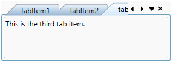
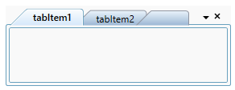

# Getting Started with TabControl

This section explains how to create a WPF TabControl and explains about its structure.

## Structure of TabControl

The various elements of TabControl are illustrated in the following screenshot.

## Assembly deployment

Refer to the [Control Dependencies](https://help.syncfusion.com/wpf/control-dependencies#tabcontrolext) section to get the list of assemblies or NuGet package that needs to be added as a reference to use the control in any application.

Refer to this [documentation](https://help.syncfusion.com/wpf/visual-studio-integration/nuget-packages) to find more details about installing nuget packages in a WPF application.

## Adding WPF TabControl via designer

1) The TabControl can be added to an application by dragging it from the toolbox to a designer view. The following dependent assemblies will be added automatically:

* Syncfusion.Tools.WPF
* Syncfusion.Shared.WPF

2) Set the properties for TabControl in design mode using the SmartTag feature.

## Adding WPF TabControl via XAML

To add the TabControl manually in XAML, follow these steps:

1) Create a new WPF project in Visual Studio.

2) Add the following required assembly references to the project:

* Syncfusion.Tools.WPF
* Syncfusion.Shared.WPF

3) Import Syncfusion WPF schema **http://schemas.syncfusion.com/wpf**, and declare the TabControl in XAML page.





<Window x:Class="TabControlExt_sample.MainWindow"
        xmlns="http://schemas.microsoft.com/winfx/2006/xaml/presentation"
        xmlns:x="http://schemas.microsoft.com/winfx/2006/xaml"
        xmlns:d="http://schemas.microsoft.com/expression/blend/2008"
        xmlns:mc="http://schemas.openxmlformats.org/markup-compatibility/2006"
        xmlns:local="clr-namespace:TabControlExt_sample"
        xmlns:syncfusion="http://schemas.syncfusion.com/wpf"
        mc:Ignorable="d"
        Title="MainWindow" Height="450" Width="800">

<Grid Name="grid">
    <syncfusion:TabControlExt Name="tabControl" Height="100" Width="280" />
</Grid>





## Adding WPF TabControl via C#

To add the TabControl manually in C#, follow these steps:

1) Create a new WPF application via Visual Studio.

2) Add the following required assembly references to the project:

* Syncfusion.Tools.WPF
* Syncfusion.Shared.WPF

3) Include the required namespace.





using Syncfusion.Windows.Tools.Controls;





4) Create an instance of [TabControl](https://help.syncfusion.com/cr/wpf/Syncfusion.Tools.Wpf~Syncfusion.Windows.Tools.Controls.TabControlExt.html), and add it to the window.





// Creating an instance of the TabControl
TabControlExt tabControlExt = new TabControlExt();

// Setting height and width to TabControl
tabControlExt.Height = 100;
tabControlExt.Width = 280;

// Adding control into the main window
grid.Children.Add(tabControlExt); 





## Adding TabItem

You can add the tabitem using the [TabControlExt.Items](https://docs.microsoft.com/en-us/dotnet/api/system.windows.controls.itemscontrol.items?redirectedfrom=MSDN&view=netframework-4.8#System_Windows_Controls_ItemsControl_Items) property of TabControl. You can set the tabitem name using [TabItemExt.Header](https://docs.microsoft.com/en-us/dotnet/api/system.windows.controls.headeredcontentcontrol.header?redirectedfrom=MSDN&view=netframework-4.8#System_Windows_Controls_HeaderedContentControl_Header) property and add the content to each TabItem by using [TabItemExt.Content](https://docs.microsoft.com/en-us/dotnet/api/system.windows.controls.contentcontrol.content?redirectedfrom=MSDN&view=netframework-4.8#System_Windows_Controls_ContentControl_Content) property.

N> Download demo application from [GitHub](https://github.com/SyncfusionExamples/getting-started-with-wpf-tabcontrol)





<syncfusion:TabControlExt Name="tabControl">
    <syncfusion:TabItemExt Header="tabItem1">
        <TextBlock Name="textBlock" Text="This is the first tab item." />
    </syncfusion:TabItemExt>
    <syncfusion:TabItemExt Header="tabItem2">
        <TextBlock Name="textBlock1" Text="This is the second tab item." />
    </syncfusion:TabItemExt>
    <syncfusion:TabItemExt Header="tabItem3">
        <TextBlock Name="textBlock2" Text="This is the third tab item." />
    </syncfusion:TabItemExt>
</syncfusion:TabControlExt>





// Creating an instances of tabitems
TabItemExt tabItemExt1 = new TabItemExt();
TabItemExt tabItemExt2 = new TabItemExt();
TabItemExt tabItemExt3 = new TabItemExt();

// Adding header into tabitems
tabItemExt1.Header = "tabItem1";
tabItemExt2.Header = "tabItem2";
tabItemExt3.Header = "tabItem3";

// Creating an instance of TextBlock
TextBlock textBlock1 = new TextBlock();
TextBlock textBlock2 = new TextBlock();
TextBlock textBlock3 = new TextBlock();

// Adding the text
textBlock1.Text = "This is the first tab item.";
textBlock2.Text = "This is the second tab item.";
textBlock3.Text = "This is the third tab item.";

// Adding the textblock into tabitem
tabItemExt1.Content = textBlock1;
tabItemExt2.Content = textBlock2;
tabItemExt3.Content = textBlock3;

// Adding the tabitems into the tabcontrol
tabControlExt.Items.Add(tabItemExt1);
tabControlExt.Items.Add(tabItemExt2);
tabControlExt.Items.Add(tabItemExt3);





## Placement of TabItem

You can place the tabitem header at any of the four sides of TabControl using the [TabStripPlacement](https://help.syncfusion.com/cr/wpf/Syncfusion.Tools.Wpf~Syncfusion.Windows.Tools.Controls.TabControlSettings~TabStripPlacement.html) property.





<syncfusion:TabControlExt TabStripPlacement="Bottom">
    <syncfusion:TabItemExt Header="tabItem1">
        <TextBlock Name="textBlock" Text="This is the first tab item." />
    </syncfusion:TabItemExt>
    <syncfusion:TabItemExt Header="tabItem2">
        <TextBlock Name="textBlock1" Text="This is the second tab item." />
    </syncfusion:TabItemExt>
    <syncfusion:TabItemExt Header="tabItem3">
        <TextBlock Name="textBlock" Text="This is the third tab item." />
    </syncfusion:TabItemExt>
</syncfusion:TabControlExt>





tabControlExt.TabStripPlacement = Dock.Bottom;





## Selecting TabItem

You can select a particular tabitem in TabControl by setting the [IsSelected](https://docs.microsoft.com/en-us/dotnet/api/system.windows.controls.tabitem.isselected?redirectedfrom=MSDN&view=netframework-4.8#System_Windows_Controls_TabItem_IsSelected) property to `true`.





<syncfusion:TabControlExt Name="tabControl">
    <syncfusion:TabItemExt Header="tabItem1" />
    <syncfusion:TabItemExt Header="tabItem2" />
    <syncfusion:TabItemExt Header="tabItem3" IsSelected="True"/>
</syncfusion:TabControlExt>





tabItemExt3.IsSelected = true;





### Tab Selection event

The TabControl notifies that the selected tabitem is changed by user through the [SelectedChangedEvent](https://help.syncfusion.com/cr/wpf/Syncfusion.Tools.Wpf~Syncfusion.Windows.Tools.Controls.TabControlExt~SelectedItemChangedEvent_EV.html) event. You can use the `OldSelectedItem` and `NewSelectedItem` properties to get the old and new selected tabitem in the `SelectedItemChangedEvent` event.





tabControlExt.SelectedItemChangedEvent += TabControlExt_SelectedItemChangedEvent;

private void TabControlExt_SelectedItemChangedEvent(object sender, SelectedItemChangedEventArgs e)
{
    var newTabItem = e.NewSelectedItem.Header;
    if (e.OldSelectedItem != null)
    {
        var oldTabItem = e.OldSelectedItem.Header;
    }
    else
    {
        var oldTabItem = string.Empty;
    }
}





## Working with tab close button

TabControl allows end-users to close the tabs using close button. The close button can be displayed in tabcontrol using [TabControlExt.CloseButtonType](https://help.syncfusion.com/cr/wpf/Syncfusion.Tools.Wpf~Syncfusion.Windows.Tools.Controls.TabControlExt~CloseButtonType.html) property. 
The following options are supported to show close the button in TabControl.

* **Common** - Only, Tab control shows the close button.

* **Individual** - The close button displayed only in the headers of tabitem.

* **Both** - TabControl and TabItem displays the close button.

* **Hide** - The close button is not visible.

* **IndividualOnMouseOver** - The close button displayed only when the mouse is over the tabitem.

* **Extended** - The close button displayed only for the selected tabitem and the remaining tabitem displays close button  while mouse is over the tab header.

For example, When you set the `TabControlExt.CloseButtonType` as `Both`, then the close button is displayed in both TabItem and TabControl. 





<syncfusion:TabControlExt Name="tabControl" CloseButtonType="Both">
    <syncfusion:TabItemExt Header="tabItem1" />
    <syncfusion:TabItemExt Header="tabItem2" />
</syncfusion:TabControlExt>





//set `Both` option to `CloseButtonType` property.
tabControlExt.CloseButtonType = CloseButtonType.Both;





You can disable the users from closing on particular tabitem by setting [TabItemExt.CanClose](https://help.syncfusion.com/cr/wpf/Syncfusion.Tools.Wpf~Syncfusion.Windows.Tools.Controls.TabItemExt~CanClose.html) property as `false`.





<syncfusion:TabControlExt Name="tabControl" CloseButtonType="Both">
    <syncfusion:TabItemExt Header="tabItem1" />
    <syncfusion:TabItemExt Header="tabItem2" CanClose="False" />
</syncfusion:TabControlExt>





//set `Both` option to `CloseButtonType` property.
tabControlExt.CloseButtonType = CloseButtonType.Both;

//Disable the close button.
tabItemExt2.CanClose = false;





In the below screenshot, second tabitem `TabItemExt.CanClose` property is `false`. So, close button in tabitem header and tabcontrol is in disabled state for second tabitem.

If you want to collapse the visibility of close button in particular tabitem, then you can collapse using [TabItemExt.CloseButtonState](https://help.syncfusion.com/cr/wpf/Syncfusion.Tools.Wpf~Syncfusion.Windows.Tools.Controls.TabItemExt~CloseButtonState.html) property.





<syncfusion:TabControlExt Name="tabControl" CloseButtonType="Both" CanClose="False">
    <syncfusion:TabItemExt Header="tabItem1" CloseButtonState="Collapsed" />
    <syncfusion:TabItemExt Header="tabItem2" />
</syncfusion:TabControlExt>





//set `Both` option to `CloseButtonType` property.
tabControlExt.CloseButtonType = CloseButtonType.Both;

//Disable the close button.
tabItemExt2.CanClose = false;

//Collapse the close button.
tabItemExt2.CloseButtonState = Collapsed;





## Show or hide new tab button

You can show the new tab button by setting the [TabControlExt.IsNewButtonEnabled](https://help.syncfusion.com/cr/wpf/Syncfusion.Tools.Wpf~Syncfusion.Windows.Tools.Controls.TabControlExt~IsNewButtonEnabled.html) property to `true` in TabControl. The [NewButtonClick](https://help.syncfusion.com/cr/wpf/Syncfusion.Tools.Wpf~Syncfusion.Windows.Tools.Controls.TabControlExt~NewButtonClick_EV.html) event handles the click action of new tab button to add new tabitem in TabControl.





<syncfusion:TabControlExt Name="tabControl" IsNewButtonEnabled="True" NewButtonClick="TabControl_NewButtonClick" >
            <syncfusion:TabItemExt Header="tabItem1" />
            <syncfusion:TabItemExt Header="tabItem2" />
    </syncfusion:TabItemExt>
</syncfusion:TabControlExt>





private void TabControl_NewButtonClick(object sender, EventArgs e)
{
    TabItemExt itemExt = new TabItemExt();
    itemExt.Header = "tabItem" + (tabControl.Items.Count + 1);
    tabControl.Items.Add(itemExt);
}





## Show or hide TabList context menu

You can show the tab list context menu by setting the [TabControlExt.ShowTabListContextMenu](https://help.syncfusion.com/cr/wpf/Syncfusion.Tools.Wpf~Syncfusion.Windows.Tools.Controls.TabControlExt~ShowTabListContextMenu.html) property to `true` in TabControl.





<syncfusion:TabControlExt Name="tabControl" ShowTabListContextMenu="True">
            <syncfusion:TabItemExt Header="tabItem1" />
            <syncfusion:TabItemExt Header="tabItem2" />
    </syncfusion:TabItemExt>
</syncfusion:TabControlExt>





tabControlExt.ShowTabListContextMenu = true;





## Enable or disable tab navigation bar

The [TabControlExt.TabScrollButtonVisibility](https://help.syncfusion.com/cr/wpf/Syncfusion.Tools.Wpf~Syncfusion.Windows.Tools.Controls.TabControlExt~TabScrollButtonVisibility.html) property is used to decide whether to enable or disable the tab navigation bar in TabControl. You can show the different tab navigation style in TabControl using the [TabScrollStyle](https://help.syncfusion.com/cr/wpf/Syncfusion.Tools.Wpf~Syncfusion.Windows.Tools.Controls.TabControlExt~TabScrollStyle.html) property.





<syncfusion:TabControlExt Name="tabControl" TabScrollStyle="Extended" TabScrollButtonVisibility="Visible">
    <syncfusion:TabItemExt Name="tabItemExt1" Header="tabItem1" />
    <syncfusion:TabItemExt Name="tabItemExt2" Header="tabItem2" />
</syncfusion:TabControlExt>





tabControlExt.TabScrollStyle = TabScrollStyle.Extended;
tabControlExt.TabScrollButtonVisibility = TabScrollButtonVisibility.Visible;





## Show or hide built-in context menu

You can show the built-in context menu of the tabitem by setting the [TabControlExt.ShowTabItemContextMenu](https://help.syncfusion.com/cr/wpf/Syncfusion.Tools.Wpf~Syncfusion.Windows.Tools.Controls.TabControlExt~ShowTabItemContextMenu.html) property to `true` in TabControl.

The built-in context menu of the tab item has following menu items:

* **Close** - Closes the current or selected tab item.
* **Close All But This** - Closes all the tab items, except the current or selected tab item.
* **Close All** - Closes all the tab items.





<syncfusion:TabControlExt Name="tabControl" ShowTabItemContextMenu="True">
    <syncfusion:TabItemExt Header="tabItem1" />
    <syncfusion:TabItemExt Header="tabItem2" />        
</syncfusion:TabControlExt>





//Changing the visibility of context menu
tabControlExt.ShowTabItemContextMenu = true;





You can add custom context menu item using the [TabItemExt.ContextMenuItems](https://help.syncfusion.com/cr/wpf/Syncfusion.Tools.Wpf~Syncfusion.Windows.Tools.Controls.TabItemExt~ContextMenuItems.html) property in TabControl. This property is enabled by setting the [TabControlExt.IsCustomTabItemContextMenuEnabled](https://help.syncfusion.com/cr/wpf/Syncfusion.Tools.Wpf~Syncfusion.Windows.Tools.Controls.TabControlExt~IsCustomTabItemContextMenuEnabled.html) property to `true`.





<syncfusion:TabControlExt IsCustomTabItemContextMenuEnabled="True">
    <syncfusion:TabItemExt Header="tabItem1">
        <syncfusion:TabItemExt.ContextMenuItems>
            <syncfusion:CustomMenuItem Header="Menu1" />
        </syncfusion:TabItemExt.ContextMenuItems>
    </syncfusion:TabItemExt>
    <syncfusion:TabItemExt Header="tabItem2" IsSelected="True">
        <syncfusion:TabItemExt.ContextMenuItems>
            <syncfusion:CustomMenuItem Header="Menu2" />
        </syncfusion:TabItemExt.ContextMenuItems>
    </syncfusion:TabItemExt>
</syncfusion:TabControlExt>





// Enabling custom tabitem context menu
tabControlExt.IsCustomTabItemContextMenuEnabled = true;

// Adding custom context menu for the first tabitem
CustomMenuItem customMenuItem = new CustomMenuItem();
customMenuItem.Header = "New1";
tabItemExt.ContextMenuItems.Add(customMenuItem);

// Adding custom context menu for the second tabitem
CustomMenuItem customMenuItem1 = new CustomMenuItem();
customMenuItem1.Header = "Menu2";
tabItemExt1.ContextMenuItems.Add(customMenuItem1);





