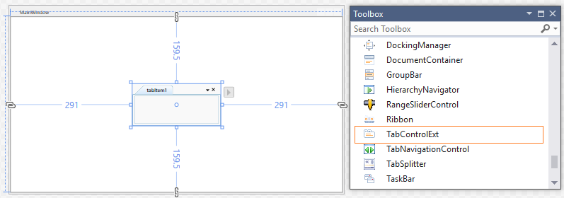
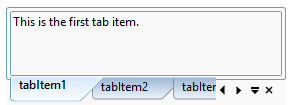
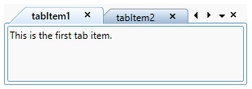
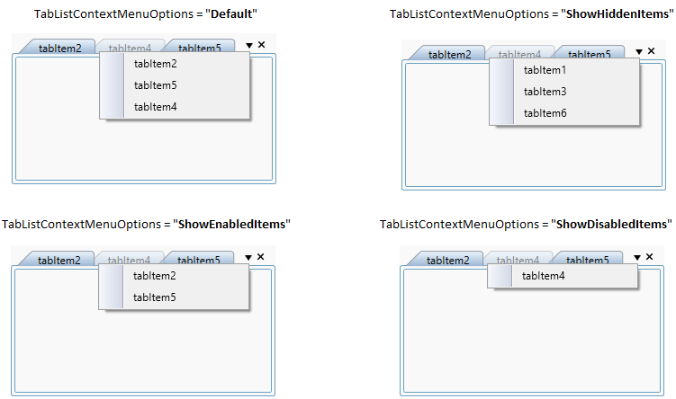
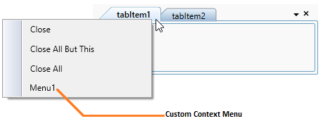

# Getting Started with WPF TabControl (TabControlExt)

This section explains how to create a WPF [TabControl](https://help.syncfusion.com/cr/wpf/Syncfusion.Windows.Tools.Controls.TabControlExt.html) and explains about its structure.

## Structure of TabControl

The various elements of `TabControl` are illustrated in the following images.

## Assembly deployment

Refer to the [Control Dependencies](https://help.syncfusion.com/wpf/control-dependencies#tabcontrolext) section to get the list of assemblies or NuGet package that needs to be added as a reference to use the control in any application.

Refer to this [documentation](https://help.syncfusion.com/wpf/visual-studio-integration/nuget-packages) to find more details about installing nuget packages in a WPF application.

## Adding WPF TabControl via designer

You can add the `TabControl` control to an application by dragging it from the toolbox to a view of the designer. The following dependent assembly will be added automatically.

* Syncfusion.Tools.WPF
* Syncfusion.Shared.WPF

## Adding WPF TabControl via XAML

To add the `TabControl` manually in XAML, follow these steps:

1) Create a new WPF project in Visual Studio.

2) Add the following required assembly references to the project:

    * Syncfusion.Tools.WPF
    * Syncfusion.Shared.WPF

3) Import Syncfusion WPF schema **http://schemas.syncfusion.com/wpf**, and declare the `TabControl` in XAML page.





<Window x:Class="TabControlExt_sample.MainWindow"
        xmlns="http://schemas.microsoft.com/winfx/2006/xaml/presentation"
        xmlns:x="http://schemas.microsoft.com/winfx/2006/xaml"
        xmlns:d="http://schemas.microsoft.com/expression/blend/2008"
        xmlns:mc="http://schemas.openxmlformats.org/markup-compatibility/2006"
        xmlns:local="clr-namespace:TabControlExt_sample"
        xmlns:syncfusion="http://schemas.syncfusion.com/wpf"
        mc:Ignorable="d"
        Title="MainWindow" Height="450" Width="800">

<Grid Name="grid">
    <syncfusion:TabControlExt Name="tabControl" Height="100" Width="280" />
</Grid>





## Adding WPF TabControl via C#

To add the [TabControl](https://www.syncfusion.com/wpf-controls/tabcontrol) control manually in C#, follow these steps:

1. Create a new WPF application via Visual Studio.

2. Add the  following assembly references to the project,
    * Syncfusion.Shared.WPF

3. Include the required namespace and create an instance of `TabControl` and add it to the window.

4.	Declare the `TabControl` control using C#.




using Syncfusion.Windows.Tools.Controls;

public partial class MainWindow : Window {
    public MainWindow() {
        InitializeComponent();

        // Creating an instance of the TabControl
        TabControlExt tabControlExt = new TabControlExt();

        // Setting height and width to TabControl
        tabControlExt.Height = 100;
        tabControlExt.Width = 280;

        //Adding TabControl as window content
        this.Content = tabControlExt;
    }
}




## Adding TabItem

You can add the tab item using the `Items` property of `TabControl`. You can set the tab item name using `TabItemExt` property and add the content to each tab item by using `TabItemExt.Content` property.




<syncfusion:TabControlExt Name="tabControlExt">
    <syncfusion:TabItemExt Header="tabItem1">
        <TextBlock Name="textBlock" Text="This is the first tab item." />
    </syncfusion:TabItemExt>
    <syncfusion:TabItemExt Header="tabItem2">
        <TextBlock Name="textBlock1" Text="This is the second tab item." />
    </syncfusion:TabItemExt>
    <syncfusion:TabItemExt Header="tabItem3">
        <TextBlock Name="textBlock2" Text="This is the third tab item." />
    </syncfusion:TabItemExt>
</syncfusion:TabControlExt>




// Creating an instances of tabitems and adding header & content
TabItemExt tabItemExt1 = new TabItemExt() 
{
    Header= "tabItem1", 
    Content= new TextBlock() { Text= "This is the first tab item" }  
};

TabItemExt tabItemExt2 = new TabItemExt() 
{
    Header= "tabItem2", 
    Content= new TextBlock() { Text= "This is the second tab item" }  
};

TabItemExt tabItemExt3 = new TabItemExt() 
{
    Header= "tabItem3", 
    Content= new TextBlock() { Text= "This is the third tab item" }  
};

// Creating an instances of TabControl and adding the tabitems into the TabControl
TabControlExt tabControlExt = new TabControlExt();
tabControlExt.Items.Add(tabItemExt1);
tabControlExt.Items.Add(tabItemExt2);
tabControlExt.Items.Add(tabItemExt3);




 

Please refer [DataBinding](https://help.syncfusion.com/wpf/tabcontrol/databinding) page to know about how to add a tab item using Data Binding.

N> View [Sample](https://github.com/SyncfusionExamples/syncfusion-wpf-tabcontrolext-examples/tree/master/Samples/Getting-Started) in GitHub

## Placement of TabItem

You can place the tab item header at any of the four sides of `TabControl` using the [TabStripPlacement](https://help.syncfusion.com/cr/wpf/Syncfusion.Windows.Tools.Controls.TabControlSettings.html#Syncfusion_Windows_Tools_Controls_TabControlSettings_TabStripPlacement) property.




<syncfusion:TabControlExt TabStripPlacement="Bottom" 
                          Name="tabControlExt">
    <syncfusion:TabItemExt Header="tabItem1" />
    <syncfusion:TabItemExt Header="tabItem2" />
    <syncfusion:TabItemExt Header="tabItem3" />
</syncfusion:TabControlExt>




tabControlExt.TabStripPlacement = Dock.Bottom;




N> View [Sample](https://github.com/SyncfusionExamples/syncfusion-wpf-tabcontrolext-examples/tree/master/Samples/Tabs%20Placement) in GitHub

## Selecting TabItem

You can select a particular tab item by using the mouse click on the tab header. You can use the `Ctrl + Tab` key to select a tab item when control not in focused state. You also use the `Left-Arrow` and `Right-Arrow` key , to select the previous tab item or next tab item of current selected tab item when control in focused . You can get the selected item by using the `SelectedItem` property. By default, the first tab item is selected.

N> You can select only one tab item at a time.

N> View [Sample](https://github.com/SyncfusionExamples/syncfusion-wpf-tabcontrolext-examples/tree/master/Samples/SelectedItem) in GitHub

### Tab selection changed notification

The `TabControl` notifies that the selected tab item is changed by user through the [SelectedItemChangedEvent](https://help.syncfusion.com/cr/wpf/Syncfusion.Windows.Tools.Controls.TabControlExt.html) event. You can use the [OldSelectedItem](https://help.syncfusion.com/cr/wpf/Syncfusion.Windows.Tools.Controls.SelectedItemChangedEventArgs.html#Syncfusion_Windows_Tools_Controls_SelectedItemChangedEventArgs_OldSelectedItem) and [NewSelectedItem](https://help.syncfusion.com/cr/wpf/Syncfusion.Windows.Tools.Controls.SelectedItemChangedEventArgs.html#Syncfusion_Windows_Tools_Controls_SelectedItemChangedEventArgs_NewSelectedItem) properties to get the old and new selected tabitem in the `SelectedItemChangedEvent` event.




<syncfusion:TabControlExt SelectedItemChangedEvent="TabControlExt_SelectedItemChangedEvent"
                          Name="tabControlExt" />




TabControlExt tabControlExt = new TabControlExt();
tabControlExt.SelectedItemChangedEvent += TabControlExt_SelectedItemChangedEvent;




You can handle the event as follows:




private void TabControlExt_SelectedItemChangedEvent(object sender, SelectedItemChangedEventArgs e) {
    var newTabItem = e.NewSelectedItem.Header;
    if (e.OldSelectedItem != null) {
        var oldTabItem = e.OldSelectedItem.Header;
    }
    else {
        var oldTabItem = string.Empty;
    }
}




## Closing the tab item

`TabControl` allows end-users to close the tabs using close button. The close button can be displayed in `Tabcontrol` using [TabControlExt.CloseButtonType](https://help.syncfusion.com/cr/wpf/Syncfusion.Windows.Tools.Controls.TabControlExt.html#Syncfusion_Windows_Tools_Controls_TabControlExt_CloseButtonType) property. 
The following options are supported to show close the button in `TabControl`.

* **Common** - Only, `TabControl` shows the close button.

* **Individual** - The close button displayed only in the headers of tab items.

* **Both** - `TabControl` and tab items displays the close button.

* **Hide** - The close button is not visible.

* **IndividualOnMouseOver** - The close button displayed only when the mouse is over the tab item.

* **Extended** - The close button displayed only for the selected tabitem and the remaining tab item displays close button while mouse is over the tab header.

For example, when you set the `TabControlExt.CloseButtonType` as `Both`, then the close button is displayed in both TabItem and TabControl. 




<syncfusion:TabControlExt Name="tabControlExt" CloseButtonType="Both">
    <syncfusion:TabItemExt Header="tabItem1" />
    <syncfusion:TabItemExt Header="tabItem2" />
</syncfusion:TabControlExt>




//set `Both` option to `CloseButtonType` property.
tabControlExt.CloseButtonType = CloseButtonType.Both;




N> View [Sample](https://github.com/SyncfusionExamples/syncfusion-wpf-tabcontrolext-examples/tree/master/Samples/Tab-Closing) in GitHub

### Disable particular tab close button

You can disable the users from closing on particular tab item by setting [TabItemExt.CanClose](https://help.syncfusion.com/cr/wpf/Syncfusion.Windows.Tools.Controls.TabItemExt.html#Syncfusion_Windows_Tools_Controls_TabItemExt_CanClose) property as `false`.




<syncfusion:TabControlExt CloseButtonType="Both"
                  Name="tabControlExt" >
    <syncfusion:TabItemExt Header="tabItem1" Name="tabItem1"/>
    <syncfusion:TabItemExt Header="tabItem2" Name="tabItem2"
                           CanClose="False" />
</syncfusion:TabControlExt>




//set `Both` option to `CloseButtonType` property.
tabControlExt.CloseButtonType = CloseButtonType.Both;

//Disable the close button.
tabItem2.CanClose = false;




In the below screenshot, second tabitem `TabItemExt.CanClose` property is `false`. So, close button in tabitem header and `TabControl` is in disabled state for second tabitem.

N> View [Sample](https://github.com/SyncfusionExamples/syncfusion-wpf-tabcontrolext-examples/tree/master/Samples/Tab-Closing) in GitHub

### Hide particular tab close button

If you want to hide the visibility of close button in particular tab item, then you can collapse using [TabItemExt.CloseButtonState](https://help.syncfusion.com/cr/wpf/Syncfusion.Windows.Tools.Controls.TabItemExt.html#Syncfusion_Windows_Tools_Controls_TabItemExt_CloseButtonState) property value as `Collapsed`.




<syncfusion:TabControlExt CloseButtonType="Both" 
                          Name="tabControlExt" >
    <syncfusion:TabItemExt Header="tabItem1" Name="tabItem1" />         
    <syncfusion:TabItemExt Header="tabItem2" Name="tabItem2"
                           CloseButtonState="Collapsed" 
                           CanClose="False"/>
</syncfusion:TabControlExt>




//set `Both` option to `CloseButtonType` property.
tabControlExt.CloseButtonType = CloseButtonType.Both;

//Disable the close button.
tabItem2.CanClose = false;

//Collapse the close button.
tabItem2.CloseButtonState = Collapsed;




Here, `tabItem2` close button is collapsed.

N> View [Sample](https://github.com/SyncfusionExamples/syncfusion-wpf-tabcontrolext-examples/tree/master/Samples/Tab-Closing) in GitHub

## Add new TabItem using new button

You can add the new tab item by clicking the New button. You can show the new tab button by setting the [TabControlExt.IsNewButtonEnabled](https://help.syncfusion.com/cr/wpf/Syncfusion.Windows.Tools.Controls.TabControlExt.html#Syncfusion_Windows_Tools_Controls_TabControlExt_IsNewButtonEnabled) property to `true` in `TabControl`. The [NewButtonClick](https://help.syncfusion.com/cr/wpf/Syncfusion.Windows.Tools.Controls.TabControlExt.html) event handles the click action of new tab button to add new tab item in `TabControl`.




<syncfusion:TabControlExt IsNewButtonEnabled="True" 
                          NewButtonClick="TabControlExt_NewButtonClick" 
                          Name="tabControlExt" >
    <syncfusion:TabItemExt Header="tabItem1" />
    <syncfusion:TabItemExt Header="tabItem2" />
</syncfusion:TabControlExt>




tabControlExt.IsNewButtonEnabled = true;
tabControlExt.NewButtonClick += TabControlExt_NewButtonClick;




private void TabControlExt_NewButtonClick(object sender, EventArgs e) {
    TabItemExt itemExt = new TabItemExt();
    itemExt.Header = "tabItem" + (tabControlExt.Items.Count + 1);

    //Add a new item in a TabControl
    tabControlExt.Items.Add(itemExt);
}




N> View [Sample](https://github.com/SyncfusionExamples/syncfusion-wpf-tabcontrolext-examples/tree/master/Samples/NewButton) in GitHub

## Tab list menu for switching tabs

You can easily navigate to any tab item by using the tab list menu which is placed in the top-right corner of the tab header panel .The header of all tab item’s are shown as a menu item in the tab list menu. You can hide this tab list menu by using the [ShowTabListContextMenu](https://help.syncfusion.com/cr/wpf/Syncfusion.Windows.Tools.Controls.TabControlExt.html#Syncfusion_Windows_Tools_Controls_TabControlExt_ShowTabListContextMenu) property value as `false`.  The default value of `ShowTabListContextMenu` property is `true`.




<syncfusion:TabControlExt ShowTabListContextMenu="True" 
                          Name="tabControlExt" >
    <syncfusion:TabItemExt Header="tabItem1" />
    <syncfusion:TabItemExt Header="tabItem2" />
</syncfusion:TabControlExt>




tabControlExt.ShowTabListContextMenu = true;




N> View [Sample](https://github.com/SyncfusionExamples/syncfusion-wpf-tabcontrolext-examples/tree/master/Samples/ContextMenu) in GitHub

### Show hidden tab items

By default, all the tab items except hidden items are listed in the tab list context menu. If you wants to show the hidden tab items into tab list context menu to navigate, use the [TabListContextMenuOptions](https://help.syncfusion.com/cr/wpf/Syncfusion.Windows.Tools.Controls.TabControlExt.html#Syncfusion_Windows_Tools_Controls_TabControlExt_TabListContextMenuOptions) property value as `Default, ShowHiddenItems`. You can set single or multiple options for the `TabListContextMenuOptions` to show single or different types of tab items into the context menu. The default value of `TabListContextMenuOptions` property is `Default`.




<syncfusion:TabControlExt TabListContextMenuOptions="Default, ShowHiddenItems"
                          ShowTabListContextMenu="True"
                          Name="tabControlExt">
    <syncfusion:TabItemExt Header="tabItem1" Visibility="Collapsed"/>
    <syncfusion:TabItemExt Header="tabItem2"/>
    <syncfusion:TabItemExt Header="tabItem3" Visibility="Collapsed"/>
    <syncfusion:TabItemExt Header="tabItem4" IsEnabled="False"/>
    <syncfusion:TabItemExt Header="tabItem5"/>
    <syncfusion:TabItemExt Header="tabItem6" Visibility="Collapsed"/>
</syncfusion:TabControlExt>




tabControlExt.ShowTabListContextMenu = true;
tabControlExt.TabListContextMenuOptions = TabListContextMenuOptions.Default |
                                          TabListContextMenuOptions.ShowHiddenItems;




N> View [Sample](https://github.com/SyncfusionExamples/syncfusion-wpf-tabcontrolext-examples/tree/master/Samples/TabListContextMenuOptions) in GitHub

## Enable or disable tab navigation bar

You can enable or disable the  the tab navigation bar in `TabControl` by using the [TabScrollButtonVisibility](https://help.syncfusion.com/cr/wpf/Syncfusion.Windows.Tools.Controls.TabControlExt.html#Syncfusion_Windows_Tools_Controls_TabControlExt_TabScrollButtonVisibility) property value as `Visible` or `Hidden`. You can show the different tab navigation style in `TabControl` using the [TabScrollStyle](https://help.syncfusion.com/cr/wpf/Syncfusion.Windows.Tools.Controls.TabControlExt.html#Syncfusion_Windows_Tools_Controls_TabControlExt_TabScrollStyle) property.




<syncfusion:TabControlExt TabScrollButtonVisibility="Visible"
                          TabScrollStyle="Extended" 
                          Name="tabControlExt" >
    <syncfusion:TabItemExt Header="tabItem1" />
    <syncfusion:TabItemExt Header="tabItem2" />
</syncfusion:TabControlExt>




tabControlExt.TabScrollButtonVisibility = TabScrollButtonVisibility.Visible;
tabControlExt.TabScrollStyle = TabScrollStyle.Extended;




N> View [Sample](https://github.com/SyncfusionExamples/syncfusion-wpf-tabcontrolext-examples/tree/master/Samples/Tabs%20Placement) in GitHub

## Show or hide built-in context menu

You can show the built-in context menu of the tab item by setting the [ShowTabItemContextMenu](https://help.syncfusion.com/cr/wpf/Syncfusion.Windows.Tools.Controls.TabControlExt.html#Syncfusion_Windows_Tools_Controls_TabControlExt_ShowTabItemContextMenu) property to `true` in `TabControl`.

The built-in context menu of the tab item has following menu items:

* **Close** - Closes the current or selected tab item.
* **Close All But This** - Closes all the tab items, except the current or selected tab item.
* **Close All** - Closes all the tab items.




<syncfusion:TabControlExt ShowTabItemContextMenu="True"
                          Name="tabControlExt" >
    <syncfusion:TabItemExt Header="tabItem1" />
    <syncfusion:TabItemExt Header="tabItem2" />
</syncfusion:TabControlExt>




//Changing the visibility of context menu
tabControlExt.ShowTabItemContextMenu = true;




You can add custom context menu item using the [TabItemExt.ContextMenuItems](https://help.syncfusion.com/cr/wpf/Syncfusion.Windows.Tools.Controls.TabItemExt.html#Syncfusion_Windows_Tools_Controls_TabItemExt_ContextMenuItems) property in `TabControl`. This property is enabled by setting the [IsCustomTabItemContextMenuEnabled](https://help.syncfusion.com/cr/wpf/Syncfusion.Windows.Tools.Controls.TabControlExt.html#Syncfusion_Windows_Tools_Controls_TabControlExt_IsCustomTabItemContextMenuEnabled) property to `true`.




<syncfusion:TabControlExt IsCustomTabItemContextMenuEnabled="True" 
                          Name="tabControlExt">
    <syncfusion:TabItemExt Header="tabItem1" Name="tabItem1">
        <syncfusion:TabItemExt.ContextMenuItems>
            <syncfusion:CustomMenuItem Header="Menu1" />
        </syncfusion:TabItemExt.ContextMenuItems>
    </syncfusion:TabItemExt>
    <syncfusion:TabItemExt Header="tabItem2" Name="tabItem2">
        <syncfusion:TabItemExt.ContextMenuItems>
            <syncfusion:CustomMenuItem Header="Menu2" />
        </syncfusion:TabItemExt.ContextMenuItems>
    </syncfusion:TabItemExt>
</syncfusion:TabControlExt>




// Enabling custom tabitem context menu
tabControlExt.IsCustomTabItemContextMenuEnabled = true;

// Adding custom context menu for the first tabitem
CustomMenuItem customMenuItem = new CustomMenuItem() { Header="Menu1" };
tabItem1.ContextMenuItems.Add(customMenuItem);

// Adding custom context menu for the second tabitem
CustomMenuItem customMenuItem1 = new CustomMenuItem() { Header = "Menu1" };
tabItem2.ContextMenuItems.Add(customMenuItem1);




N> View [Sample](https://github.com/SyncfusionExamples/syncfusion-wpf-tabcontrolext-examples/tree/master/Samples/ContextMenu) in GitHub

## Localization support

Localization is the process of translating the application resources into different language for the specific cultures. You can localize the `TabControl` control by adding resource file for each language.

Refer the following links to know more about how provide a localization support for the `TabControl`,

* [https://help.syncfusion.com/wpf/localization](https://help.syncfusion.com/wpf/localization)
* [https://github.com/syncfusion/wpf-controls-localization-resx-files](https://github.com/syncfusion/wpf-controls-localization-resx-files)

## Theme

The WPF TabControl supports various built-in themes. Refer to the below links to apply themes for the TabControl,

  * [Apply theme using SfSkinManager](https://help.syncfusion.com/wpf/themes/skin-manager)
	
  * [Create a custom theme using ThemeStudio](https://help.syncfusion.com/wpf/themes/theme-studio#creating-custom-theme)
  
N> View [Sample](https://github.com/SyncfusionExamples/syncfusion-wpf-tabcontrolext-examples/tree/master/Samples/Themes) in GitHub

  
