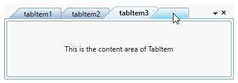
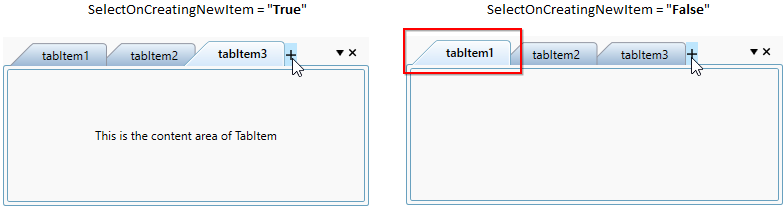
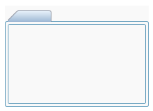
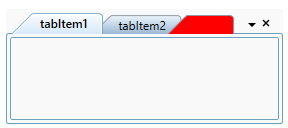

# NewButton Feature in WPF TabControl (TabControlExt)

This section explains how to create new tab items using new button and its UI customization in the [TabControl](https://help.syncfusion.com/cr/wpf/Syncfusion.Windows.Tools.Controls.TabControlExt.html). 

## Adding New tab button and new tab item

You can add a new tab item at runtime by clicking the new button. You can enable it by using the [IsNewButtonEnabled](https://help.syncfusion.com/cr/wpf/Syncfusion.Windows.Tools.Controls.TabControlExt.html#Syncfusion_Windows_Tools_Controls_TabControlExt_IsNewButtonEnabled) property. You should handle the click action of the New Button and add a new tab items to `TabControl` by using the [NewButtonClick](https://help.syncfusion.com/cr/wpf/Syncfusion.Windows.Tools.Controls.TabControlExt.html) event. The new button can be aligned first or last position in the tab item header panel by using the [NewButtonAlignment](https://help.syncfusion.com/cr/wpf/Syncfusion.Windows.Tools.Controls.TabControlExt.html#Syncfusion_Windows_Tools_Controls_TabControlExt_NewButtonAlignment) property. The default value of `IsNewButtonEnabled` property is `false` and `NewButtonAlignment` property is `Last`.




<syncfusion:TabControlExt NewButtonClick="tabControlExt_NewButtonClick"
                          IsNewButtonEnabled="True"
                          NewButtonAlignment="First"
                          Name="tabControlExt">
    <syncfusion:TabItemExt Header="tabItem1" />
    <syncfusion:TabItemExt Header="tabItem2" />
</syncfusion:TabControlExt>




tabControlExt.NewButtonClick += tabControlExt_NewButtonClick;
tabControlExt.IsNewButtonEnabled = true;
tabControlExt.NewButtonAlignment = NewButtonAlignment.First;




You can handle the event as follows:




private void tabControlExt_NewButtonClick(object sender, EventArgs e) {
    TabItemExt tabItemExt1 = new TabItemExt()
    {
        Header = "tabItem"+ (tabControlExt.Items.Count + 1),
        Content = new TextBlock() { Text = "This is the content area of TabItem" }
    };

    //Adding new tab item into the TabControl.
    tabControlExt.Items.Add(tabItemExt1);
}




N> View [Sample](https://github.com/SyncfusionExamples/syncfusion-wpf-tabcontrolext-examples/tree/master/Samples/NewButton) in GitHub

## Select a new tab item while creating it by new button

If you want to select the recently creating tab item as the selected item that is created by the new button click, use [SelectOnCreatingNewItem](https://help.syncfusion.com/cr/wpf/Syncfusion.Windows.Tools.Controls.TabControlExt.html#Syncfusion_Windows_Tools_Controls_TabControlExt_SelectOnCreatingNewItemProperty) property value as `true`. You can restrict it by setting the `SelectOnCreatingNewItem` property value as `false`. The default value of `SelectOnCreatingNewItem` property is `true`.




<syncfusion:TabControlExt SelectOnCreatingNewItem="True" 
                          NewButtonClick="tabControlExt_NewButtonClick"
                          IsNewButtonEnabled="True"
                          Name="tabControlExt">
    <syncfusion:TabItemExt Header="tabItem1" />
    <syncfusion:TabItemExt Header="tabItem2" />
</syncfusion:TabControlExt>




tabControlExt.NewButtonClick += tabControlExt_NewButtonClick;
tabControlExt.IsNewButtonEnabled = true;
tabControlExt.SelectOnCreatingNewItem = true;




You can handle the event as follows:




private void tabControlExt_NewButtonClick(object sender, EventArgs e) {
    TabItemExt tabItemExt1 = new TabItemExt()
    {
        Header = "tabItem"+ (tabControlExt.Items.Count + 1),
        Content = new TextBlock() { Text = "This is the content area of TabItem" }
    };

    //Adding new tab item into the TabControl.
    tabControlExt.Items.Add(tabItemExt1);
}




N> View [Sample](https://github.com/SyncfusionExamples/syncfusion-wpf-tabcontrolext-examples/tree/master/Samples/NewButton) in GitHub

## Auto hide new button when no child tab item

The `TabControl` automatically hides the new button on when no child tab item present in the `TabControl`. If you want to always show the new button, use the [IsNewButtonClosedonNoChild](https://help.syncfusion.com/cr/wpf/Syncfusion.Windows.Tools.Controls.TabControlExt.html#Syncfusion_Windows_Tools_Controls_TabControlExt_IsNewButtonClosedonNoChild) property value as `false`. The default value of `IsNewButtonClosedonNoChild` property is `true`.




<syncfusion:TabControlExt IsNewButtonClosedonNoChild="False"
                          IsNewButtonEnabled="True"
                          Name="tabControlExt">
    <syncfusion:TabItemExt Content="This is the first tab item"
                           Header="tabItem1"/>
</syncfusion:TabControlExt>




tabControlExt.IsNewButtonClosedonNoChild = false;
tabControlExt.IsNewButtonEnabled = true;




N> View [Sample](https://github.com/SyncfusionExamples/syncfusion-wpf-tabcontrolext-examples/tree/master/Samples/NewButton) in GitHub

## Custom template for the new button

If you wants to change the UI for the new button, use the [NewTabButtonTemplate](https://help.syncfusion.com/cr/wpf/Syncfusion.Windows.Tools.Controls.TabControlExt.html#Syncfusion_Windows_Tools_Controls_TabControlExt_NewTabButtonTemplate) property. 




<syncfusion:TabControlExt IsNewButtonEnabled="True"
                          x:Name="tabControlExt">
    <syncfusion:TabControlExt.NewTabButtonTemplate>
        <DataTemplate>
            <TextBlock Background="Red"
                       FontSize="14"
                       TextAlignment="Center" 
                       Width="25" Height="25" 
                       Text=" + "/>
        </DataTemplate>
    </syncfusion:TabControlExt.NewTabButtonTemplate>
    <syncfusion:TabItemExt Header="tabItem1" Name="tabItemExt1"/>
    <syncfusion:TabItemExt Header="tabItem2" Name="tabItemExt2"/>
</syncfusion:TabControlExt>




N> View [Sample](https://github.com/SyncfusionExamples/syncfusion-wpf-tabcontrolext-examples/tree/master/Samples/NewButton) in GitHub

## Change background and border thickness of new button

If you want to change the background and border thickness of the new button, use the [NewButtonBackground](https://help.syncfusion.com/cr/wpf/Syncfusion.Windows.Tools.Controls.TabControlExt.html#Syncfusion_Windows_Tools_Controls_TabControlExt_NewButtonBackground) and [NewButtonBorderThickness](https://help.syncfusion.com/cr/wpf/Syncfusion.Windows.Tools.Controls.TabControlExt.html#Syncfusion_Windows_Tools_Controls_TabControlExt_NewButtonBorderThicknessProperty) properties. The default value of `NewButtonBackground` property is `null` and `` property is ``.




<syncfusion:TabControlExt NewButtonBackground="Red"
                          NewButtonBorderThickness="2"
                          Name="tabControlExt">
    <syncfusion:TabItemExt Content="This is the first tab item"
                           Header="tabItem1"/>
</syncfusion:TabControlExt>




tabControlExt.NewButtonBackground = Brushes.Red;
tabControlExt.NewButtonBorderThickness = new Thickness(2);




N> View [Sample](https://github.com/SyncfusionExamples/syncfusion-wpf-tabcontrolext-examples/tree/master/Samples/NewButton) in GitHub
