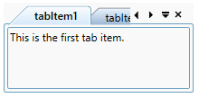

# About Syncfusion® WPF Tab Control

The [WPF Tab Control](https://help.syncfusion.com/cr/wpf/Syncfusion.Windows.Tools.Controls.TabControlExt.html) is similar to the dividers in a notebook or the labels in a file cabinet. By using this control, an application can define multiple pages for the same area of a window. It contains the [TabItemExt](https://help.syncfusion.com/cr/wpf/Syncfusion.Windows.Tools.Controls.TabItemExt.html), which is used to define Tab Items for `WPF Tab Control`. By clicking a tab item header, the data corresponding to that particular tab item will be displayed.

## Key features

**Tab Orientation** - Provides support to position the tabs horizontally at the top or bottom and vertically at the left or right.

**Editable header** - Provides support to edit the headers interactively in UI by pressing the F2 key or by double-clicking a tab header.

**Display mode** - Provides support to customize the display mode of the Close button.

**Layout** - Provides different layout types for enhanced usage to the control. The types are SingleLine, SingleLineStar, MultiLine, MultiLineWithFullWidth, and MultiLineStar.

**Pin and UnPin** - Provides support to pinning tabs for quick access and allows users to interactively pin and unpin the tabs.

**Selection** - Provides support to select the tabs quickly through keyboard or mouse interaction.

**Styles** - Provides a rich set of built-in themes and customizes the style of each part of `WPF Tab Control`.

**Drag and drop** - Provides support to reorder the tabs by dragging and dropping headers and change the color of drag marker while dragging the tab page in `WPF Tab Control`.

**Scrolling** - Provides support to scroll the tab items to next, previous, first, and last in `WPF Tab Control`.

**Images** - Provides support to add images to the tab header and also aligns the header image to any position.

**Context menu** - Provides support to built-in context menu option for tab list and tab item.

