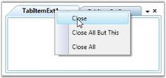

# Setting TabListContextMenu and TabItemContextMenu For Tab Item

In TabControlExt, context menu can be displayed for the Tab Items by setting the [ShowTabItemContextMenu](https://help.syncfusion.com/cr/wpf/Syncfusion.Tools.Wpf~Syncfusion.Windows.Tools.Controls.TabControlExt~ShowTabItemContextMenu.html) property to True. This is a dependency property which is used to enable or disable the context menu for the Tab Item.

The context menu of the Tab Item has the following menu items.

* Close
* Close All But This
* Close All

To enable the Tab Item context menu, use the below code.





<!-- Adding TabControlExt  -->

<syncfusion:TabControlExt Name="tabControlExt" ShowTabItemContextMenu="True">

    <!-- Adding TabItemExt -->

    <syncfusion:TabItemExt Name="tabItemExt1" Header="TabItemExt1">

    </syncfusion:TabItemExt>

    <!-- Adding TabItemExt -->

    <syncfusion:TabItemExt Name="tabItemExt2" Header="TabItemExt2">

    </syncfusion:TabItemExt>

</syncfusion:TabControlExt>




// Creating instance of the TabControlExt control

TabControlExt tabControlExt = new TabControlExt();

//Creating the instance of StackPanel

StackPanel stackPanel = new StackPanel();

//Creating instance of the TabItemExt 

TabItemExt tabItemExt1 = new TabItemExt();

// Setting header of the TabItemExt

tabItemExt1.Header = "TabItemExt1";

//Adding TabItemExt to TabControlExt

tabControlExt.Items.Add(tabItemExt1);            

// Changing the Visibility of Scroll button 

tabControlExt.ShowTabItemContextMenu = true; 

//Adding control to the StackPanel

stackPanel.Children.Add(tabControlExt);




## Tab Item Context Menu Events

###  OnCloseOtherTabs Event

This [OnCloseOtherTabs](https://help.syncfusion.com/cr/wpf/Syncfusion.Tools.Wpf~Syncfusion.Windows.Tools.Controls.TabControlExt~OnCloseOtherTabs_EV.html) event is handled when the 'Close All But This' menu item in the TabItemContextMenu is clicked.

### OnCloseAllTabs Event

This [OnCloseAllTabs](https://help.syncfusion.com/cr/wpf/Syncfusion.Tools.Wpf~Syncfusion.Windows.Tools.Controls.TabControlExt~OnCloseAllTabs_EV.html) event is handled when the 'Close All' menu item in TabItemContextMenu is clicked.

### Event

This event is handled when the 'Close' menu item in TabItemContextMenu is clicked.



[Resizing the Tab Item](https://help.syncfusion.com/wpf/tabext/resizing-the-tab-item)

[Editing the Tab Item Header at Run Time](https://help.syncfusion.com/wpf/tabext/editing-the-tab-item-header-at-run-time)

[Tab Item Header Image](https://help.syncfusion.com/wpf/tabext/tab-item-header#header-image)

[Tab Item Header Image Alignment](https://help.syncfusion.com/wpf/tabext/tab-item-header#image-alignment) 

