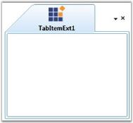

# TabItem Header of TabControlExt

This section illustrates the Tab Item Header of TabControlExt control and contains the following topics:

## Header Image

You can add images to the Tab Item headers by using the Image property of the TabItemExt. This is a dependency property which gets or sets the image for the Tab Item header. 

The following code snippet illustrates how to add images to the tab item header.





<!-- Adding TabcontrolExt  -->

<syncfusion:TabControlExt Name="tabControlExt">

    <!-- Adding TabItemExt with image  -->

    <syncfusion:TabItemExt Name="tabItemExt1" Image="Sync.png" Header="TabItemExt1">

    </syncfusion:TabItemExt>

</syncfusion:TabControlExt>





// Creating instance of the TabControlExt control

TabControlExt tabControlExt = new TabControlExt();

//Creating the instance of StackPanel

StackPanel stackPanel = new StackPanel();

//Creating instance of the TabItemExt 

TabItemExt tabItemExt1 = new TabItemExt();

// Setting header of the TabItemExt

tabItemExt1.Header = "TabItemExt1";

// Adding Image to the TabItemExt header

tabItemExt1.Image = new BitmapImage(new Uri("Sync.png", UriKind.RelativeOrAbsolute)); 

//Adding TabItemExt to TabControlExt

tabControlExt.Items.Add(tabItemExt1);    

//Adding control to the stack panel

stackPanel.Children.Add(tabControlExt);







[Editing the Tab Item Header at Run Time](https://help.syncfusion.com/wpf/tabext/editing-the-tab-item-header-at-run-time)

[Tab Item Header Image](https://help.syncfusion.com/wpf/tabext/tab-item-header#header-image)

[Tab Item Header Image Alignment](https://help.syncfusion.com/wpf/tabext/tab-item-header#image-alignment) 

[Context Menu for the Tab Item](https://help.syncfusion.com/wpf/tabext/setting-tablistcontextmenu-and-tabitemcontextmenu-for-tab-item)



## Image Alignment

You can align the Tab Item header image by using the [ImageAlignment](https://help.syncfusion.com/cr/wpf/Syncfusion.Tools.Wpf~Syncfusion.Windows.Tools.Controls.TabItemExt~ImageAlignment.html) property of TabItemExt. You can align the image to any one of the following positions.

* AboveText-Images are placed above the tab item header
* BelowText–Images are placed below the tab item header
* LeftOfText–Images are placed to the left of the tab item header
* RightOfText–Images are placed to the right of the tab item header

To set the tab item header image alignment as "AboveText", use the below code.





<!-- Adding TabControlExt  -->

<syncfusion:TabControlExt Name="tabControlExt">

    <!-- Adding TabItemExt -->

    <syncfusion:TabItemExt Name="tabItemExt1" Image="Sync.png" ImageAlignment="AboveText" Header="TabItemExt1">

    </syncfusion:TabItemExt>

</syncfusion:TabControlExt>




// Creating instance of the TabControlExt control

TabControlExt tabControlExt = new TabControlExt();

//Creating the instance of StackPanel

StackPanel stackPanel = new StackPanel();

//Creating instance of the TabItemExt 

TabItemExt tabItemExt1 = new TabItemExt();

// Setting header of the TabItemExt

tabItemExt1.Header = "TabItemExt1";

// Adding Image to the TabItemExt header

tabItemExt1.Image = new BitmapImage(new Uri("Sync.png", UriKind.RelativeOrAbsolute)); 

// Aligning the image

tabItemExt1.ImageAlignment = ImageAlignment.AboveText;    

//Adding TabItemExt to TabControlExt

tabControlExt.Items.Add(tabItemExt1);    

//Adding control to the StackPanel

stackPanel.Children.Add(tabControlExt);





### ImageAlignmentChanged Event

This [ImageAlignmentChanged](https://help.syncfusion.com/cr/wpf/Syncfusion.Tools.Wpf~Syncfusion.Windows.Tools.Controls.TabItemExt~ImageAlignmentChanged_EV.html) event is triggered when the [ImageAlignment](https://help.syncfusion.com/cr/wpf/Syncfusion.Tools.Wpf~Syncfusion.Windows.Tools.Controls.TabItemExt~ImageAlignment.html) property is changed.

The following code snippet illustrates handling the [ImageAlignmentChanged](https://help.syncfusion.com/cr/wpf/Syncfusion.Tools.Wpf~Syncfusion.Windows.Tools.Controls.TabItemExt~ImageAlignmentChanged_EV.html) event.



/// 

/// Tabs the item ext1_ image alignment changed.

/// 

/// <param name="d">The d.</param>

/// <param name="e">The <see cref="System.Windows.DependencyPropertyChangedEventArgs"/> instance containing the event data.</param>

private void tabItemExt1_ImageAlignmentChanged(DependencyObject d, DependencyPropertyChangedEventArgs e)

{

if (tabItemExt1.ImageAlignment == ImageAlignment.LeftOfText)

{

tabControlExt.TabItemSize = TabItemSizeMode.ShrinkToFit;

}

}



In the above example, when the [ImageAlignment](https://help.syncfusion.com/cr/wpf/Syncfusion.Tools.Wpf~Syncfusion.Windows.Tools.Controls.TabItemExt~ImageAlignment.html) property is set to LeftOfText, the Tab Item header looks enlarged. To avoid this, the TabItemSize property is set as ShrinkToFit.



[Editing the Tab Item Header at Run Time](https://help.syncfusion.com/wpf/tabext/editing-the-tab-item-header-at-run-time)

[Tab Item Header Image](https://help.syncfusion.com/wpf/tabext/tab-item-header#header-image)

[Tab Item Header Image Alignment](https://help.syncfusion.com/wpf/tabext/tab-item-header#image-alignment) 

[Context Menu for the Tab Item](https://help.syncfusion.com/wpf/tabext/setting-tablistcontextmenu-and-tabitemcontextmenu-for-tab-item)

