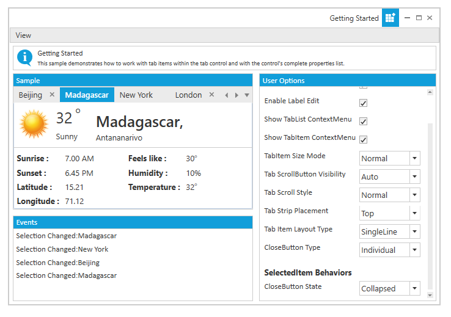

# Behavior of CloseButton

## Restrict TabItem closing through closing event

The closure of TabItem can now be restricted by setting e.Cancel to true in OnCloseButtonClick delegate. “e” represents the event argument CloseTabEventArgs for OnCloseButtonClick event. The default value of e.Cancel is false.

The following code illustrates the same.





  <syncfusion:TabControlExt OnCloseButtonClick="TabControlExt_OnCloseButtonClick">

            <syncfusion:TabItemExt Header="Tab1"/>
            
            <syncfusion:TabItemExt Header="Tab2"/>
            
            <syncfusion:TabItemExt Header="Tab3"/>
            
</syncfusion:TabControlExt>





 private void TabControlExt_OnCloseButtonClick(object sender, CloseTabEventArgs e)
 
 {

            if (e.TargetTabItem.Header.ToString() == "Tab1")
                e.Cancel = true;
 }





## Restrict TabItem closing using CanClose property

User can restrict the closing functionality of TabItem using `CanClose` property of TabItemExt. When the `CanClose` property is false, the corresponding TabItem will be non-closable. The default value of the property is True. 

The following code illustrates the same.



<syncfusion:TabControlExt x:Name="Tab" CloseButtonType="Individual"
                                      >
                <syncfusion:TabItemExt Header="Beijing" CanClose="false"/>
            
            <syncfusion:TabItemExt Header="Madagascar"/>
            
            <syncfusion:TabItemExt Header="New York"/>
            <syncfusion:TabItemExt Header="London"/>
            </syncfusion:TabControlExt>



## Setting Close Buttons type

The display mode of the Close button is specified by using the CloseButtonType property. This dependency property sets the display mode for the Close button.

The following Close button modes are supported by the TabControlExt.

* Common–close button is displayed commonly for all tab items in the TabControlExt control
* Individual–close button is displayed individually for each tab item in the TabControlExt control
* Both–close button is displayed commonly for all tab items and also individually for each tab item in TabControlExt control
* Hide–close button is hidden in the TabControlExt control
* IndividualOnMouseOver – close button is displayed when the mouse hovers over the tab item in the TabControlExt control

The following code snippet illustrates how to set the "Both" Close button mode in the TabControlExt control.





<!-- Adding TabcontrolExt with CloseButtonType is Both -->

<syncfusion:TabControlExt Margin="20" Name="tabControlExt" CloseButtonType="Both">

    <!-- Adding TabItemExt -->

    <syncfusion:TabItemExt Name="tabItemExt1" Header="TabItemExt1"/>

    <!-- Adding TabItemExt -->

    <syncfusion:TabItemExt Name="tabItemExt2" Header="TabItemExt2"/>

</syncfusion:TabControlExt>





// Creating instance of the TabControlExt control

TabControlExt tabControlExt = new TabControlExt();

//Creating the instance of StackPanel

StackPanel stackPanel = new StackPanel();

//Creating instance of the TabItemExt 

TabItemExt tabItemExt1 = new TabItemExt();

// Setting header of the TabItemExt

tabItemExt1.Header = "TabItemExt1";

//Adding TabItemExt to TabControlExt

tabControlExt.Items.Add(tabItemExt1);

//Creating instance of the TabItemExt2 

TabItemExt tabItemExt2 = new TabItemExt();

// Setting header of the TabItemExt

tabItemExt2.Header = "TabItemExt2";

//Adding TabItemExt to TabControlExt

tabControlExt.Items.Add(tabItemExt2);           

//Setting CloseButtonType property as Both

tabControlExt.CloseButtonType = CloseButtonType.Both;

//Adding control to the StackPanel

stackPanel.Children.Add(tabControlExt); 





## Visibility of CloseButton in TabItemExt

Visibility of the TabItem's CloseButton can be handled through `CloseButtonState` property. `CloseButtonState` will be effective only if the property `CloseButtonType` of TabControlExt is one among individual, extended or both.

<table>
<tr>
<td>
<b> CloseButtonState </b>   </td><td>
<b> Description </b>   </td></tr>
<tr>
<td>
Visible  </td><td>
Close button of TabItemExt is visible  </td></tr>
<tr>
<td>
Collapsed  </td><td>
Close button of TabItemExt is collapsed  </td></tr>
<tr>
<td>
Hidden  </td><td>
Close button of TabItemExt is hidden  </td></tr>
</table>



<syncfusion:TabControlExt x:Name="Tab" CloseButtonType="Individual"
                                      >
                <syncfusion:TabItemExt Header="Beijing" CloseButtonState="Visible" />
            
            <syncfusion:TabItemExt Header="Madagascar" CloseButtonState="Collapsed"/>
            
            <syncfusion:TabItemExt Header="New York" CloseButtonState="Hidden"/>
            <syncfusion:TabItemExt Header="London"/>
            </syncfusion:TabControlExt>



N> "Beijing" TabItem has CloseButtonState as visible, "Madagascar" TabItem has CloseButtonState as Collapsed and "New York" TabItem has CloseButtonState as Hidden.
