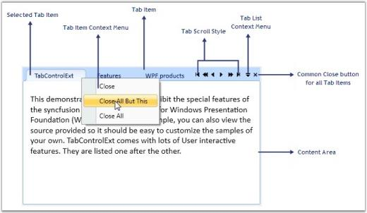
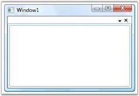

# Getting Started

This section guides you on getting started with TabControlExt control. It covers the following topics:

## Why to use our TabControlExt control

Here are some highlights of our TabControlExt control.

* Support to position the Tab Strip to the Left, Right, Top or Bottom of the TabControlExt
* Ability to customize the display mode of the Close button
* Facilitation of different layout types for enhanced usage
* Drag-and-drop support with drag marker customization
* Provides Tab Scroller in two modes: Normal and Extended
* Support to add Header Images
* Ability to resize the Tab Item by using two modes: Normal and ShrinkToFit
* Built-in Tab List and Tab Item context menu support
* Supports visual customization

## Elaborate Structure of the Control

The various elements of a TabControlExt control is illustrated in the below image.

## Creating TabControlExt control

There are two possible ways to create a simple TabControlExt control.

### Through Designer

To create the TabControlExt control through designer, follow the below steps.

1. Drag the TabControlExt control from the toolbox onto your WPF application.

2. Set the properties for the TabControlExt in design mode by using the SmartTag feature.

   

### Creating TabControlExt Programmatically

TabControlExt control is created by either XAML or C# code. The following steps helps to add required WPF control through code.

* Create a WPF project in Visual Studio and refer to the following assemblies.

1. Syncfusion.Tools.WPF.dll
2. Syncfusion.Shared.WPF.dll

* Include an XML namespace for the above assemblies to the Main window.





<Window

xmlns="http://schemas.microsoft.com/winfx/2006/xaml/presentation"

xmlns:x="http://schemas.microsoft.com/winfx/2006/xaml" 

xmlns:syncfusion="http://schemas.syncfusion.com/wpf" />





* Now add the TabControlExt control with a required optimal name.





<!-- Adding TabControlExt -->

<syncfusion:TabControlExt Name="tabControlExt">

</syncfusion:TabControlExt>





// Creating instance of the TabControlExt control

TabControlExt tabControlExt = new TabControlExt();

//Creating the instance of StackPanel

StackPanel stackPanel = new StackPanel();          

//Adding control to the stack panel

stackPanel.Children.Add(tabControlExt); 





N> To display the TabControlExt using C# code, you must already have a panel in which you are going to add the control. Otherwise, the control cannot be displayed.
