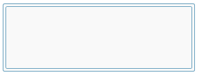
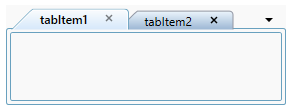
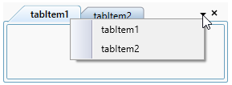
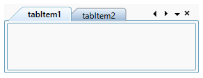
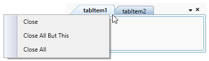

# Getting Started with TabControl

This section explains how to create WPF TabControl, and its structure.

## Structure of TabControl

The various elements of TabControl is illustrated in the below image.

## Assembly deployment

Refer to the [control dependencies](https://help.syncfusion.com/wpf/control-dependencies#tabcontrolext) section to get the list of assemblies or NuGet package that needs to be added as a reference to use the control in any application.

[Click here](https://help.syncfusion.com/wpf/visual-studio-integration/nuget-packages) to find more details on how to install nuget packages in WPF application.

## Adding WPF TabControl via designer

1) The TabControl can be added to an application by dragging it from the toolbox to a designer view. The following dependent assemblies will be added automatically.

* Syncfusion.Tools.WPF
* Syncfusion.Shared.WPF

2) Set the properties for TabControl in design mode by using the SmartTag feature.

## Adding WPF TabControl via XAML

In order to add the TabControl manually in XAML, do the below steps,

1) Create a new WPF project in Visual Studio.

2) Add the following required assembly references to the project.

* Syncfusion.Tools.WPF
* Syncfusion.Shared.WPF

3) Import Syncfusion WPF schema **http://schemas.syncfusion.com/wpf** and declare the TabControl in XAML page.





<Window x:Class="TabControlExt_sample.MainWindow"
        xmlns="http://schemas.microsoft.com/winfx/2006/xaml/presentation"
        xmlns:x="http://schemas.microsoft.com/winfx/2006/xaml"
        xmlns:d="http://schemas.microsoft.com/expression/blend/2008"
        xmlns:mc="http://schemas.openxmlformats.org/markup-compatibility/2006"
        xmlns:local="clr-namespace:TabControlExt_sample"
        xmlns:syncfusion="http://schemas.syncfusion.com/wpf"
        mc:Ignorable="d"
        Title="MainWindow" Height="450" Width="800">

<Grid Name="grid">
    <syncfusion:TabControlExt Name="tabControl" Height="100" Width="280" />
</Grid>





## Adding WPF TabControl via C#

In order to add the TabControl manually in C#, do the below steps,

1) Create a new WPF application via Visual Studio.

2) Add the following required assembly references to the project.

* Syncfusion.Tools.WPF
* Syncfusion.Shared.WPF

3) Include the required namespace.





using Syncfusion.Windows.Tools.Controls;





4) Create an instance of [TabControl](https://help.syncfusion.com/cr/wpf/Syncfusion.Tools.Wpf~Syncfusion.Windows.Tools.Controls.TabControlExt.html) and add it to the window.





// Creating instance of the TabControl
TabControlExt tabControlExt = new TabControlExt();

//set height and width to TabControl
tabControlExt.Height = 100;
tabControlExt.Width = 280;

//Adding control into the main window
grid.Children.Add(tabControlExt); 





## Adding TabItem

The [TabControl](https://help.syncfusion.com/cr/wpf/Syncfusion.Tools.Wpf~Syncfusion.Windows.Tools.Controls.TabControlExt.html) allows the user to adding new tabitem into its control. You can set header to each tabitem by using [Header](https://docs.microsoft.com/en-us/dotnet/api/system.windows.controls.headeredcontentcontrol.header?redirectedfrom=MSDN&view=netframework-4.8#System_Windows_Controls_HeaderedContentControl_Header) property and add the content into tabitem in TabControl.





<syncfusion:TabControlExt Name="tabControl" Height="100" Width="280">
    <syncfusion:TabItemExt Header="tabItem1">
        <TextBlock Name="textBlock" Text="This is the first tab item." />
    </syncfusion:TabItemExt>
    <syncfusion:TabItemExt Header="tabItem2">
        <TextBlock Name="textBlock1" Text="This is the second tab item." />
    </syncfusion:TabItemExt>
    <syncfusion:TabItemExt Header="tabItem3">
        <TextBlock Name="textBlock2" Text="This is the third tab item." />
    </syncfusion:TabItemExt>
</syncfusion:TabControlExt>





// Create an instances of tabitems
TabItemExt tabItemExt = new TabItemExt();
TabItemExt tabItemExt1 = new TabItemExt();
TabItemExt tabItemExt2 = new TabItemExt();

//Adding header into tabitems
tabItemExt.Header = "tabItem1";
tabItemExt1.Header = "tabItem2";
tabItemExt2.Header = "tabItem3";

//Create an instance of TextBlock
TextBlock textBlock = new TextBlock();
TextBlock textBlock1 = new TextBlock();
TextBlock textBlock2 = new TextBlock();

//Add the text
textBlock.Text = "This is the first tab item.";
textBlock1.Text = "This is the second tab item.";
textBlock2.Text = "This is the third tab item.";

//Add the textblock into tabitem
tabItemExt.Content = textBlock;
tabItemExt1.Content = textBlock1;
tabItemExt2.Content = textBlock2;

//Add the tabitems into the tabcontrol
tabControlExt.Items.Add(tabItemExt);
tabControlExt.Items.Add(tabItemExt1);
tabControlExt.Items.Add(tabItemExt2);





## Placement of TabItem's

You can align the tabitem position to all four sides of TabControl by using [TabStripPlacement](https://help.syncfusion.com/cr/wpf/Syncfusion.Tools.Wpf~Syncfusion.Windows.Tools.Controls.TabControlSettings~TabStripPlacement.html) property.





<syncfusion:TabControlExt Height="100" Width="280" TabStripPlacement="Bottom">
    <syncfusion:TabItemExt Header="tabItem1">
        <TextBlock Name="textBlock" Text="This is the first tab item." />
    </syncfusion:TabItemExt>
    <syncfusion:TabItemExt Header="tabItem2">
        <TextBlock Name="textBlock1" Text="This is the second tab item." />
    </syncfusion:TabItemExt>
    <syncfusion:TabItemExt Header="tabItem3">
        <TextBlock Name="textBlock" Text="This is the third tab item." />
    </syncfusion:TabItemExt>
</syncfusion:TabControlExt>





tabControlExt.TabStripPlacement = Dock.Bottom;





## Selecting TabItem

You can select the particular tabitem in TabControl by setting the [IsSelected](https://docs.microsoft.com/en-us/dotnet/api/system.windows.controls.tabitem.isselected?redirectedfrom=MSDN&view=netframework-4.8#System_Windows_Controls_TabItem_IsSelected) property to `true`.





<syncfusion:TabControlExt Name="tabControl" Height="100" Width="280">
    <syncfusion:TabItemExt Header="tabItem1" IsSelected="False" />
    <syncfusion:TabItemExt Header="tabItem2" IsSelected="False" />
    <syncfusion:TabItemExt Header="tabItem3" IsSelected="True" />
</syncfusion:TabControlExt>





tabItemExt2.IsSelected = true;





### Tab Selection event

The TabControl notifies user change the selected tabitem through [SelectedItemChangedEvent](https://help.syncfusion.com/cr/wpf/Syncfusion.Tools.Wpf~Syncfusion.Windows.Tools.Controls.TabControlExt~SelectedItemChangedEvent_EV.html) event. You can use the `OldSelectedItem` and `NewSelectedItem` property to get the old and new selected tabitem in `SelectedItemChangedEvent` event.





tabControlExt.SelectedItemChangedEvent += TabControlExt_SelectedItemChangedEvent;

private void TabControlExt_SelectedItemChangedEvent(object sender, SelectedItemChangedEventArgs e)
{
    var newTabItem = e.NewSelectedItem.Header;
    if (e.OldSelectedItem != null)
    {
        var oldTabItem = e.OldSelectedItem.Header;
    }
    else
    {
        var oldTabItem = string.Empty;
    }
}





## Enable or disable close button

The [TabItemExt.CanClose](https://help.syncfusion.com/cr/wpf/Syncfusion.Tools.Wpf~Syncfusion.Windows.Tools.Controls.TabItemExt~CanClose.html) property is used for decides whether the close button enable or disable in tabitem. You can show the close button as only individual tabitem or commonly for all tabitem by using [TabControlExt.CloseButtonType](https://help.syncfusion.com/cr/wpf/Syncfusion.Tools.Wpf~Syncfusion.Windows.Tools.Controls.TabControlExt~CloseButtonType.html) property in TabControl.





<syncfusion:TabControlExt Name="tabControl" Height="100" Width="280" CloseButtonType="Individual">
    <syncfusion:TabItemExt Header="tabItem1" CanClose="False" />
    <syncfusion:TabItemExt Header="tabItem2" />
</syncfusion:TabControlExt>





tabItemExt.CanClose = false;





## Enable or disable TabList context menu

You can show the tab list context menu by setting the [TabControlExt.ShowTabListContextMenu](https://help.syncfusion.com/cr/wpf/Syncfusion.Tools.Wpf~Syncfusion.Windows.Tools.Controls.TabControlExt~ShowTabListContextMenu.html) property to `true` in TabControl.





<syncfusion:TabControlExt Height="100" Width="280" ShowTabListContextMenu="True">
            <syncfusion:TabItemExt Header="tabItem1" />
            <syncfusion:TabItemExt Header="tabItem2" />
    </syncfusion:TabItemExt>
</syncfusion:TabControlExt>





tabControlExt.ShowTabListContextMenu = true;





## Enable or disable tab navigation bar

The [TabControlExt.TabScrollButtonVisibility](https://help.syncfusion.com/cr/wpf/Syncfusion.Tools.Wpf~Syncfusion.Windows.Tools.Controls.TabControlExt~TabScrollButtonVisibility.html) property is used for decides whether the tab navigation bar enable or disable in TabControl. You can show different tab navigation style in TabControl by using [TabScrollStyle](https://help.syncfusion.com/cr/wpf/Syncfusion.Tools.Wpf~Syncfusion.Windows.Tools.Controls.TabControlExt~TabScrollStyle.html) property.





<syncfusion:TabControlExt Name="tabControl" Height="100" Width="280" TabScrollStyle="Extended" TabScrollButtonVisibility="Visible">
    <syncfusion:TabItemExt Name="tabItemExt1" Header="tabItem1" />
    <syncfusion:TabItemExt Name="tabItemExt2" Header="tabItem2" />
</syncfusion:TabControlExt>





tabControlExt.TabScrollStyle = TabScrollStyle.Extended;
tabControlExt.TabScrollButtonVisibility = TabScrollButtonVisibility.Visible;





## Enable or disable built-in context menu

You can show the built-in context menu of the tabitem's by setting the [TabControlExt.ShowTabItemContextMenu](https://help.syncfusion.com/cr/wpf/Syncfusion.Tools.Wpf~Syncfusion.Windows.Tools.Controls.TabControlExt~ShowTabItemContextMenu.html) property to `true` in TabControl.





<syncfusion:TabControlExt Name="tabControl" Height="100" Width="280" ShowTabItemContextMenu="True">
    <syncfusion:TabItemExt Header="tabItem1" />
    <syncfusion:TabItemExt Header="tabItem2" />        
</syncfusion:TabControlExt>





//Changing the visibility of context menu
tabControlExt.ShowTabItemContextMenu = true;





