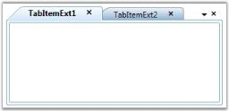

# Setting Close Buttons type

The display mode of the Close button is specified by using the [CloseButtonType](https://help.syncfusion.com/cr/wpf/Syncfusion.Tools.Wpf~Syncfusion.Windows.Tools.Controls.TabControlExt~CloseButtonType.html) property. This dependency property sets the display mode for the Close button.

The following Close button modes are supported by the TabControlExt.

* Common–close button is displayed commonly for all tab items in the TabControlExt control
* Individual–close button is displayed individually for each tab item in the TabControlExt control
* Both–close button is displayed commonly for all tab items and also individually for each tab item in TabControlExt control
* Hide–close button is hidden in the TabControlExt control
* IndividualOnMouseOver – close button is displayed when the mouse hovers over the tab item in the TabControlExt control

The following code snippet illustrates how to set the "Both" Close button mode in the TabControlExt control.





<!-- Adding TabcontrolExt with CloseButtonType is Both -->

<syncfusion:TabControlExt Margin="20" Name="tabControlExt" CloseButtonType="Both">

    <!-- Adding TabItemExt -->

    <syncfusion:TabItemExt Name="tabItemExt1" Header="TabItemExt1"/>

    <!-- Adding TabItemExt -->

    <syncfusion:TabItemExt Name="tabItemExt2" Header="TabItemExt2"/>

</syncfusion:TabControlExt>





// Creating instance of the TabControlExt control

TabControlExt tabControlExt = new TabControlExt();

//Creating the instance of StackPanel

StackPanel stackPanel = new StackPanel();

//Creating instance of the TabItemExt 

TabItemExt tabItemExt1 = new TabItemExt();

// Setting header of the TabItemExt

tabItemExt1.Header = "TabItemExt1";

//Adding TabItemExt to TabControlExt

tabControlExt.Items.Add(tabItemExt1);

//Creating instance of the TabItemExt2 

TabItemExt tabItemExt2 = new TabItemExt();

// Setting header of the TabItemExt

tabItemExt2.Header = "TabItemExt2";

//Adding TabItemExt to TabControlExt

tabControlExt.Items.Add(tabItemExt2);           

//Setting CloseButtonType property as Both

tabControlExt.CloseButtonType = CloseButtonType.Both;

//Adding control to the StackPanel

stackPanel.Children.Add(tabControlExt); 





