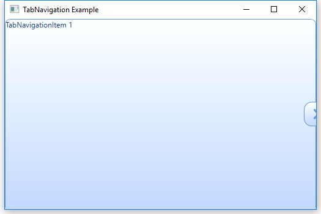
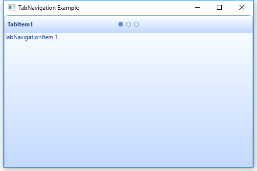
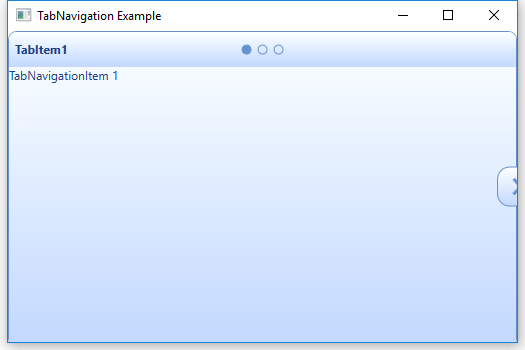

# Interactive Features

## Show/ Hide the Header

You can enable/ disable the visibility of header by setting [HeaderVisibility](https://help.syncfusion.com/cr/wpf/Syncfusion.Tools.Wpf~Syncfusion.Windows.Tools.Controls.TabNavigationControl~HeaderVisibility.html) property of TabNavigationControl.



 <!-- TabNavigation Control -->
<syncfusion:TabNavigationControl x:Name="TabNavigation" HeaderVisibility="Collapsed" >
	<syncfusion:TabNavigationItem Header="TabItem1" Content="TabNavigationItem 1"/>
	<syncfusion:TabNavigationItem Header="TabItem2" Content="TabNavigationItem 2"/>
	<syncfusion:TabNavigationItem Header="TabItem3" Content="TabNavigationItem 3"/>
</syncfusion:TabNavigationControl>


//Hide the header
tabNavigation.HeaderVisibility = Visibility.Collapsed;



## Show/ Hide the Navigation Button

You can enable/ disable the visibility of navigation button by setting [NavigationButtonVisibility](https://help.syncfusion.com/cr/wpf/Syncfusion.Tools.Wpf~Syncfusion.Windows.Tools.Controls.TabNavigationControl~NavigationButtonVisibility.html) property of TabNavigationControl.



<!-- TabNavigation Control -->
<syncfusion:TabNavigationControl x:Name="TabNavigation" TabStripVisibility="Visible" NavigationButtonVisibility="Collapsed" >
	<syncfusion:TabNavigationItem Header="TabItem1" Content="TabNavigationItem 1"/>
	<syncfusion:TabNavigationItem Header="TabItem2" Content="TabNavigationItem 2"/>
</syncfusion:TabNavigationControl>


//Hide the navigation button
tabNavigation.NavigationButtonVisibility = Visibility.Collapsed;



## Show/ Hide the TabStrip

You can enable/ disable the visibility of tab strip by setting [TabStripVisibility](https://help.syncfusion.com/cr/wpf/Syncfusion.Tools.Wpf~Syncfusion.Windows.Tools.Controls.TabNavigationControl~TabStripVisibility.html) property of TabNavigationControl.



<!-- TabNavigation Control -->
<syncfusion:TabNavigationControl x:Name="TabNavigation" TabStripVisibility="Visible">
	<syncfusion:TabNavigationItem Header="TabItem1" Content="TabNavigationItem 1"/>
	<syncfusion:TabNavigationItem Header="TabItem2" Content="TabNavigationItem 2"/>
</syncfusion:TabNavigationControl>


//Enable the tab strip visibility
tabNavigation.TabStripVisibility = Visibility.Visible;



