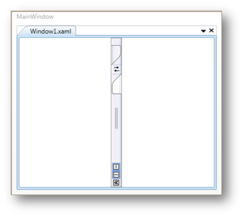

# Orientation

TabSplitter Items are placed horizontally or vertically by using the Orientation property. This is a dependency property which sets the orientation of the TabSplitter Item. It supports the following types of orientation.

* Horizontal: TabSplitter Item in the TabSplitter is placed horizontally
* Vertical: TabSplitter Item in the TabSplitter is placed vertically

Set the orientation using the code given below:

[XAML]

&lt;!-- Adding TabSplitter --&gt;

&lt;syncfusion:TabSplitter Name="tabsplitter"&gt;

    &lt;!-- Adding TabSplitterItem --&gt;

    &lt;syncfusion:TabSplitterItem Header="Window1.xaml" Orientation="Vertical" Name="tabSplitterItem1"&gt;

        &lt;!-- Adding TopPanelItems --&gt;

        &lt;syncfusion:TabSplitterItem.TopPanelItems&gt; 

            &lt;!-- Adding SplitterPage --&gt;

            &lt;syncfusion:SplitterPage Name="splitterPage1" Header="XAML"&gt;

            &lt;/syncfusion:SplitterPage&gt;

        &lt;/syncfusion:TabSplitterItem.TopPanelItems&gt;

        &lt;!-- Adding BottomPanelItems --&gt;

        &lt;syncfusion:TabSplitterItem.BottomPanelItems&gt; 

            &lt;!-- Adding SplitterPage --&gt;

            &lt;syncfusion:SplitterPage Name="splitterPage2" Header="Design"&gt;

            &lt;/syncfusion:SplitterPage&gt;

        &lt;/syncfusion:TabSplitterItem.BottomPanelItems&gt;

    &lt;/syncfusion:TabSplitterItem&gt;

&lt;/syncfusion:TabSplitter&gt;

[C#]

// Set the Orientation

tabSplitterItem1.Orientation = Orientation.Vertical;

{  | markdownify }
{:.image }

