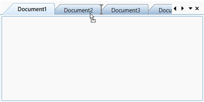

# Rearrange position of TDI items 

## Rearrange position of document items by drag and drop

You can rearrange the position of the TDI items in DocumentContainer by setting the [IsTDIDragDropEnabled](https://help.syncfusion.com/cr/wpf/Syncfusion.Windows.Tools.Controls.DocumentContainer.html#Syncfusion_Windows_Tools_Controls_DocumentContainer_IsTDIDragDropEnabled) property value as `true` and dragging and dropping the respective item in the required position. This feature works only when [Mode](https://help.syncfusion.com/cr/wpf/Syncfusion.Windows.Tools.Controls.DocumentContainer.html#Syncfusion_Windows_Tools_Controls_DocumentContainer_Mode) property value is `TDI`.

The default value of [IsTDIDragDropEnabled](https://help.syncfusion.com/cr/wpf/Syncfusion.Windows.Tools.Controls.DocumentContainer.html#Syncfusion_Windows_Tools_Controls_DocumentContainer_IsTDIDragDropEnabled) property is `true`.




<syncfusion:DocumentContainer IsTDIDragDropEnabled="True" Name="documentcontainer" Mode="TDI" >
    <Grid syncfusion:DockingManager.Header="Document1" syncfusion:DockingManager.State="Document"/>
    <Grid syncfusion:DockingManager.Header="Document2" syncfusion:DockingManager.State="Document"/>
    <Grid syncfusion:DockingManager.Header="Document3" syncfusion:DockingManager.State="Document"/>
    <Grid syncfusion:DockingManager.Header="Document4" syncfusion:DockingManager.State="Document"/>
    <Grid syncfusion:DockingManager.Header="Document5" syncfusion:DockingManager.State="Document"/>
</syncfusion:DocumentContainer>




DocumentContainer documentContainer = new DocumentContainer();
documentcontainer.Mode = DocumentContainerMode.TDI;
documentcontainer.IsTDIDragDropEnabled = true;




## Rearrange position of document items with auto scrolling
You can move document items to position beyond the non-visual items by setting the `EnableAutoScroll` property value as `true` and dragging the respective item over the overflow button (with three dots) or beyond the overflow button to auto scroll to the required position.
The default value of `EnableAutoScroll` property is `false`.




<syncfusion:DocumentContainer x:Name="documentContainer" EnableAutoScroll="True" Mode="TDI" >
    <ContentControl x:Name="Content1" syncfusion:DockingManager.Header="Document1" />
    <ContentControl x:Name="Content2" syncfusion:DockingManager.Header="Document2" />
    <ContentControl x:Name="Content3" syncfusion:DockingManager.Header="Document3" />
    <ContentControl x:Name="Content4" syncfusion:DockingManager.Header="Document4" />
    <ContentControl x:Name="Content5" syncfusion:DockingManager.Header="Document5" />
</syncfusion:DocumentContainer>




DocumentContainer documentContainer = new DocumentContainer();
documentContainer.EnableAutoScroll = true;




