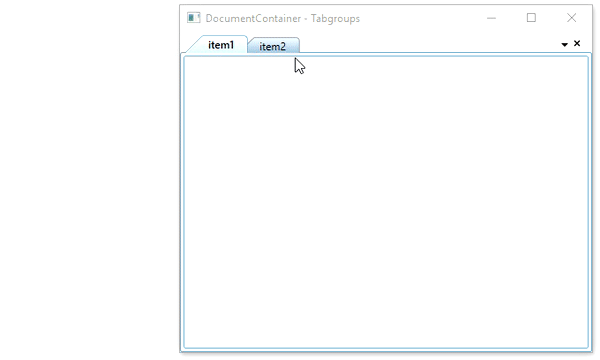
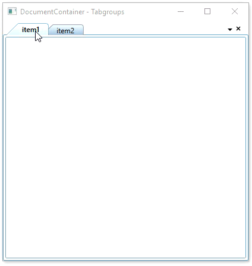
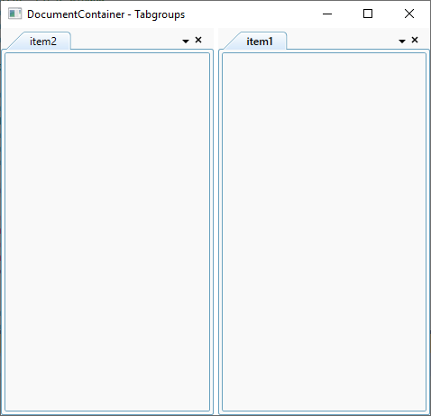

# Creating tab groups in WPF DocumentContainer

you can create tab groups for the tabitem of TDI mode [DocumentContainer](https://help.syncfusion.com/cr/wpf/Syncfusion.Tools.Wpf~Syncfusion.Windows.Tools.Controls.DocumentContainer.html) by dragging and also using the options in context menu items.

## Creating tab groups using context menu item

You can create a new horizontal or vertical tab groups for the TDI `DocumentContainer` by clicking the `New Horizontal Tab Group` or `New Vertical Tab Group` options available in the tabitem context menu. 




<syncfusion:DocumentContainer Mode="TDI" 
                              x:Name="documentContainer" >
    <ContentControl syncfusion:DocumentContainer.Header="item1"
                    Name="item1" />
    <ContentControl syncfusion:DocumentContainer.Header="item2"
                    Name="item2" />
</syncfusion:DocumentContainer>




N> Tab groups created only in TDI mode of the `DocumentContainer`. You can enable it by setting the [Mode](https://help.syncfusion.com/cr/wpf/Syncfusion.Tools.Wpf~Syncfusion.Windows.Tools.Controls.DocumentContainer~Mode.html) property value as `TDI`.

## Creating tab groups using tabitem dragging

You can create new horizontal tab group for the TDI `DocumentContainer` tab item by dragging the tabitem into the Document area and click the `New Tab Group` menu item from context menu item. You can cancel this tab group creation by clicking the `Cancel` menu item from context menu item.




<syncfusion:DocumentContainer Mode="TDI" 
                              x:Name="documentContainer" >
    <ContentControl syncfusion:DocumentContainer.Header="item1"
                    Name="item1" />
    <ContentControl syncfusion:DocumentContainer.Header="item2"
                    Name="item2" />
</syncfusion:DocumentContainer>




## Creating tab groups programmatically

You can programmatically creates a tab group on horizontally or vertically by using the [CreateHorizontalTabGroup](https://help.syncfusion.com/cr/wpf/Syncfusion.Tools.Wpf~Syncfusion.Windows.Tools.Controls.DocumentContainer~CreateHorizontalTabGroup.html) and [CreateVerticalTabGroup](https://help.syncfusion.com/cr/wpf/Syncfusion.Tools.Wpf~Syncfusion.Windows.Tools.Controls.DocumentContainer~CreateVerticalTabGroup.html) methods.




<syncfusion:DocumentContainer Mode="TDI" 
                              Loaded="DocumentContainer_Loaded"
                              x:Name="documentContainer" >
    <ContentControl syncfusion:DocumentContainer.Header="item1"
                    Name="item1" />
    <ContentControl syncfusion:DocumentContainer.Header="item2"
                    Name="item2" />
</syncfusion:DocumentContainer>







private void DocumentContainer_Loaded(object sender, RoutedEventArgs e) {
    documentContainer.CreateVerticalTabGroup(item1 as UIElement);
}




