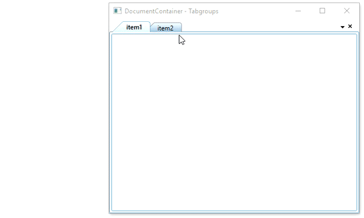
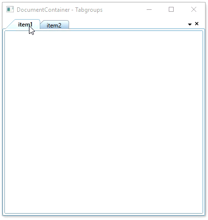
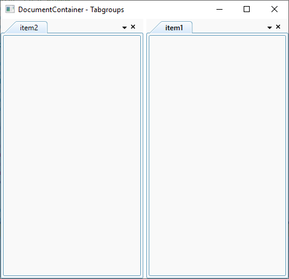

# Creating Tab Groups in WPF Document Container

You can create tab groups for the tab items of a TDI mode [WPF Document Container](https://help.syncfusion.com/cr/wpf/Syncfusion.Windows.Tools.Controls.DocumentContainer.html) by dragging a tab item, by using the context menu items, or programmatically. Tab groups are only supported in `TDI` mode.

## Creating Tab Groups Using the Context Menu

You can create new horizontal or vertical tab groups for the TDI `WPF Document Container` by clicking the `New Horizontal Tab Group` or `New Vertical Tab Group` options available in the tab item context menu.




<syncfusion:DocumentContainer Mode="TDI" 
                              x:Name="documentContainer" >
    <ContentControl syncfusion:DocumentContainer.Header="item1"
                    Name="item1" />
    <ContentControl syncfusion:DocumentContainer.Header="item2"
                    Name="item2" />
</syncfusion:DocumentContainer>




N> Tab groups can only be created in TDI mode of the `WPF Document Container`. You can enable it by setting the [Mode](https://help.syncfusion.com/cr/wpf/Syncfusion.Windows.Tools.Controls.DocumentContainer.html#Syncfusion_Windows_Tools_Controls_DocumentContainer_Mode) property to `TDI`.

## Creating Tab Groups by Dragging a Tab Item

You can create a new horizontal tab group for the TDI `WPF Document Container` tab item by dragging the tab item into the document area and then clicking the `New Tab Group` menu item from the context menu. You can cancel the tab group creation by clicking the `Cancel` menu item from the context menu.




<syncfusion:DocumentContainer Mode="TDI" 
                              x:Name="documentContainer" >
    <ContentControl syncfusion:DocumentContainer.Header="item1"
                    Name="item1" />
    <ContentControl syncfusion:DocumentContainer.Header="item2"
                    Name="item2" />
</syncfusion:DocumentContainer>




## Creating Tab Groups Programmatically

You can create a tab group horizontally or vertically by using the [CreateHorizontalTabGroup](https://help.syncfusion.com/cr/wpf/Syncfusion.Windows.Tools.Controls.DocumentContainer.html#Syncfusion_Windows_Tools_Controls_DocumentContainer_CreateHorizontalTabGroup_System_Windows_UIElement_) and [CreateVerticalTabGroup](https://help.syncfusion.com/cr/wpf/Syncfusion.Windows.Tools.Controls.DocumentContainer.html#Syncfusion_Windows_Tools_Controls_DocumentContainer_CreateVerticalTabGroup_System_Windows_UIElement_) methods. Both methods accept the `UIElement` that should be moved into a new tab group.




<syncfusion:DocumentContainer Mode="TDI"
                              Loaded="DocumentContainer_Loaded"
                              x:Name="documentContainer">
    <ContentControl syncfusion:DocumentContainer.Header="item1"
                    x:Name="item1" />
    <ContentControl syncfusion:DocumentContainer.Header="item2"
                    x:Name="item2" />
</syncfusion:DocumentContainer>







private void DocumentContainer_Loaded(object sender, RoutedEventArgs e)
{
    documentContainer.CreateVerticalTabGroup(item1);
}




