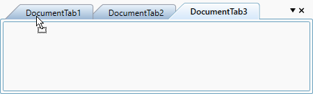

# Disabling Drag-Drop of TDI Items in DockingManager & DocumentContainer

By default, TDI items in DockingManager and DocumentContainer are can be dragged. The IsTDIDragDropEnabled property is available to disable the dragging and dropping of TDI items, as demonstrated in the following code:


        
<syncfusion:DockingManager Name="dockingmanager1" 
UseDocumentContainer="True" 
IsTDIDragDropEnabled="False">          
  <Grid syncfusion:DockingManager.Header="Tab1" syncfusion:DockingManager.State="Document"/>        
  <Grid syncfusion:DockingManager.Header="Tab2" syncfusion:DockingManager.State="Document"/>    
  </syncfusion:DockingManager>
  


 dockingmanager1.IsTDIDragDropEnabled=false;
 
 

This property is also applicable to DocumentContainer, as shown in the following code.


      
  <syncfusion:DocumentContainer Name="documentcontainer1" Mode="TDI" IsTDIDragDropEnabled="False" >      
  <Grid syncfusion:DockingManager.Header="Tab1" syncfusion:DockingManager.State="Document"/>     
  <Grid syncfusion:DockingManager.Header="Tab2" syncfusion:DockingManager.State="Document"/>   
  </syncfusion:DocumentContainer>
  
 


documentcontainer1.IsTDIDragDropEnabled=false;



## TDI item's order changing notification in DocumentContainer

You can notified when the TDI item's order is changing by using the [DocumentTabOrderChanging](https://help.syncfusion.com/cr/wpf/Syncfusion.Windows.Tools.Controls.DockingManager.html#Syncfusion_Windows_Tools_Controls_DockingManager_DocumentTabOrderChanging) event. You can get the order changed TDI item with its old and new index values by using the [SourceTabItem](https://help.syncfusion.com/cr/wpf/Syncfusion.Windows.Tools.Controls.DocumentTabOrderChangedEventArgs.html#Syncfusion_Windows_Tools_Controls_DocumentTabOrderChangedEventArgs_SourceTabItem), [OldIndex](https://help.syncfusion.com/cr/wpf/Syncfusion.Windows.Tools.Controls.DocumentTabOrderChangedEventArgs.html#Syncfusion_Windows_Tools_Controls_DocumentTabOrderChangedEventArgs_OldIndex) and [NewIndex](https://help.syncfusion.com/cr/wpf/Syncfusion.Windows.Tools.Controls.DocumentTabOrderChangedEventArgs.html#Syncfusion_Windows_Tools_Controls_DocumentTabOrderChangedEventArgs_NewIndex) properties. You can also get old and new tab group of the order changed item by using the the [SourceTabGroup](https://help.syncfusion.com/cr/wpf/Syncfusion.Windows.Tools.Controls.DocumentTabOrderChangedEventArgs.html#Syncfusion_Windows_Tools_Controls_DocumentTabOrderChangedEventArgs_SourceTabGroup) and [TargetTabGroup](https://help.syncfusion.com/cr/wpf/Syncfusion.Windows.Tools.Controls.DocumentTabOrderChangedEventArgs.html#Syncfusion_Windows_Tools_Controls_DocumentTabOrderChangedEventArgs_TargetTabGroup) properties. You can also notified when the TDI item's order is changed by using the [DocumentTabOrderChanged](https://help.syncfusion.com/cr/wpf/Syncfusion.Windows.Tools.Controls.DockingManager.html#Syncfusion_Windows_Tools_Controls_DockingManager_DocumentTabOrderChanged) event.

N> The `DocumentTabOrderChanged` event also invoked when create a horizontal or vertical tab groups using context menu or move the tab document to previous  or next tab groups.




<syncfusion:DocumentContainer DocumentTabOrderChanged="Documentcontainer1_DocumentTabOrderChanging"
                              Name="documentcontainer1"
                              Mode="TDI">
    <Grid syncfusion:DockingManager.Header="Tab1" syncfusion:DockingManager.State="Document"/>
    <Grid syncfusion:DockingManager.Header="Tab2" syncfusion:DockingManager.State="Document"/>
    <Grid syncfusion:DockingManager.Header="Tab3" syncfusion:DockingManager.State="Document"/>
</syncfusion:DocumentContainer>




documentcontainer1.Mode = DocumentContainerMode.TDI;
documentcontainer1.DocumentTabOrderChanging += Documentcontainer1_DocumentTabOrderChanging;




You can handle the event as follows,




private void Documentcontainer1_DocumentTabOrderChanging(object sender, Syncfusion.Windows.Tools.Controls.DocumentTabOrderChangedEventArgs e)
{
    var drag_Drop_Item = e.TargetTabGroup;

    //Get the old and new index of the SourceTabItem
    var oldIndex = e.OldIndex;
    var newIndex = e.NewIndex;

    //Get the old and new tab group of the SourceTabItem
    var sourceTabGroup = e.SourceTabGroup;
    var targetTabGroup = e.TargetTabGroup;

}




N> [View Sample in GitHub]()

## Restrict TDI item reordering in DocumentContainer

If you want to restrict the user to reordering the TDI items by drag and drop operation, use the `DocumentTabOrderChanging` event and set `Cancel` property value as `true`.




<syncfusion:DocumentContainer DocumentTabOrderChanged="Documentcontainer1_DocumentTabOrderChanging"
                              Name="documentcontainer1"
                              Mode="TDI">
    <Grid syncfusion:DockingManager.Header="Tab1" syncfusion:DockingManager.State="Document"/>
    <Grid syncfusion:DockingManager.Header="Tab2" syncfusion:DockingManager.State="Document"/>
    <Grid syncfusion:DockingManager.Header="Tab3" syncfusion:DockingManager.State="Document"/>
</syncfusion:DocumentContainer>




documentcontainer1.Mode = DocumentContainerMode.TDI;
documentcontainer1.DocumentTabOrderChanging += Documentcontainer1_DocumentTabOrderChanging;




You can handle the event as follows,




private void Documentcontainer1_DocumentTabOrderChanging(object sender, Syncfusion.Windows.Tools.Controls.DocumentTabOrderChangedEventArgs e)
{
    // Restrict the TDI item re-ordering
    e.Cancel = true;

}




N> [View Sample in GitHub]()

