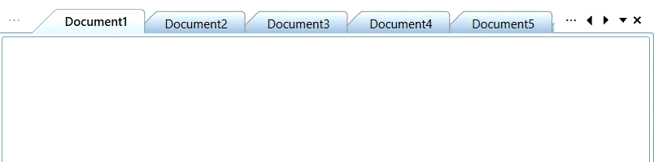

# Disabling Drag-Drop of TDI Items in DockingManager & DocumentContainer

 You can disable the dragging and dropping of TDI items in DocumentContainer and DockingManager by setting the [IsTDIDragDropEnabled](https://help.syncfusion.com/cr/wpf/Syncfusion.Windows.Tools.Controls.DocumentContainer.html#Syncfusion_Windows_Tools_Controls_DocumentContainer_IsTDIDragDropEnabled) property value as `false`. By default, [IsTDIDragDropEnabled](https://help.syncfusion.com/cr/wpf/Syncfusion.Windows.Tools.Controls.DocumentContainer.html#Syncfusion_Windows_Tools_Controls_DocumentContainer_IsTDIDragDropEnabled) property value is `true`.


        
<syncfusion:DockingManager Name="dockingmanager1" 
UseDocumentContainer="True" 
IsTDIDragDropEnabled="False">          
  <Grid syncfusion:DockingManager.Header="Tab1" syncfusion:DockingManager.State="Document"/>        
  <Grid syncfusion:DockingManager.Header="Tab2" syncfusion:DockingManager.State="Document"/>    
  </syncfusion:DockingManager>
  


 dockingmanager1.IsTDIDragDropEnabled=false;
 
 

This property is also applicable to DocumentContainer, as shown in the following code.


      
  <syncfusion:DocumentContainer Name="documentcontainer1" Mode="TDI" IsTDIDragDropEnabled="False" >      
  <Grid syncfusion:DockingManager.Header="Tab1" syncfusion:DockingManager.State="Document"/>     
  <Grid syncfusion:DockingManager.Header="Tab2" syncfusion:DockingManager.State="Document"/>   
  </syncfusion:DocumentContainer>
  
 


documentcontainer1.IsTDIDragDropEnabled=false;



## Rearrange position of document items with auto scrolling
You can move document items to position beyond the non-visual items by setting the `EnableAutoScroll` property value as `true` and dragging the respective item over the overflow button (with three dots) or beyond the overflow button to auto scroll to the required position.
The default value of `EnableAutoScroll` property is `false`.




<syncfusion:DocumentContainer x:Name="documentContainer" EnableAutoScroll="True" Mode="TDI" >
    <ContentControl x:Name="Content1" syncfusion:DockingManager.Header="Document1" />
    <ContentControl x:Name="Content2" syncfusion:DockingManager.Header="Document2" />
    <ContentControl x:Name="Content3" syncfusion:DockingManager.Header="Document3" />
    <ContentControl x:Name="Content4" syncfusion:DockingManager.Header="Document4" />
    <ContentControl x:Name="Content5" syncfusion:DockingManager.Header="Document5" />
</syncfusion:DocumentContainer>




DocumentContainer documentContainer = new DocumentContainer();
documentContainer.EnableAutoScroll = true;
documentContainer.Mode = DocumentContainerMode.TDI;




## TDI item's order changed notification in DocumentContainer

You will be notified when the TDI item's order is changed by using the [DocumentTabOrderChanged](https://help.syncfusion.com/cr/wpf/Syncfusion.Windows.Tools.Controls.DockingManager.html#Syncfusion_Windows_Tools_Controls_DockingManager_DocumentTabOrderChanged) event. You can get the order changed TDI item with its old and new index values by using the [SourceTabItem](https://help.syncfusion.com/cr/wpf/Syncfusion.Windows.Tools.Controls.DocumentTabOrderChangingEventArgs.html#Syncfusion_Windows_Tools_Controls_DocumentTabOrderChangedEventArgs_SourceTabItem), [OldIndex](https://help.syncfusion.com/cr/wpf/Syncfusion.Windows.Tools.Controls.DocumentTabOrderChangingEventArgs.html#Syncfusion_Windows_Tools_Controls_DocumentTabOrderChangedEventArgs_OldIndex) and [NewIndex](https://help.syncfusion.com/cr/wpf/Syncfusion.Windows.Tools.Controls.DocumentTabOrderChangingEventArgs.html#Syncfusion_Windows_Tools_Controls_DocumentTabOrderChangedEventArgs_NewIndex) properties. You can also get old and new tab group of the order changed item by using the the [SourceTabGroup](https://help.syncfusion.com/cr/wpf/Syncfusion.Windows.Tools.Controls.DocumentTabOrderChangingEventArgs.html#Syncfusion_Windows_Tools_Controls_DocumentTabOrderChangedEventArgs_SourceTabGroup) and [TargetTabGroup](https://help.syncfusion.com/cr/wpf/Syncfusion.Windows.Tools.Controls.DocumentTabOrderChangingEventArgs.html#Syncfusion_Windows_Tools_Controls_DocumentTabOrderChangingEventArgs_TargetTabGroup) properties.

N> The `DocumentTabOrderChanged` event also invoked when create a horizontal or vertical tab groups using context menu or move the tab document to previous  or next tab groups.




<syncfusion:DocumentContainer DocumentTabOrderChanging="Documentcontainer1_DocumentTabOrderChanging"
                              Name="documentcontainer1"
                              Mode="TDI">
    <Grid syncfusion:DockingManager.Header="Tab1" syncfusion:DockingManager.State="Document"/>
    <Grid syncfusion:DockingManager.Header="Tab2" syncfusion:DockingManager.State="Document"/>
    <Grid syncfusion:DockingManager.Header="Tab3" syncfusion:DockingManager.State="Document"/>
</syncfusion:DocumentContainer>




documentcontainer1.Mode = DocumentContainerMode.TDI;
documentcontainer1.DocumentTabOrderChanging += Documentcontainer1_DocumentTabOrderChanging;




You can handle the event as follows,




private void Documentcontainer1_DocumentTabOrderChanging(object sender, Syncfusion.Windows.Tools.Controls.DocumentTabOrderChangedEventArgs e)
{
    var drag_Drop_Item = e.TargetTabGroup;

    //Get the old and new index of the SourceTabItem
    var oldIndex = e.OldIndex;
    var newIndex = e.NewIndex;

    //Get the old and new tab group of the SourceTabItem
    var sourceTabGroup = e.SourceTabGroup;
    var targetTabGroup = e.TargetTabGroup;

}




N> [View Sample in GitHub](https://github.com/SyncfusionExamples/syncfusion-wpf-docking-manager-wpf-examples/tree/master/Samples/DocumentTabOrdering)

## Restrict TDI item reordering in DocumentContainer

If you want to restrict the user to reordering the TDI items by drag and drop operation, use the `DocumentTabOrderChanging` event and set `Cancel` property value as `true`.




<syncfusion:DocumentContainer DocumentTabOrderChanging="Documentcontainer1_DocumentTabOrderChanging"
                              Name="documentcontainer1"
                              Mode="TDI">
    <Grid syncfusion:DockingManager.Header="Tab1" syncfusion:DockingManager.State="Document"/>
    <Grid syncfusion:DockingManager.Header="Tab2" syncfusion:DockingManager.State="Document"/>
    <Grid syncfusion:DockingManager.Header="Tab3" syncfusion:DockingManager.State="Document"/>
</syncfusion:DocumentContainer>




documentcontainer1.Mode = DocumentContainerMode.TDI;
documentcontainer1.DocumentTabOrderChanging += Documentcontainer1_DocumentTabOrderChanging;




You can handle the event as follows,




private void Documentcontainer1_DocumentTabOrderChanging(object sender, Syncfusion.Windows.Tools.Controls.DocumentTabOrderChangingEventArgs e)
{
    // Restrict the TDI item re-ordering
    e.Cancel = true;
}




N> [View Sample in GitHub](https://github.com/SyncfusionExamples/syncfusion-wpf-docking-manager-wpf-examples/tree/master/Samples/DocumentTabOrdering)

