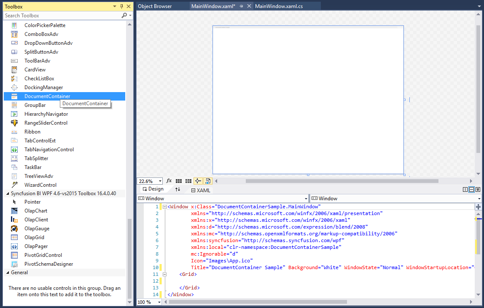
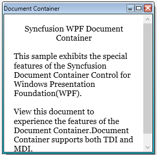
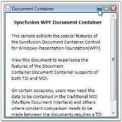

# Getting Started with WPF Tabbed MDI Form (DocumentContainer)

This section describes how to add [DocumentContainer](https://help.syncfusion.com/cr/wpf/Syncfusion.Windows.Tools.Controls.DocumentContainer.html) control into wpf application and its basic functionalities.

## Assembly deployment

Refer to the [control dependencies](https://help.syncfusion.com/wpf/control-dependencies#documentcontainer) section to get the list of assemblies or NuGet package that needs to be added as a reference to use the control in any application.

You can find more details about installing the NuGet package in a WPF application in the following link: 

[How to install nuget packages](https://help.syncfusion.com/wpf/nuget-packages)

## Create a simple application with DocumentContainer

## Create a project

Create a new WPF project in Visual Studio to display the DocumentContainer with functionalities.

## Add control through designer

The DocumentContainer control can be added to an application by dragging it from the toolbox to a designer view. The following required assembly references will be added automatically:

* Syncfusion.Tools.WPF
* Syncfusion.Shared.WPF 

## Add control manually in XAML

To add the control manually in XAML, follow the given steps:

1.	Add the following required assembly references to the project:
    * Syncfusion.Tools.WPF
    * Syncfusion.Shared.WPF 
2.	Import Syncfusion WPF schema **http://schemas.syncfusion.com/wpf** in the XAML page.
3.	Declare the DocumentContainer control in the XAML page.



<Window xmlns="http://schemas.microsoft.com/winfx/2006/xaml/presentation"
        xmlns:x="http://schemas.microsoft.com/winfx/2006/xaml"
        xmlns:syncfusion="http://schemas.syncfusion.com/wpf" 
        x:Class="DocumentContainerSample.MainWindow"
        Title="DocumentContainer Sample" Height="350" Width="525">
    <Grid>
        <!--Adding DocumentContainer control -->
        <syncfusion:DocumentContainer x:Name="documentContainer" Width="100" Height="100" VerticalAlignment="Center" HorizontalAlignment="Center"/>
    </Grid>
</Window>



## Add control manually in C\#

To add the control manually in C#, follow the given steps:
1.	Add the following required assembly references to the project:
    * Syncfusion.Tools.WPF
    * Syncfusion.Shared.WPF
2.	Import the DocumentContainer namespace **using Syncfusion.Windows.Tools.Controls;**.
3.	Create a DocumentContainer instance, and add it to the window.



using Syncfusion.Windows.Tools.Controls;
namespace DocumentContainerSample
{
    /// 

    /// Interaction logic for MainWindow.xaml
    /// 

    public partial class MainWindow : Window
    {
        public MainWindow()
        {
            InitializeComponent();
            //Creating an instance of DocumentContainer control
            DocumentContainer documentContainer = new DocumentContainer();
            //Adding DocumentContainer as window content
            this.Content = documentContainer;
        } 
    }
}



## Add document windows

The document container allows users add new framework elements such as button and text block to its container using the [Items](https://docs.microsoft.com/en-us/dotnet/api/system.windows.controls.itemscontrol.items?view=netframework-4.7.2) property. 



<syncfusion:DocumentContainer x:Name="documentContainer" Mode="TDI">
<Button></Button>
<Button/></Button>
<Button/></Button>
</syncfusion:DocumentContainer>


Button button1 = new Button();
Button button2 = new Button();
Button button3 = new Button();
//Adding buttons as document container window
documentContainer.Items.Add(button1);
documentContainer.Items.Add(button2);
documentContainer.Items.Add(button3);



## Set header to document

You can set header to the DocumentContainer elements by setting the [Header](https://help.syncfusion.com/cr/wpf/Syncfusion.Windows.Tools.Controls.DocumentHeader.html#Syncfusion_Windows_Tools_Controls_DocumentHeader_Header) property.



<syncfusion:DocumentContainer Name="documentContainer" Mode="MDI" SwitchMode="VS2005">
    <!-- Setting header for window -->
    <FlowDocumentScrollViewer syncfusion:DocumentContainer.Header="Document Container">
        <FlowDocument TextAlignment="Left">
            <Paragraph TextAlignment="Center">
                Syncfusion WPF Document Container</Paragraph>
            <Paragraph>
                This sample exhibits the special features of the Syncfusion Document Container Control for Windows Presentation Foundation(WPF).
            </Paragraph>
            <Paragraph>
                View this document to experience the features of the Document Container.Document Container supports both TDI and MDI.
            </Paragraph>
        </FlowDocument>
    </FlowDocumentScrollViewer>
</syncfusion:DocumentContainer>


//Setting header for document container elements
DocumentContainer.SetHeader(flowScrollViewer, "Document Container");



## Set TDI/MDI document mode

The DocumentContainer supports the following document modes :

* **TDI** - Tabbed Document Interface
* **MDI** - Multiple Document Interface

You can change the above modes using the [Mode](https://help.syncfusion.com/cr/wpf/Syncfusion.Windows.Tools.Controls.DocumentContainer.html#Syncfusion_Windows_Tools_Controls_DocumentContainer_Mode) property of DocumentContainer.



<syncfusion:DocumentContainer Name="documentContainer" Mode="TDI" />


documentContainer.Mode=DocumentContainerMode.TDI;



* **TDI**

* **MDI**

## Minimizing MDI window

You can minimize the `MDI` window by setting the [CanMDIMinimize](https://help.syncfusion.com/cr/wpf/Syncfusion.Windows.Tools.Controls.DocumentContainer.html#Syncfusion_Windows_Tools_Controls_DocumentContainer_CanMDIMinimize) property as `true`. The default value of `CanMDIMinimize` property is `false`. The minimized  MDI windows are arranged one by one in the bottom-left corner of the window.




<syncfusion:DocumentContainer Name="DocContainer"
                              CanMDIMinimize="True" 
                              Mode="MDI">
    <FlowDocumentScrollViewer syncfusion:DocumentContainer.Header="Features"/>
    <FlowDocumentScrollViewer syncfusion:DocumentContainer.Header="Window1"/>
    <FlowDocumentScrollViewer syncfusion:DocumentContainer.Header="Document Container"/>
</syncfusion:DocumentContainer>




## Theme

DocumentContainer supports various built-in themes. Refer to the below links to apply themes for the DocumentContainer,

  * [Apply theme using SfSkinManager](https://help.syncfusion.com/wpf/themes/skin-manager)
	
  * [Create a custom theme using ThemeStudio](https://help.syncfusion.com/wpf/themes/theme-studio#creating-custom-theme)

  
   
  