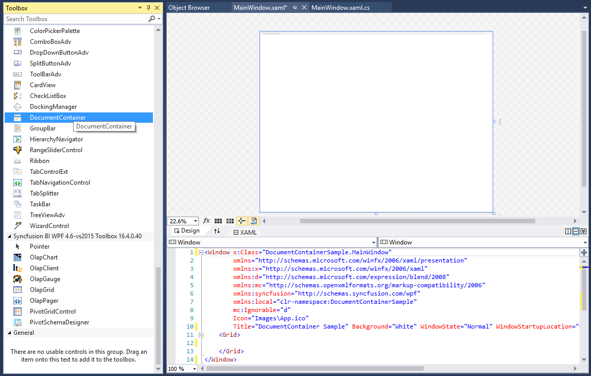
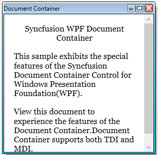
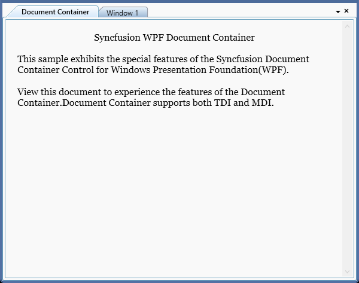
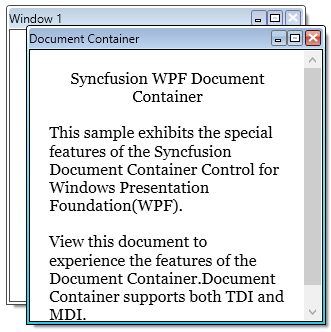
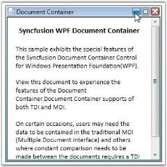

# Getting Started with WPF DocumentContainer

This section describes how to add [WPF Tabbed MDI Form](https://www.syncfusion.com/wpf-controls/tabbed-mdi-form) (DocumentContainer) control into wpf application and its basic functionalities.

## Assembly deployment

Refer to the [control dependencies](https://help.syncfusion.com/wpf/control-dependencies#documentcontainer) section to get the list of assemblies or NuGet package that needs to be added as a reference to use the control in any application.

You can find more details about installing the NuGet package in a WPF application in the following link: 

[How to install nuget packages](https://help.syncfusion.com/wpf/installation/install-nuget-packages)

## Create a simple application with DocumentContainer

## Create a project

Create a new WPF project in Visual Studio to display the DocumentContainer with functionalities.

## Add control through designer

The DocumentContainer control can be added to an application by dragging it from the toolbox to a designer view. The following required assembly references will be added automatically:

* Syncfusion.Tools.WPF
* Syncfusion.Shared.WPF 

## Add control manually in XAML

To add the control manually in XAML, follow the given steps:

1. Add the following required assembly references to the project:
    * Syncfusion.Tools.WPF
    * Syncfusion.Shared.WPF 
2. Import Syncfusion® WPF schema **http://schemas.syncfusion.com/wpf** in the XAML page.
3. Declare the DocumentContainer control in the XAML page.




<Window xmlns="http://schemas.microsoft.com/winfx/2006/xaml/presentation"
        xmlns:x="http://schemas.microsoft.com/winfx/2006/xaml"
        xmlns:syncfusion="http://schemas.syncfusion.com/wpf" 
        x:Class="DocumentContainerSample.MainWindow"
        Title="DocumentContainer Sample" Height="350" Width="525">
    <Grid>
        <!--Adding DocumentContainer control -->
        <syncfusion:DocumentContainer x:Name="documentContainer" Width="100" Height="100" VerticalAlignment="Center" HorizontalAlignment="Center"/>
    </Grid>
</Window>



{{ codesnippet1 | OrderList_Indent_Level_1 }}

## Add control manually in C\#

To add the control manually in C#, follow the given steps:
1. Add the following required assembly references to the project:
    * Syncfusion.Tools.WPF
    * Syncfusion.Shared.WPF
2. Import the DocumentContainer namespace **using Syncfusion.Windows.Tools.Controls;**.
3. Create a DocumentContainer instance, and add it to the window.




using Syncfusion.Windows.Tools.Controls;
namespace DocumentContainerSample
{
    /// 

    /// Interaction logic for MainWindow.xaml
    /// 

    public partial class MainWindow : Window
    {
        public MainWindow()
        {
            InitializeComponent();
            //Creating an instance of DocumentContainer control
            DocumentContainer documentContainer = new DocumentContainer();
            //Adding DocumentContainer as window content
            this.Content = documentContainer;
        }
    }
}



{{ codesnippet2 | OrderList_Indent_Level_1 }}

## Add Documents

The document container allows you to add new framework elements such as a Button or TextBlock to its container using the [Items](https://learn.microsoft.com/en-us/dotnet/api/system.windows.controls.itemscontrol.items?view=netframework-4.8) property. Set the [Mode](Setting-Mode-for-Document-Container.md) property to `TDI` or `MDI` to choose how the children are arranged.



<syncfusion:DocumentContainer x:Name="documentContainer" Mode="TDI">
    <Button Content="Button 1" />
    <Button Content="Button 2" />
    <Button Content="Button 3" />
</syncfusion:DocumentContainer>


Button button1 = new Button() { Content = "Button 1" };
Button button2 = new Button() { Content = "Button 2" };
Button button3 = new Button() { Content = "Button 3" };
//Adding buttons as document container window
documentContainer.Items.Add(button1);
documentContainer.Items.Add(button2);
documentContainer.Items.Add(button3);



## Set Header for a Document

You can set the header of any DocumentContainer element by setting the [Header](https://help.syncfusion.com/cr/wpf/Syncfusion.Windows.Tools.Controls.DocumentHeader.html#Syncfusion_Windows_Tools_Controls_DocumentHeader_Header) attached property. The `Header` accepts any `object`, so you can also use a `HeaderTemplate` to customize its appearance.



<syncfusion:DocumentContainer Name="documentContainer" Mode="MDI" SwitchMode="VS2005">
    <!-- Setting header for window -->
    <FlowDocumentScrollViewer syncfusion:DocumentContainer.Header="Document Container">
        <FlowDocument TextAlignment="Left">
            <Paragraph TextAlignment="Center">
                Syncfusion WPF Document Container</Paragraph>
            <Paragraph>
                This sample exhibits the special features of the Syncfusion Document Container Control for Windows Presentation Foundation (WPF).
            </Paragraph>
            <Paragraph>
                View this document to experience the features of the Document Container. The Document Container supports both TDI and MDI.
            </Paragraph>
        </FlowDocument>
    </FlowDocumentScrollViewer>
</syncfusion:DocumentContainer>


// Create the child element and set its header
FlowDocumentScrollViewer flowScrollViewer = new FlowDocumentScrollViewer();
DocumentContainer.SetHeader(flowScrollViewer, "Document Container");
documentContainer.Items.Add(flowScrollViewer);



## Set TDI/MDI Document Mode

The DocumentContainer supports the following document modes:

* **TDI** - Tabbed Document Interface (default)
* **MDI** - Multiple Document Interface

You can change the mode using the [Mode](https://help.syncfusion.com/cr/wpf/Syncfusion.Windows.Tools.Controls.DocumentContainer.html#Syncfusion_Windows_Tools_Controls_DocumentContainer_Mode) property of DocumentContainer. The default value is `TDI`. See [Setting Mode for Document Container](Setting-Mode-for-Document-Container.md) for more details.



<syncfusion:DocumentContainer Name="documentContainer" Mode="TDI" />


documentContainer.Mode = DocumentContainerMode.TDI;



* **TDI**

* **MDI**

## Minimizing an MDI Window

You can minimize the `MDI` window by setting the [CanMDIMinimize](https://help.syncfusion.com/cr/wpf/Syncfusion.Windows.Tools.Controls.DocumentContainer.html#Syncfusion_Windows_Tools_Controls_DocumentContainer_CanMDIMinimize) property to `true`. The default value of `CanMDIMinimize` is `false`. The minimized MDI windows are arranged one by one in the bottom-left corner of the window. See [Minimizing MDI Window](Minimizing-MDI-window.md) for the full reference.




<syncfusion:DocumentContainer Name="DocContainer"
                              CanMDIMinimize="True"
                              Mode="MDI">
    <FlowDocumentScrollViewer syncfusion:DocumentContainer.Header="Features"/>
    <FlowDocumentScrollViewer syncfusion:DocumentContainer.Header="Window1"/>
    <FlowDocumentScrollViewer syncfusion:DocumentContainer.Header="Document Container"/>
</syncfusion:DocumentContainer>



DocContainer.CanMDIMinimize = true;



## Theme

DocumentContainer supports various built-in themes. Refer to the below links to apply themes for the DocumentContainer,

  * [Apply theme using SfSkinManager](https://help.syncfusion.com/wpf/themes/skin-manager)
	
  * [Create a custom theme using ThemeStudio](https://help.syncfusion.com/wpf/themes/theme-studio#creating-custom-theme)

  
   
  

## See Also

* [Overview](Overview.md)
* [Setting Mode for Document Container](Setting-Mode-for-Document-Container.md)
* [Setting Header of the DocumentContainer](Setting-Header-of-the-Document-container.md)
* [Adding and Removing Items](Adding-and-Removing-Items-from-the-Document-Container-Control.md)
* [State Persistence](State-Persistence.md)
* [Maximizing MDI Window](Maximizing-MDI-window.md)
* [Minimizing MDI Window](Minimizing-MDI-window.md)
* [MDI Resize](MDI-Resize.md)
* [Setting Window State](Setting-Window-State.md)
* [Setting MDIBounds](Setting-MDIBounds.md)
* [Full Screen in DocumentContainer](Full-Screen-in-DocumentContainer.md)
* [Pin and Unpin TabItems](Pin-Unpin-tabs.md)
* [Creating Tab Groups](Creating-Tab-Groups.md)
* [Disabling Drag and Drop of TDI Items](Disabling-Dragging-and-Dropping-of-TDI-Items-in-DockingManager-and-DocumentContainer.md)
* [Setting Window Switchers](Setting-Window-Switchers.md)
* [Localization](Localization.md)
* [Layout Related Features](Layout-Related-Features.md)