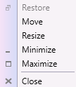
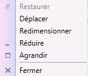
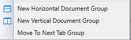
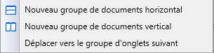
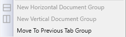
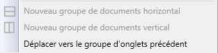
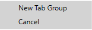
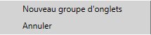
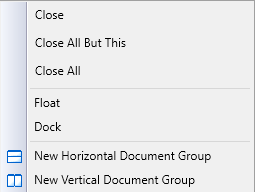
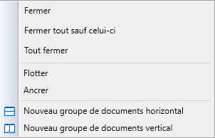

# Localization in WPF Tabbed MDI Form (DocumentContainer)

The following table describes how a DocumentContainer property can be localized to a specific culture. You can simply provide the string values in the resource file for a specific culture and set the culture in the application.

<table>
<tr>
<th colspan = "5">
Property</th><th>
Description</th></tr>
<tr>
<td colspan = "5">
MDIRestore,
MDIMove,
MDIResize,
MDIFloating,
MDIDockable,
MDIDocument,
MDIMinimize,
MDIMaximizeMDIClose</td><td>
Sets the string for the context menu item in DocumentContainer.</td></tr>
<tr>
<td colspan = "6">
{{ '' | markdownify}}

{{ '' | markdownify}}

{{ '_ContextMenu(en-US)                                                      ContextMenu(fr-FR)_' | markdownify }}</td></tr>
<tr>
<td colspan = "4">
MoveToNextTabGroup </td><td colspan = "2">
Sets the string for MoveToNextTabGroup context menu item in DockingManager and DocumentContainer.</td></tr>
<tr>
<td colspan = "6">
{{ '' | markdownify}}

{{ '' | markdownify}}

{{ '_MoveToNextTabGroup(en-US)                                       MoveToNextTabGroup(fr-FR)_' | markdownify }}</td></tr>
<tr>
<td colspan = "3">
MoveToPreviousTabGroup</td><td colspan = "3">
Sets the string for MoveToPreviousTabGroup context menu item in DockingManager and DocumentContainer.</td></tr>
<tr>
<td colspan = "6">
{{ '' | markdownify}}

{{ '' | markdownify}}

{{ '_MoveToPreviousTabGroup(en-US)                           MoveToPreviousTabGroup(fr-FR)_' | markdownify }}</td></tr>
<tr>
<td colspan = "2">
NewTabgroupMenuItemCancel</td><td colspan = "4">
Sets the string for the Tab context menu item in DockingManager and DocumentContainer.</td></tr>
<tr>
<td colspan = "6">
{{ '' | markdownify}}

{{ '' | markdownify}}

{{ '_NewTabGroup(en-US)                                NewTabGroup(fr-FR)_' | markdownify }}</td></tr>
<tr>
<td>
TabClose,
CloseAllButThis,
TabCloseAll,
Floating,
Document,
Dockable,
NewHorizontalTabGroup,
NewVerticalTabGroup</td><td colspan = "5">
Sets the string for the menu item in DocumentContainer and DockingManager.</td></tr>
<tr>
<td colspan = "6">
{{ '' | markdownify}}

{{ '' | markdownify}}

{{ '_MenuItem(en-US)                                                 MenuItem(fr-FR)_' | markdownify }}</td></tr>
</table>

