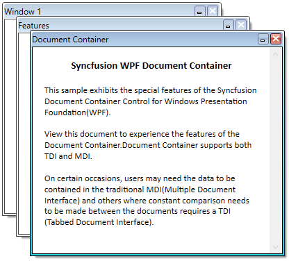

# Maximizing MDI window in WPF Tabbed MDI Form (DocumentContainer)

You can maximize the `MDI` window by setting the [CanMDIMaximize](https://help.syncfusion.com/cr/wpf/Syncfusion.Windows.Tools.Controls.DocumentContainer.html#Syncfusion_Windows_Tools_Controls_DocumentContainer_CanMDIMaximize) property as `true`. The default value of `CanMDIMaximize` property is `false`.




<syncfusion:DocumentContainer Name="DocContainer"
                              CanMDIMaximize="True" 
                              Mode="MDI">
    <FlowDocumentScrollViewer syncfusion:DocumentContainer.Header="Features"/>
    <FlowDocumentScrollViewer syncfusion:DocumentContainer.Header="Window1"/>
    <FlowDocumentScrollViewer syncfusion:DocumentContainer.Header="Document Container"/>
</syncfusion:DocumentContainer>




## Restrict Maximizing the MDI window

You can restrict maximizing the `MDI` window by setting the `CanMDIMaximize` property as `false`.




<syncfusion:DocumentContainer Name="DocContainer"
                              CanMDIMaximize="False" 
                              Mode="MDI">
    <FlowDocumentScrollViewer syncfusion:DocumentContainer.Header="Features"/>
    <FlowDocumentScrollViewer syncfusion:DocumentContainer.Header="Window1"/>
    <FlowDocumentScrollViewer syncfusion:DocumentContainer.Header="Document Container"/>
</syncfusion:DocumentContainer>




