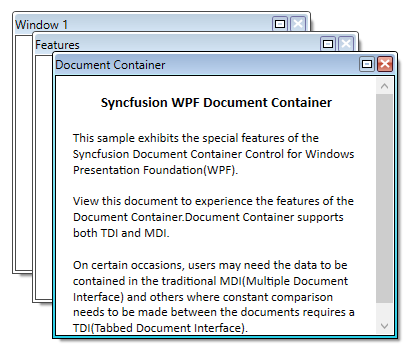

# Minimizing MDI Window in WPF DocumentContainer

## Assembly Deployment

Refer to the [control dependencies](https://help.syncfusion.com/wpf/control-dependencies#documentcontainer) section to get the list of assemblies or NuGet package that needs to be added as a reference to use the control in any application.

You can minimize the `MDI` window by setting the [CanMDIMinimize](https://help.syncfusion.com/cr/wpf/Syncfusion.Windows.Tools.Controls.DocumentContainer.html#Syncfusion_Windows_Tools_Controls_DocumentContainer_CanMDIMinimize) property to `true`. The default value of `CanMDIMinimize` is `false`. The minimized MDI windows are arranged one by one in the bottom-left corner of the window.




<syncfusion:DocumentContainer Name="DocContainer"
                              CanMDIMinimize="True"
                              Mode="MDI">
    <FlowDocumentScrollViewer syncfusion:DocumentContainer.Header="Features"/>
    <FlowDocumentScrollViewer syncfusion:DocumentContainer.Header="Window1"/>
    <FlowDocumentScrollViewer syncfusion:DocumentContainer.Header="Document Container"/>
</syncfusion:DocumentContainer>



DocContainer.CanMDIMinimize = true;



## Restricting Minimizing the MDI Window

You can restrict minimizing the `MDI` window by setting the `CanMDIMinimize` property to `false` (the default). When set to `false`, the minimize button is hidden from the MDI chrome and the user cannot minimize the window through the UI.




<syncfusion:DocumentContainer Name="DocContainer"
                              CanMDIMinimize="False"
                              Mode="MDI">
    <FlowDocumentScrollViewer syncfusion:DocumentContainer.Header="Features"/>
    <FlowDocumentScrollViewer syncfusion:DocumentContainer.Header="Window1"/>
    <FlowDocumentScrollViewer syncfusion:DocumentContainer.Header="Document Container"/>
</syncfusion:DocumentContainer>



DocContainer.CanMDIMinimize = false;



## See Also

* [Getting Started](Getting-Started.md)
* [Maximizing MDI Window](Maximizing-MDI-window.md)
* [MDI Resize](MDI-Resize.md)
* [Setting Window State](Setting-Window-State.md)

